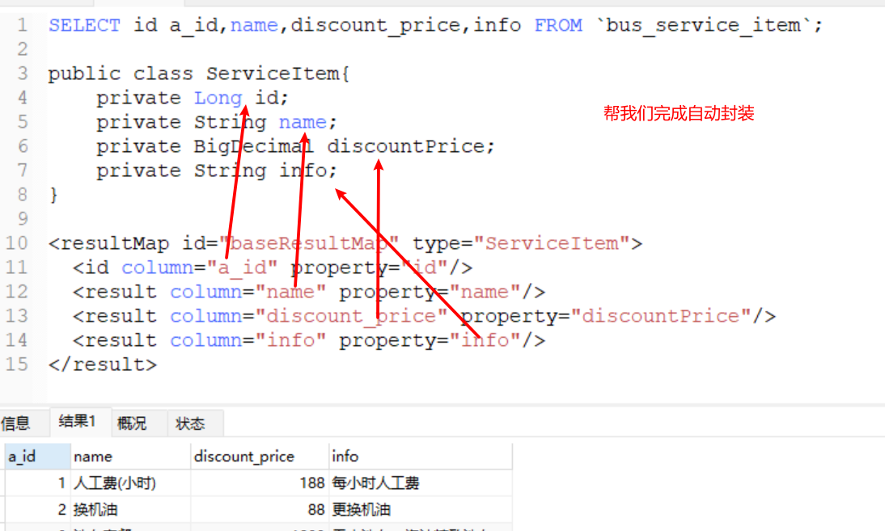
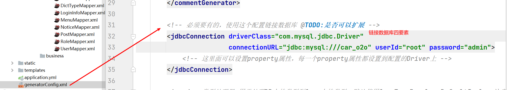
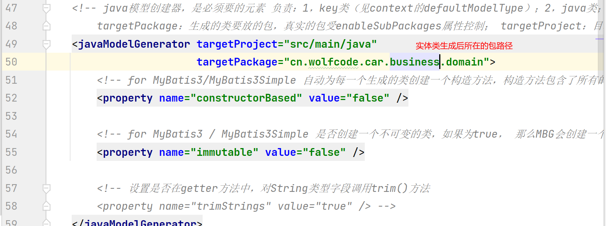
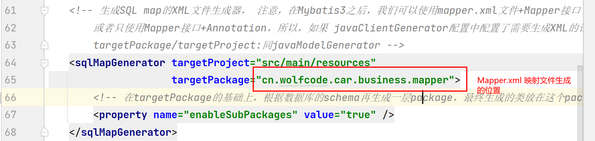
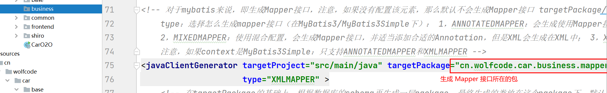
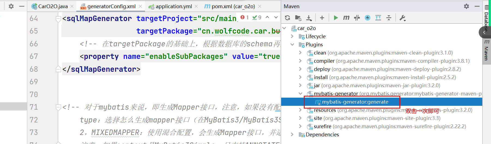
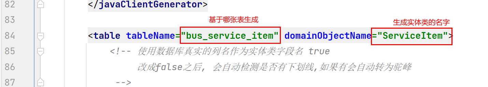
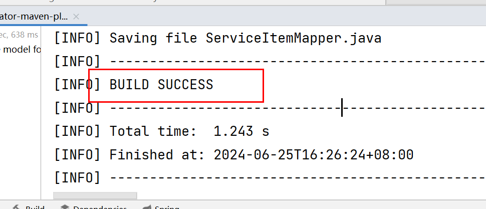

一、如何设计数据库

	1. 所有字段所见即所得。
 	2. 是否与金钱有关，要考虑小数位。尽量使用精确型小数、BigDecimal。
 	3. 若存在固定几个值的情况下。考虑数据字典。
 	4. 考虑当前表中是否有关联表。若存在关联表则需要存储关联的（一般）主键字段。
 	5. 考虑是否存在隐藏属性。

二、设计表后创建实体类。

- 数据库字段名与实体类名字“尽量”保持一致。
- 数据库字段类型 要与 实体类类型一致。 常用对照。
  - 数据库                    Java
  - bigInt		-->		Long
  - int              -->		Integer
  - decimal     -->        BegDecimal
  - char           -->        Character
  - varchar      -->        String
  - bit               -->        boolean

三、使用 MyBatis 逆向工程生成 实体类、Mapper接口、Mapper.XML 文件。

1. 什么是MyBatis	

   - MyBatis 本质上是在 xml 中将 SQL 语句进行传输的。

     - \<select id="xx"  resultMap="">\</select>：查    id 属性是唯一标识，标识具体调用哪条 SQL 语句

       ```xml
       <!--
       ResultMap:结果集映射。
       id：该 ResultMap 的唯一标识。
       type：最终返回的类型是什么（我们自定义的实体类）
       -->
       <resultMap id="xx" type="">
           <!--
       		id 和 result 都是一样的，只不过是语义化标签而已。
               column:   数据库中查询出来的那张虚拟表的列名
       	    property: 需要返回类型内字段名
       		若 column 和 proeprty 所对应在一个标签中。那么就会把 column 这列名 -> 值 封装到 property 的属性中
       	-->
           <id column="id"  property="id" />
           <result column="code"  property="code" />
       </result>
       ```

       - 本质上就是在帮我们将查询出来的结果每一列与对象中的属性 --> 一一对应进行封装。

       

     - \<insert id="xx">\</insert>：新增   id 属性是唯一标识，标识具体调用哪条 SQL 语句  返回值类型为 int，不需要可以不接收

     - \<update id="xx">\</update>：编辑   id 属性是唯一标识，标识具体调用哪条 SQL 语句 返回值类型为 int，不需要可以不接收

     - \<delete id="xx">\</delete>：删除   id 属性是唯一标识，标识具体调用哪条 SQL 语句 返回值类型为 int，不需要可以不接收

   - 持久层框架：
     - 作用：加速持久层开发。
   - 他其实就是我们曾经书写的 Dao 层。
     - MyBatis 结构体封装：（输入映射、输出映射）。
     - 输入映射：在操作 SQL 时，他允许接收一个对象为参数。他会自动使用反射拿到该对象的属性值。填充到 SQL 语句中。
     - 输出映射：在操作 SQL 时，当查询的结果是一个实体类的对象。那么他会自动将查询的每一列数据封装到一个对象中。若查询得到了多个列，他会自动将查询的结果封装到一个集合中。
     - 若想让 MyBatis 完成结构体封装：
       1. 需要一个 Mapper 接口对应一个 Mapper.xml 文件。
       2. Mapper.xml 中的 namespace 必须是接口的全限定名（包名  + 类名）
       3. Mapper 接口中的方法名 与 Mapper.xml 文件中的 id 名字一致（这样就能保证哪个方法对应哪条 SQL）
       4. 若是 select （查询） 语句。则返回值类型要相同。  

2. 什么是 MyBatis 逆向工程
   - 可以基于表帮我们生成 实体类、Mapper接口、Mapper.xml 文件
   - 以及在 Mapper.xml 中帮我们实现基础的增删改查。

3. 如何使用 MyBatis 逆向工程

   - 我们需要对 MyBatis 逆向工程进行配置。这样就可以让其帮我们自动生成了。

   - 使用步骤

     1. 添加 MyBatis 逆向工程依赖。

     2. 加入 MyBatis 逆向工程的配置文件。（百度查找即可）。 

     3. 在 MyBatis 逆向工程的配置文件 generatorConfig.xml 中。修改参数。

        1. 修改链接数据库四要素

        

        2. 修改实体类生成的位置

           

        3. 映射文件生成的位置

           

        4. Mapper 接口所在的位置

           

        5. 当配置文件都修改正确后，我们就可以使用 MyBatis 逆向工程生成 实体类、Mapper接口、Mapper.xml 文件。

           

        6. 最后修改基于哪张表生成，生成的实体类名字叫什么

           

        7. 注意：（双击一次即可）双击插件后，我们会看到下面有控制台在动。当我们看到控制台没有报错且出现 Build Success 时。说明我们生成成功了。

           

        8. 查看文件是否生成。

