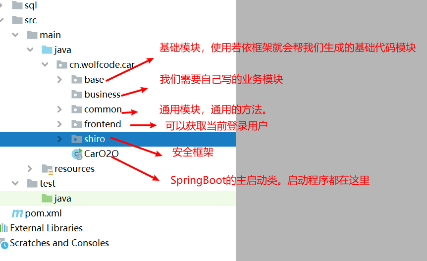
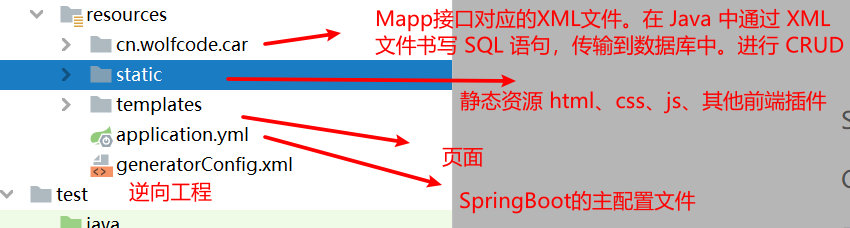
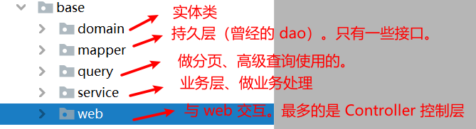
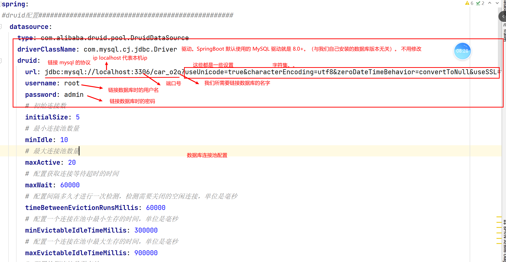
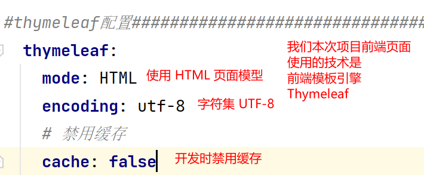
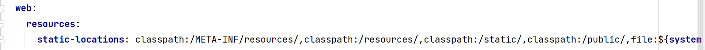
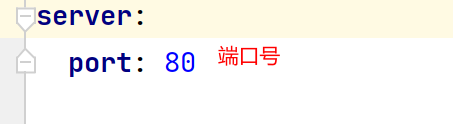

### 一、项目中的包内模块的含义

​	

### 二、包的结构

三、Shiro 安全框架

 1. Shiro 框架的配置类

    

	2.  常见注解：

     	1.  @Configuration :若一个类上贴了 @Configuration 则说明该类是一个 Spring 的配置类（Spring 容器）。
     	2.  该容器中就可以生产 bean 。
     	3.  @Bean：当方法上贴了 @Bean 注解，那么则说明该方法执行后，会将返回值（该返回值类型的对象）存入到 Spring 容器中。Spring 就可以帮我们管理对象。将来我们使用该对象时就可以从 Spring 容器中将该对象拿出来。（解耦）。

     4. 本质上 ShiroConfig 中就是创建了一些对象。交给 Spring 容器所管理。当使用到这些对象时，就可以直接从 Spring 容器中将这些对象拿出来并使用。

	3.  ShiroUtils 类

     	1.   ShiroUtils 是我们自己封装的一个关于 Shiro 的工具类。里面提供了大量的获取用户、用户权限、用户角色 等方法。我们项目若需要使用响应的数据。则可以直接从该 ShiroUtils 中调用方法即可。
     	2.  public static Subject getSubject() ：获取当前主体对象。（包含了当前登录用户等等很多信息）。
     	3.  public static Session getSession()：获取当前 session 中用户的方法。
     	4.  public static void logout()：登出的方法（安全退出）。
     	5.  public static User getUser()：获取当前登录用户。
     	6.  public static void setUser：设置当前登录用户。

### 三、运行程序

 1. 我们需要在主启动类中执行主方法即可。

    - 因为 SpringBoot 程序。在我们启动主方法时，会执行 SpringApplication.run(当前类.class, 主方法中的参数);本质上在检测我们传入的主启动类上面是否贴了 @SpringBootApplication 注解。若贴了该注解。那么则会启动程序，并执行自动装配，并将当前程序加载到 Tomcat 服务器中。

	2. 但是我们启动程序时发现启动报错。

    - 通过查看错误或百度查询。我们得知是数据库链接密码错误。所以我们需要更改 SpringBoot 链接数据库时的四要素

      - 驱动
      - 链接数据的地址(URL)
      - 用户名
      - 密码

    - 我们需要在 SpringBoot 的配置文件中配置上述所需参数。

      

    - 前端模板引擎 Thymeleaf 配置

      

    - 默认加载静态资源。默认会在程序中的 /static 或 /public 等这些文件夹中默认加载静态资源。

      

    - 将端口号改为 ： 80

      - 因为浏览器访问页面默认端口就是80。所以我们若设置为 80 后则不用在手动填写端口号了。

      

    - 最后在浏览器输入 http://localhost