### 一、下载 MyBatisX 插件

- 该插件的作用就是可以让我们更好的操作 MyBatis 对应的  XxxMapper 接口和 XxxMapper.xml 文件

1. 打开配置

   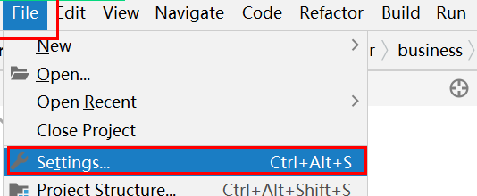

2. 在 plugins 中下载插件

   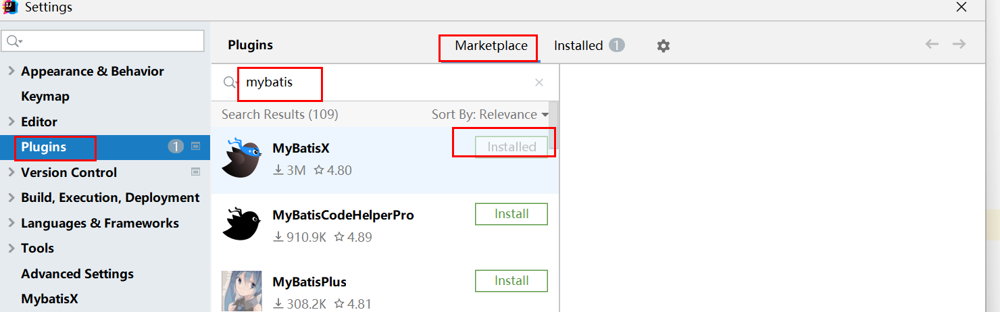

### 二、项目中的三层架构

- 控制层(Controller)  -->  业务层(Service) --> 数据持久层(Mapper) 。
- 从而实现  
  - 控制层接收用户请求。  调用业务层方法处理请求。
  - 业务层来处理请求中的业务部分（例如 对于据验证，项目中业务逻辑...等等）。 当业务层需要数据时。
  - 调用数据持久层。 数据持久层只负责与数据库打交道。 对数据进行 CRUD 后。将结果返回给业务层。
  - 业务层拿到结果后，若需要再次加共。则加工。后将数据返回给控制层。
  - 控制层最终将数据返回给 客户端(浏览器)。返回可能是页面，也可能是一组数据。
- 我们已经使用 MyBatis 逆向工程实现了数据持久层的开发。
- 接下来我们需要完成业务层的开发。

### 三、项目中的业务书写。

 1. 创建包 包名为 service

    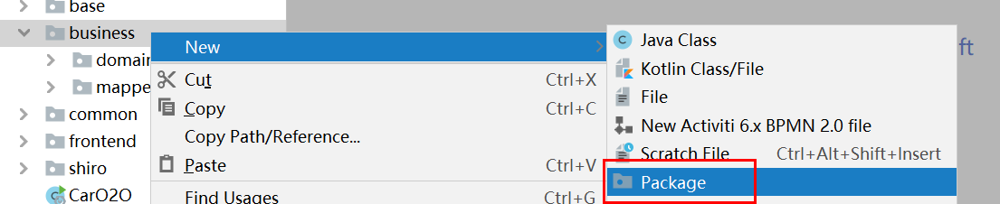

 2. 业务层中，我们采用的是接口规范模式。创建 IServiceItemService 接口

    - 业务层接口命名规范 

      - I 开头代表是一个接口 + 模块名 + Service 结尾。

     - 在业务接口中创建对应的 CURD 方法。

       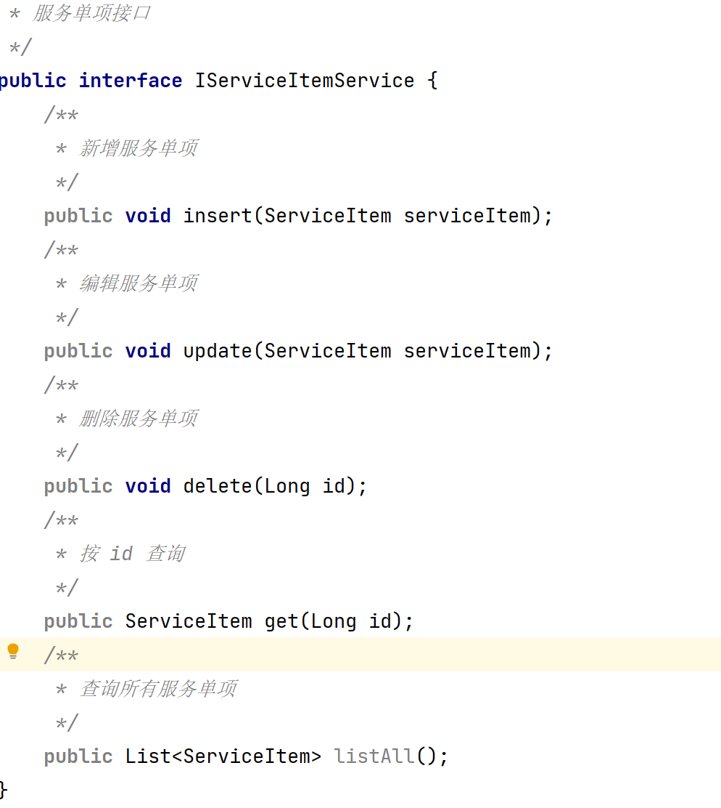

 3. 在 MyBatis 中 #{xxx} 就是取值的方法。

    - 就是我们若传递了一个对象。那么则从当前对象.xx 属性名的方式取值。

    - #{属性名}

    - 要求 #{属性名} 必须与 该类中的属性名一致。

      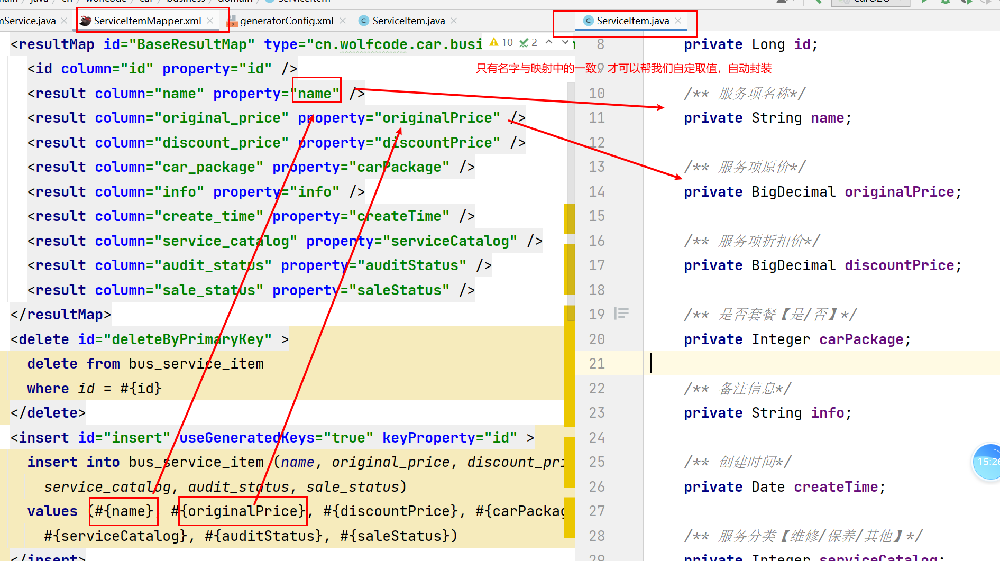

    4. 接口是提供规范的。那他里面都是抽象方法。并不是可以真正执行的方法。所以我们需要创建接口对应的实现类来去实现这些方法。让其有真正的功能。

    5. 首先创建实现类的包 -->   service 包内继续创建一个 impl  的包。

       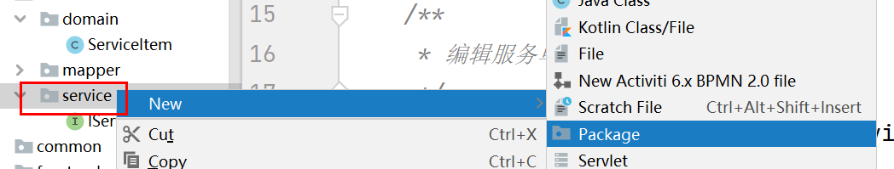

    6. 在该 impl 包中创建接口的实现类 。命名规范： 模块名 + Service + Impl(实现的意识)

       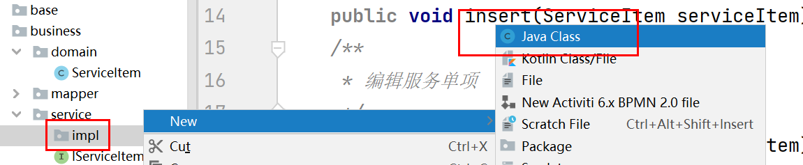

    7.  让该实现类实现这个接口

       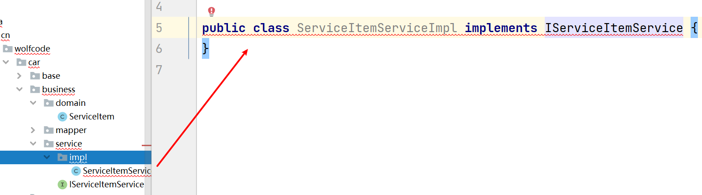

    8. 此时程序报错。报错的原因是 没有实现该接口中所有的方法。我们需要去实现该接口中的所有方法。

       - 我们需要在红线最后面按 Alt + Enter 。选择第一个选项。

         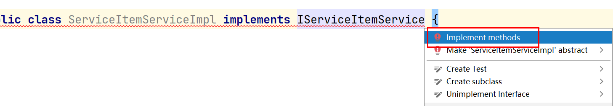

       - 然后巧回车。此时的列表就是所有需要实现的方法。

         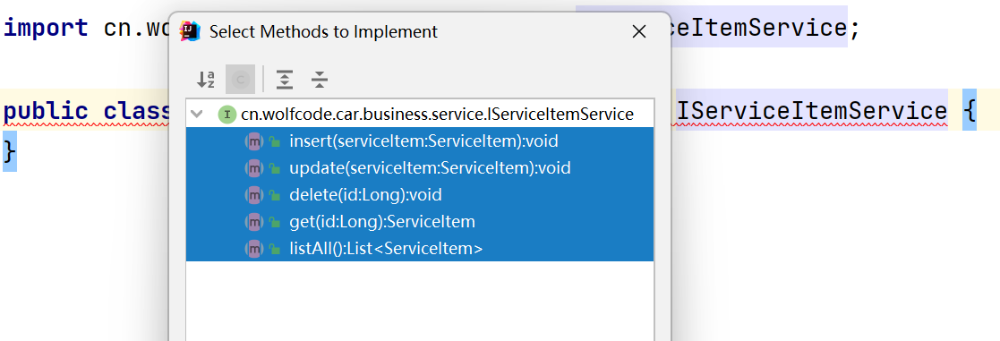

       - 在点击下面的OK即可。这样所有的方法就都实现出来了。

         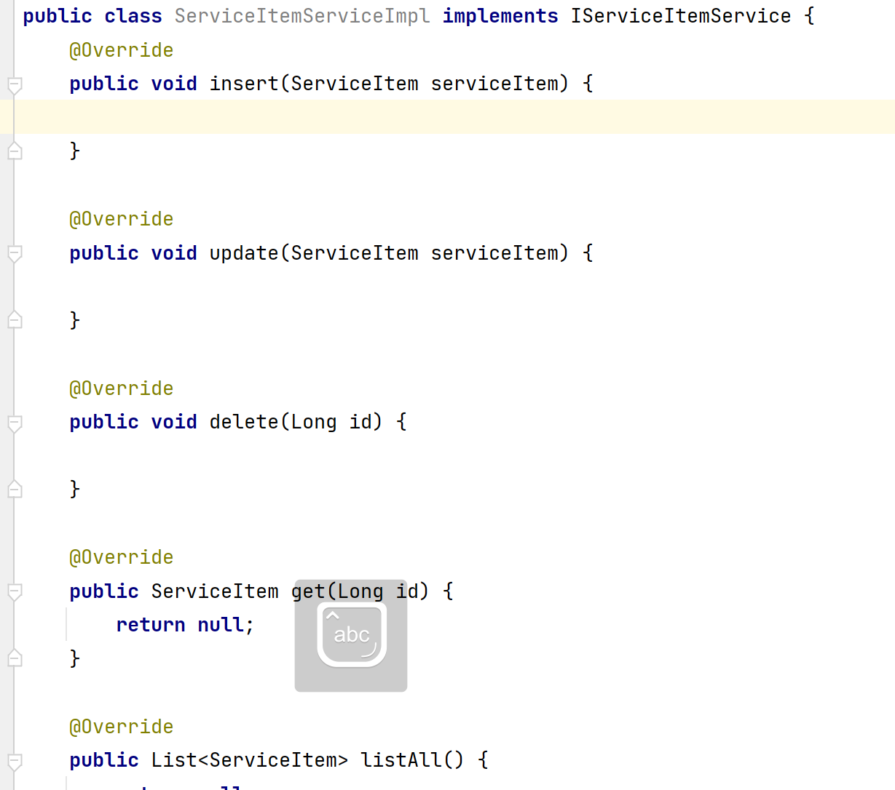

    9. 完善方法。（由于暂时我们还没有链接到前端。还没有出现业务逻辑。所以暂时先将方法用最简单的方式完善即可）。其实我们现在就是在搭建一个该模块最简单的模型出来。

       - 想完善方法，就必须调用对应的 Mapper 接口。那我们整个程序使用的是 SpringBoot 框架。我们就可以直接使用 @Autowired 来注入对应的对象。

       - @Autowired 注解：作用就是从 Spring 容器中。先按照类型在按照名字将对应的 bean（存储到 Spring 容器中的对象）取出来。供我们使用。

         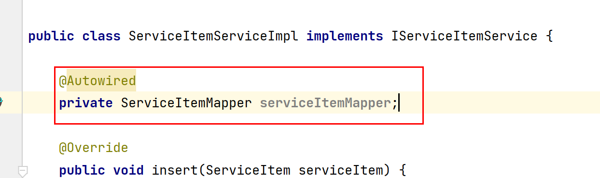

       - 完善方法

         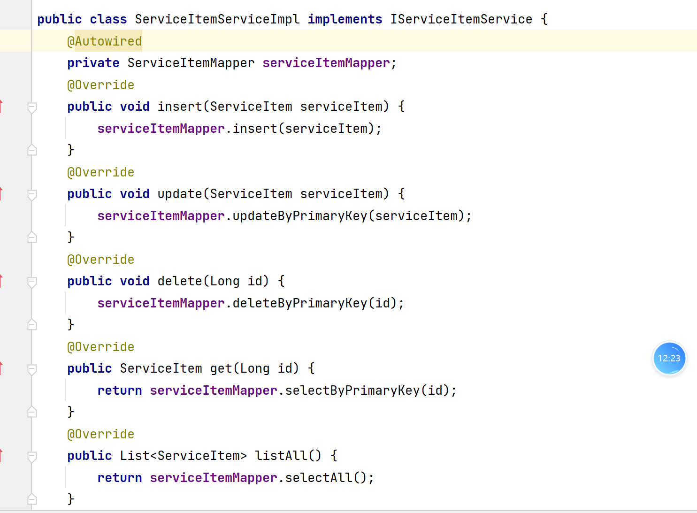

       - 最后我们需要将该对象交给 Spring 容器管理IoC。

         - 想把当前类创建的对象交给 Spring 容器管理。我们也需要贴对应的注解。这4个注解功能都是一摸一样的。只有语义化的区别。
         - 需要注意：所有的 IoC 注解都需要贴在类上。
           - @Controller ： 贴在控制层的
           - @Service：贴在业务层的
           - @Repository；贴在数据持久层的（由于我们使用的是 Mapper 接口方式，所以不用贴）。
           - @Component：若不属于三层架构中的某一层。那么我们可以直接使用这个注解

         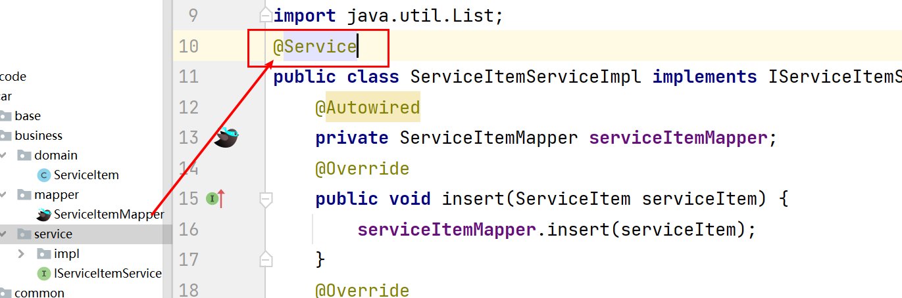

### 四、关于生成实体类问题

 1. 找到我们的实体类

    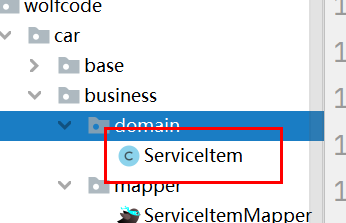

	2. 修改实体类。参照我们的讲义来修改。

    - 讲义中的实体类为我们提供了一些常量及默认值。供我们直接使用。导入后 @Setter 和 @Getter 都是红的。只需要在后面敲击 Alt + Enter 。选择 lombok 包的即可。

      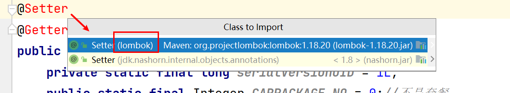

    - Data 同样选择  Java.util 包下的

      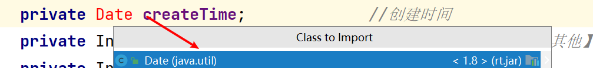

    - @Setter @Getter 本质上是我们导入依赖中的 Lombok 插件的功能。

    - 其功能可以自动帮我们生成 Getter 和 Setter 方法。

      - 好处：若我们增增加字段或减少字段的情况下。他会自动帮我们增加或减少 Getter Setter 方法。

### 五、Controller 控制层书写。

 1. 创建包 controller 。

    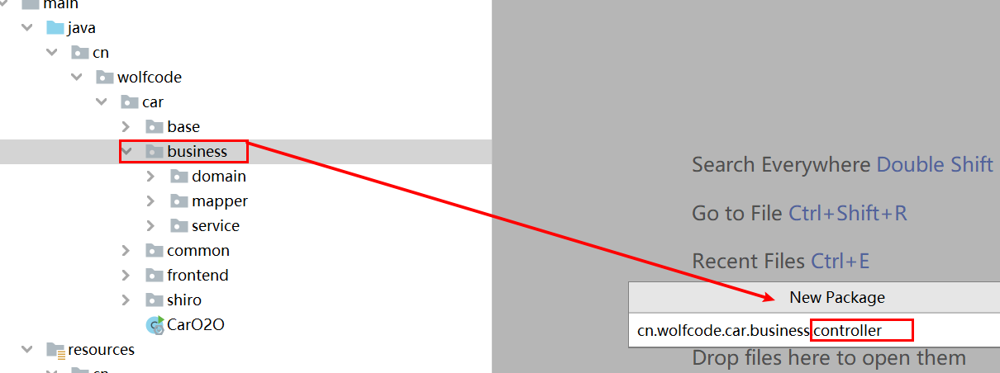

	2. 创建类。 该 Controller 的命名规则为 模块名 + Controller 结尾。

    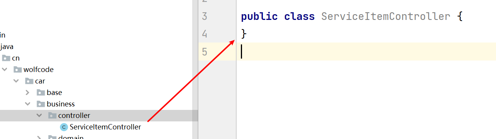

	3. 我们将 Controller 交给 Spring 容器所管理。

    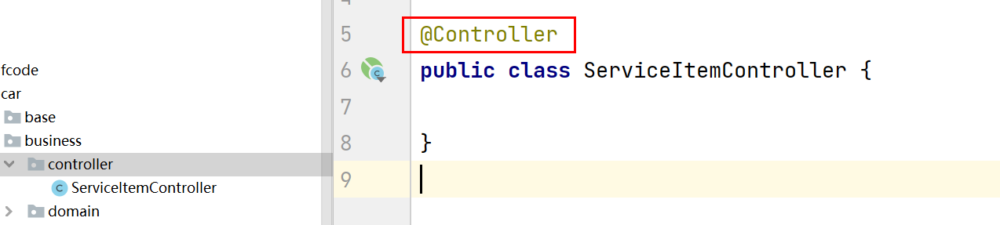

	4. 书写控制器方法，用来接收用户的请求。

    	1. 我们需要展示的是 养修服务单项列表页面。那我们就需要看前端发起的请求路径是什么。（本次项目我们不专注与前端代码的书写。只需要简单的可以看懂即可）。
    	2. 导入前端页面。（老师第一天给的资料中 templates-参考 中） 将 business 文件夹内的内容都考入到我们 项目中的 business 文件夹中。
    	3. 名字与我们模块对应的就是其对应的前端页面
        	1. 一般列表页面都叫 list.html
        	2. 新增页面叫 add.html
        	3. 编辑页面 edit.html
    	4. 建议大家把 target 文件夹删除。重新启动程序。（target 文件夹就是编译后的文件夹。由于我们考入了大量的资源文件。IDEA 很可能加载不进去。所以我们删除这个文件夹让其重新编译加载）。

    5. 成功启动程序后，我们登陆后选择 业务功能 --> 养修预约服务 --> 养修服务单项     发现页面找不到 404 状态。

    6. 在当前浏览器页面中，右键 --> 检查。 选择 Network（若是中文的选择网络）。

       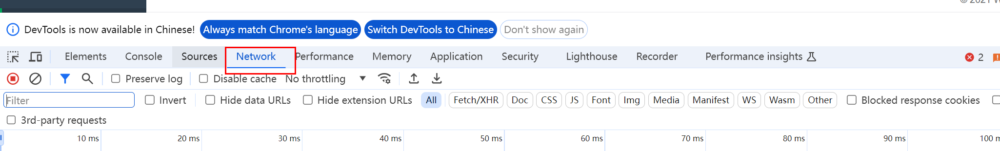

    7. 刷新页面

       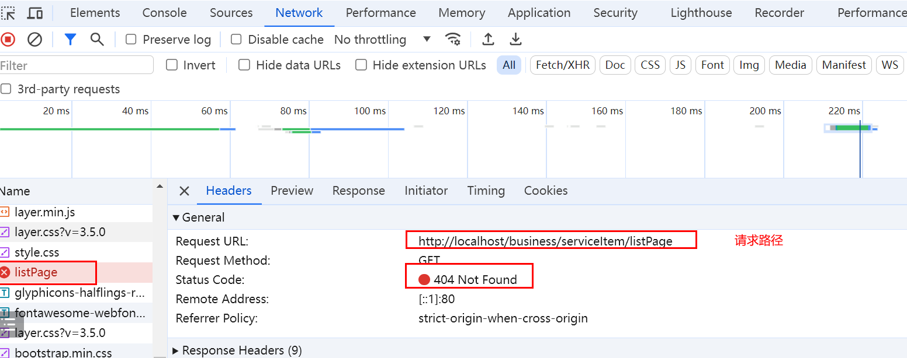

    8. 回到 Controller 中。在 Controller 上面贴上 @RequestMapping("一级路径")。

       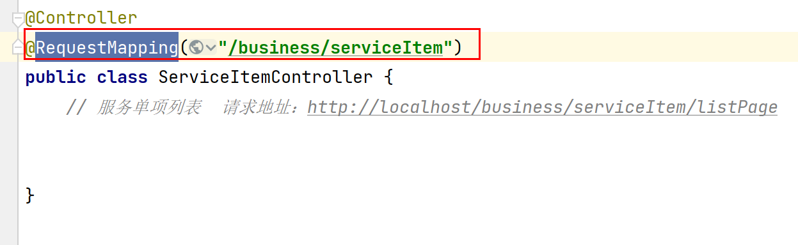

       - @RequestMapping("请求路径") ： 是 SpringBoot 中的注解。（本质上是 SpringMVC的注解）。由于我们使用的是 SpringBoot 项目，那么 SpringBoot 就将 SpringMVC 一并加载进来了。

         - 功能：请求的映射路径若与其匹配。则在到该 Controller 中匹配二级路径。若匹配则执行该方法

           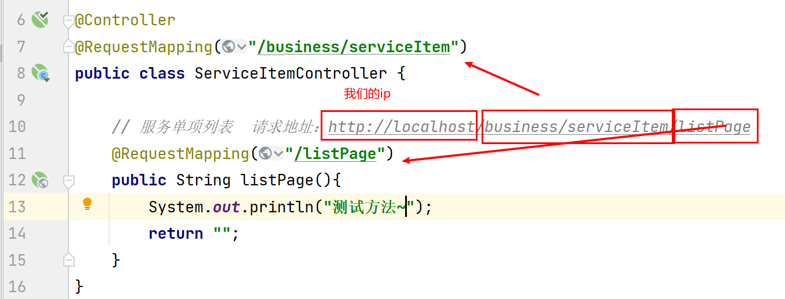

         - 通过测试确定就能访问到我们 Controller 中了。

           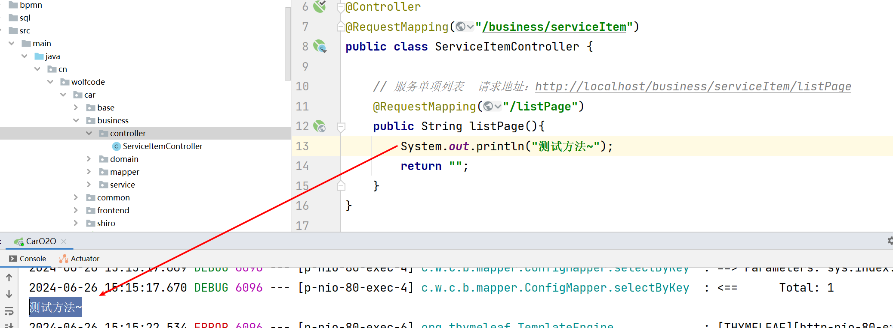

六、养修预约服务列表展示

 1. 需要在 Controller 进入到 列表页面.

    - 在 SpringBoot 集成了 Thymeleaf。那么会默认集成他的 视图解析器（根据逻辑视图名就可以找到具体的视图文件。框架底层的代码，他会自动去找并不需要我们书写。但我们需要提供逻辑视图的地址。例如：templates/business/serviceItem/list.html）在 Thymeleaf 中已经默认为我们提供好了 前缀 /templates/  和   后缀 .html

    - 由于我们同一个模块中都有好几个页面。那么每次都写前面的前缀比较麻烦。所以我们可以定义一个公共的前缀。供这个模块中所有的方法使用。

      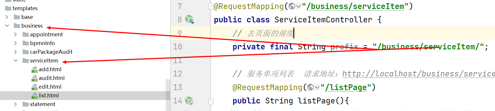

    - 我们就可以在 listPage 方法中直接去到养修服务单项页面

      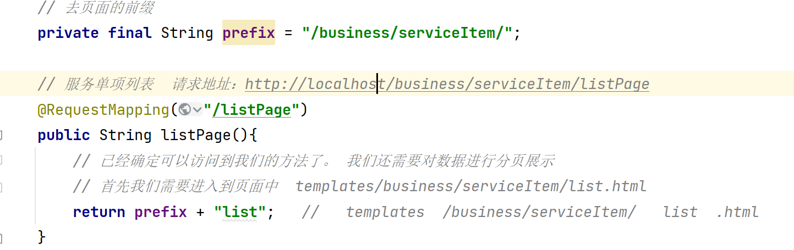

    - 这样我们就可以成功到 养修服务单项的列表页面了。 但是进入后会提示错误。那是因为页面中需要的是数据我们并没有提供。接下来我们就准备去为该页面添加数据。

	2. 我们发现页面中报错是因为我们没有提供所需要展示的数据及分页的信息。

    - 我们通过查看浏览器，发现有一个 query 方法。用来请求页面数据。该方法我们只需要返回数据即可。

    - 我们创建 Query 方法用来接收用户分页展示数据的请求。

      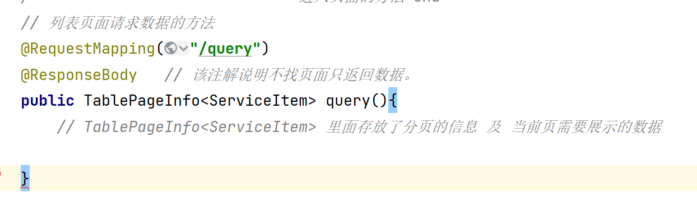

    - 调用 ServiceItemService 来处理分页请求。那我们就需要先注入 IServiceItemService

      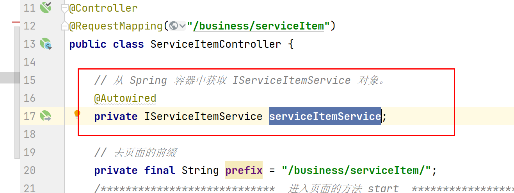

    - 使用 IServiceItemService 的对象来调用业务层方法来处理请求。同时接收请求参数

      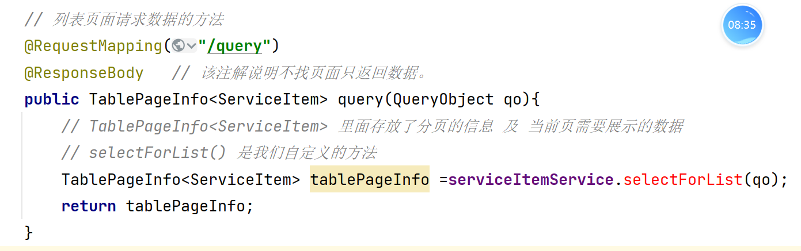

    - 在 IServiceItemService  中创建 selectForList(qo) 方法来处理展示分页数据。在 红色的 selectForList(qo) 方法后面 Alt+Enter。选择第一个

      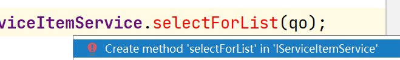

      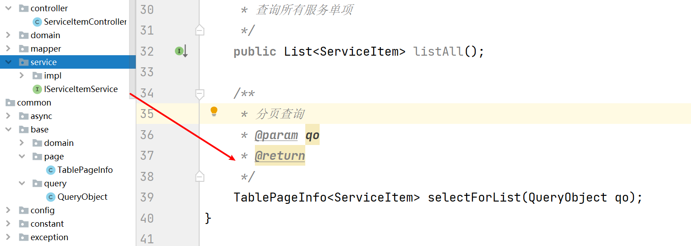

    - 创建接口后，接口只是一组规范，那真正能实现功能的是接口的实现类。所以我们接下来去实现类中实现这个方法。在红线后面 Alt + Enter

      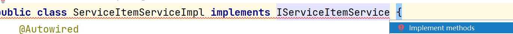

    - 做业务处理。

      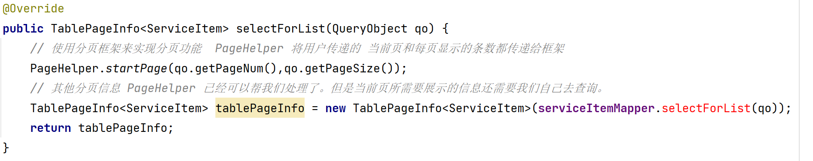

    - 调用 Mapper 持久层来帮我们去数据库中查询当前页所需要展示的信息。但是分页框架可以帮我们自动进行分页过滤。所以我们只需要提供好查询的 sql 即可。

      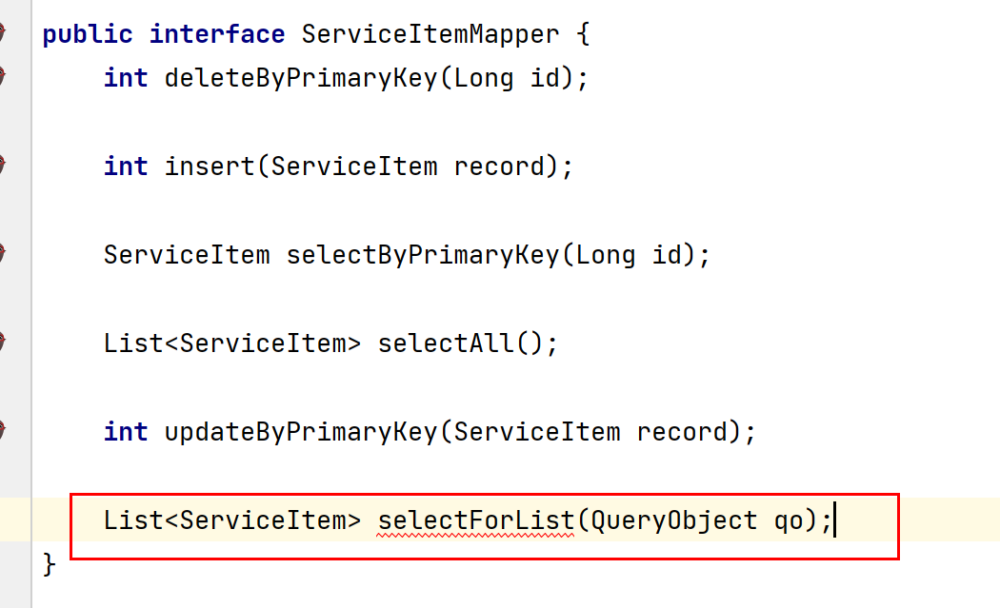

    - 在 Mapper 接口生成方法后。我们需要在方法名的红线上 Alt+Enter  选择第一个（生成 SQL 传输语句）

      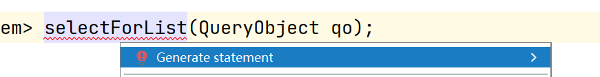

    - 到 ServiceItemMapper.xml 文件后。若查询的返回值是我们对象类型。那么一定要改为 ResultMap。因为我们的实体类名字与数据库中的字段名是不一致的。必须通过 ResultMap 映射才能进行自动封装。

      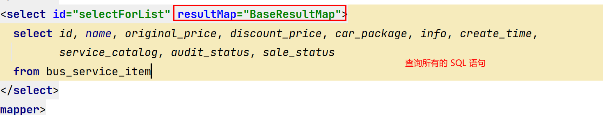

    - 此时我们的代码书写完毕。

    - 重新启动程序，进行测试看是否能看到页面中内容。

      

      