### 一、高级查询

- 什么是高级查询？
  - 所谓的高级查询，本质上就是按照条件查询、检索。
- 这些条件用户是有可能传递也有可能不传递的。
  - 若用户传递了这些条件，那我们在查询展示数据时，就应该按照这些条件去检索。
  - 若用户一个条件都没传递，那么我们则应该将所有数据都查询出来。
  - 也就是说用户的条件是动态传递进来的。根据用户传递条件的多少。我们的 SQL 语句中最终就要添加多少个条件。

- 代码思路：

  1. 我们需要定义一个类，来接受用户传递的条件。
  2. 依次向下传递  Controller --> Service --> Mapper --> 通过 Mapper.xml 文件中的 SQL 语句 --> 数据库（最终实现数据查询）。

- 代码书写

  1. 定义一个类。这个类用来接收用户传递的条件同时，展示数据的时候还需要分页处理。

     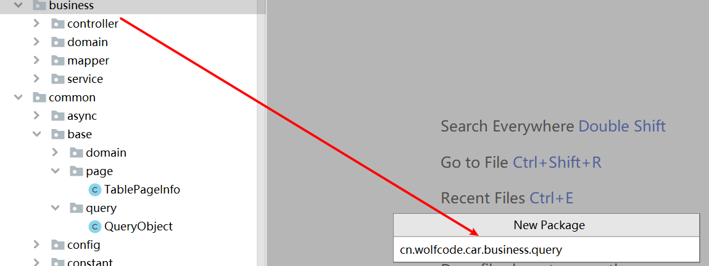

     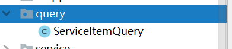

  2. 为其贴上 Lombok 注解  @Getter @Setter 以便于框架反射来设置及获取我们的属性值

     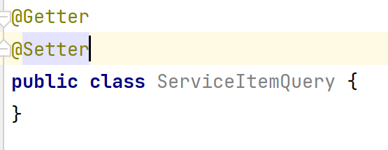

  3. 在类中定义高级查询的属性。由于我们后台提取值是根据前端的 name 属性获取。所以我们在定义这些属性时需要与前端 name  名字一致。

     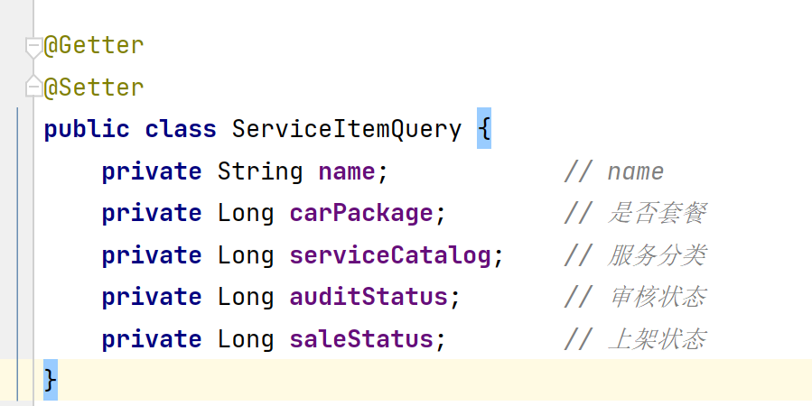

  4. 该类中只有高级查询数据，但是分页数据无法封装。但我们又定义过一个 QueryObejct 类专用于存储分页信息。所以我们可以使用当前的高级查询类来继承 QueryObject 类。这样这个类就既有了高级查询的属性又可以获取到继承的父类 QueryObejct 中分页的属性。

     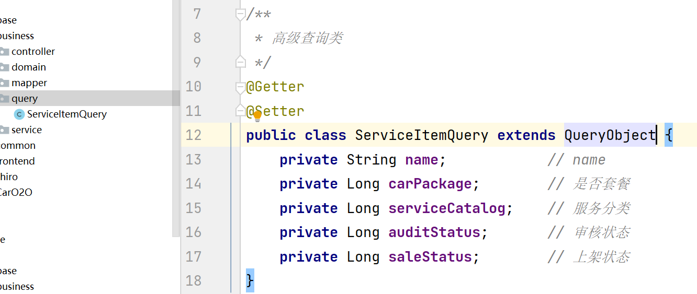

  5. 在 Controller 修改接收的参数为我们定义好的高级查询对象 ServiceItemQuery

     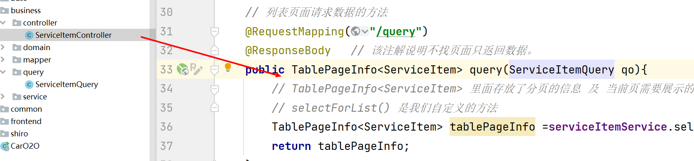

  6. Service 和 Mapper 都不用修改。只需要在 Controller 中能接收到即可。因为 QueryObject 是 ServiceItemQuery 的父类。所以在传递时。本质上使用了 Java 中的多态。那么在运行期间就是子类的实例。所有的参数都可以一并接收到。

  7. 在Mapper.xml 文件中。由于这些条件有可能传递，也有可能不传递。所以我们需要使用 MyBatis 中的 动态 SQL 来做高级查询。

     - \<where>...\</where> 
       - 当存在条件时，会自动帮我们添加 where 标签。若没有条件时则不添加。
       - 会帮我们去掉第一条 SQL 中的多余的 and
     - \<if test="条件">...\</if>
       - 在 if 标签体内的条件。若在 test 中判定若条件为真。才会拼接这条 SQL 语句。否则不添加。
       - test：里面只能判断是否为空。
         - 若不为空，则帮我们添加对应的 SQL 语句。
         - 若为空，则说明这个参数用户没有传递。则不添加该条 SQL 语句。
       - test 中：只能判断是否为 Null。其次若是字符串类型。我们还需要判定不为空串 != '''

     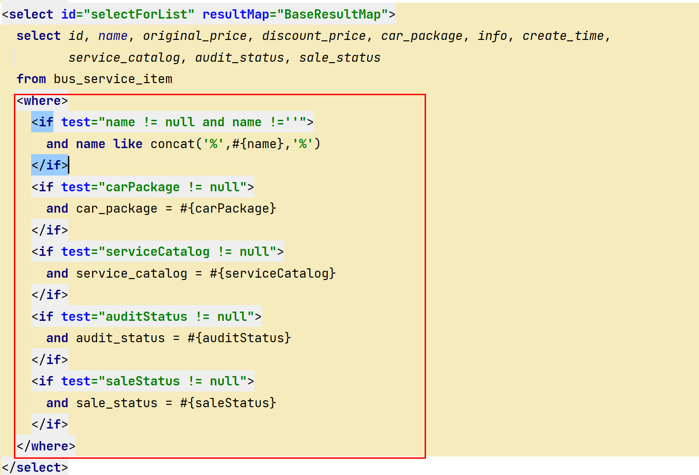

  8. 进行代码测试。高级查询测试。

  9. 页面 Bug。由于是否套餐不展示我们需要去实体类中将 carpackage 改为 Integer 类型

     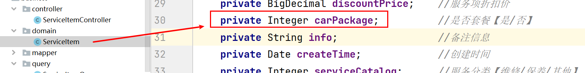

### 二、新增功能

 1. 点击新增后。不是我们预想的页面。而且出现了 404.

    - 404 状态码：代表没找到对应的资源。（一般来说就是路径问题）。

	2. 找到路径的方式：

    	1. 打开浏览器。右键 --> 检查-->Network

        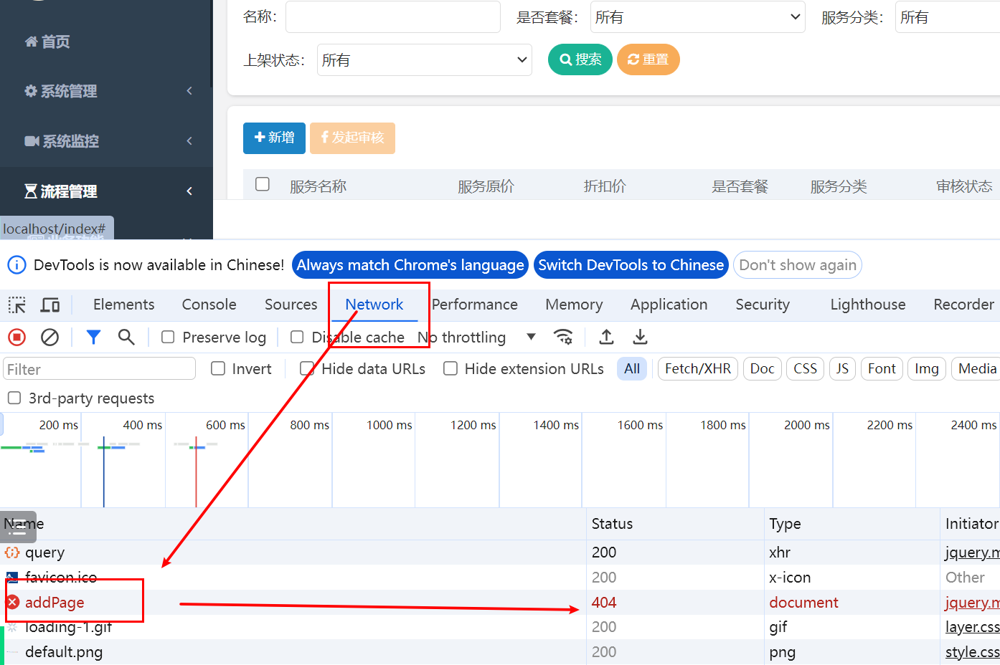

    2. 我们可以找到对应的前台页面。找到新增按钮。发现其调用了一个 operate.add() 方法。

       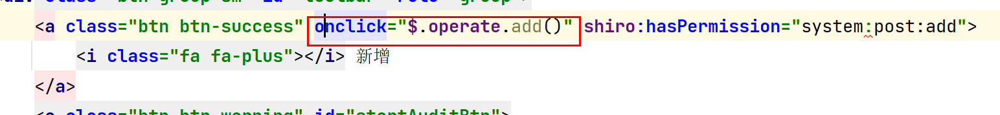

       - add 方法对应的路径在下面若依对其进行设置中。

         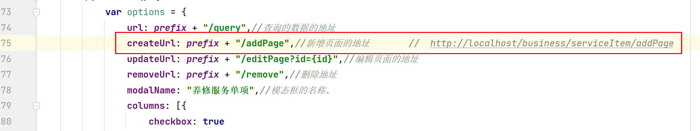

    3. 这样我们就找到了去新增页面请求的地址。我们就可以到对应的 Controller 中接收用户发送的新增请求。并作页面跳转

       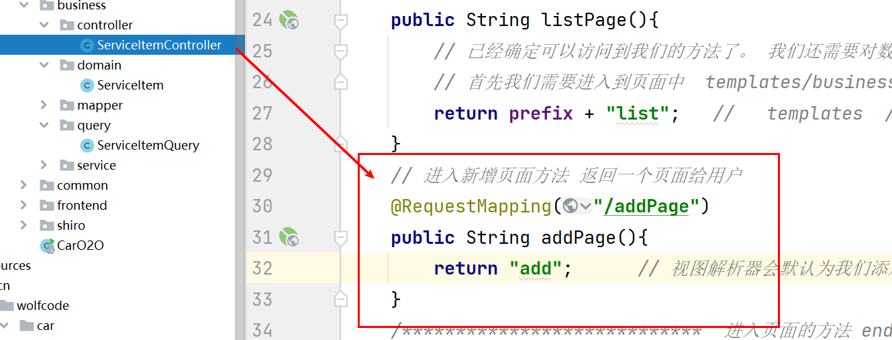

    4. 此时当我们重新启动程序后，会发现弹框中从 404 --》 500

       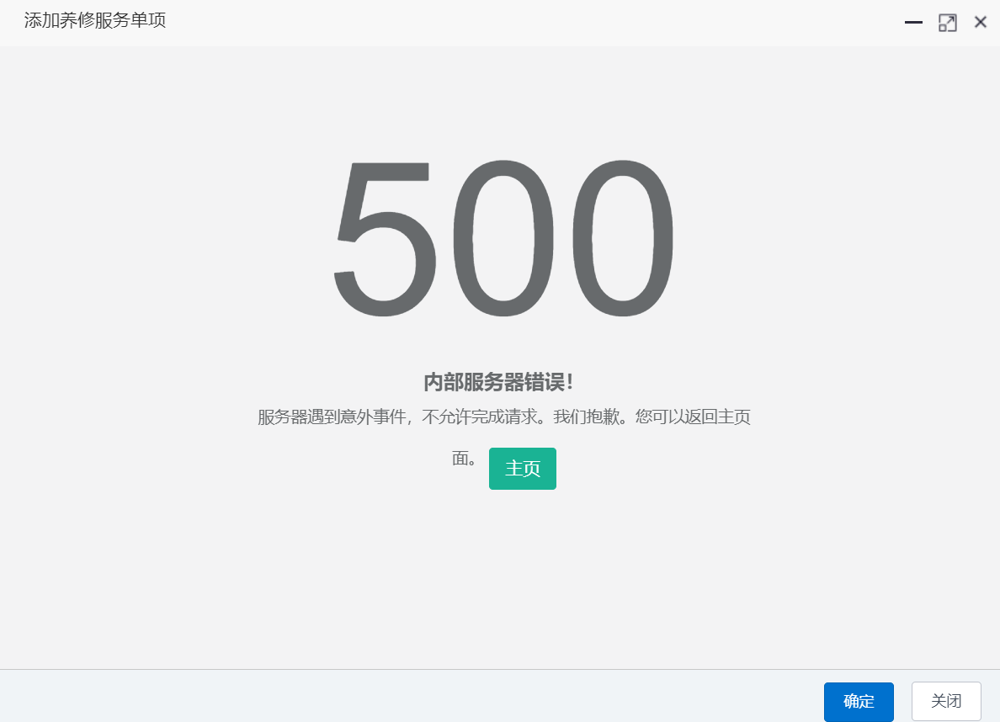

    5. 500 状态码代表服务器中有代码出现异常。需要程序员们及时来处理。通过错误查找发现我们返回值写错了。

       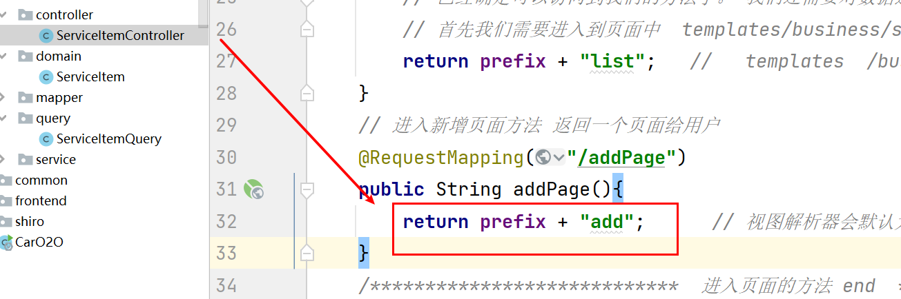

    6. 再次测试我们可以看到新增页面

    7. 在新增页面中当我们填好数据后。点击保存会发送一个请求  http://localhost/business/serviceItem/add

    8. 在 ServiceItemController 中增加方法来处理用户新增的请求。用户在前台输入的内容是以参数传递过来的。我们该方法就要接收用户的请求。并返回统一返回对象 AjaxResult（稍后讲解）。

       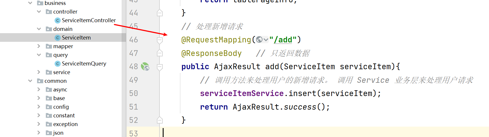

    9. 那调用业务层来处理请求，我们来 ServiceItemServiceImpl（一定是到实现类中来处理请求）。由于前台并不知道我们具体的创建时间，所以我们需要将 createTime 属性设置值。值就是当前的系统时间。之前我们使用 MyBatis 逆向工程已经将基础的 CRUD SQL 已经生成了。所以直接调用即可。

       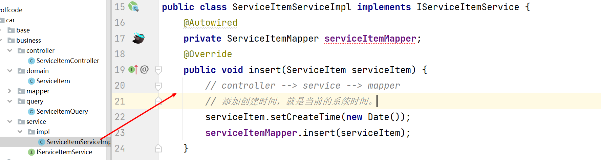

    10. 这样我们的新增功能就实现了。测试时需要将页面和数据库都查看一下。确定数据都加上了才是新增成功

        