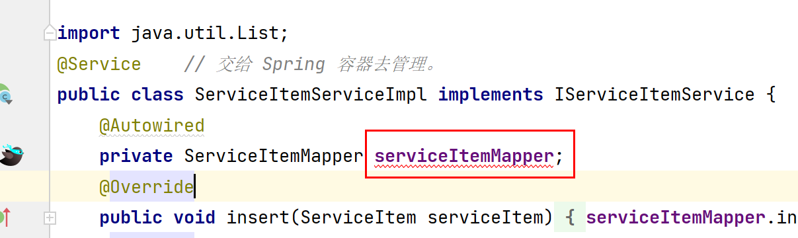
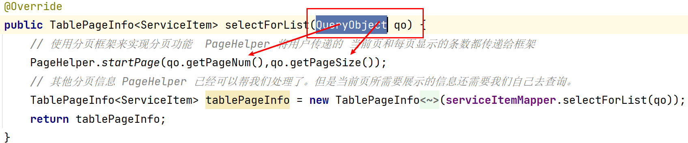
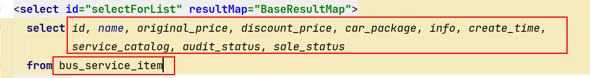

### 一、SpringBoot 框架

- 主要的作用就是快速构建 Spirng 框架的框架。
- 特点：
  - 起步依赖：可以帮我们系统的管理依赖。同时帮我们管理依赖相关的版本号。
  - 自动装配：基于约定优于配置。SpringBoot 默认与我们约定好装配了一些默认配置。若我们不需更改。则 SpringBoot 会自动帮我们将这些配置都一并配置好。

### 二、Spring 框架

- Spring 框架：主要有两大思想。最终的目的是简化开发。解除程序之间的耦合度。
- Bean：被 Spring 容器所管理的对象我们都称之为 bean
  - IoC/DI：
    - IoC：控制反转。让我们将对象的控制权转交出去。交给 IoC 容器统一管理。他可以帮我们创建对象并管理对象的生命周期。
    - DI：依赖注入：在创建对象的过程中，若该对象需要容器中的另一个对象或其他属性值。则使用 DI 思想实现注入。
  - AOP：
    - 切面：横向性关注点：可插拔式的组件。我们需要时就将这个组件插入，不需要则拔出。
  - 我们可以把 Spring 看作一个容器。他可以帮我们创建对象，并注入该对象所需要的属性值。当我们想使用对象时。直接从 Spring 容器中将其拿出来即可。
- Spring 框架中的常用注解：
  - @Component：贴在类上，就是将为该类创建对象，并将该对象交给 Spring 容器管理。
  - @Controlelr：他是由 @Component 演化而来。与 @Component 注解功能一致。只不过更加语义化。代表该类为控制层。
  - @Service：他是由 @Component 演化而来。与 @Component 注解功能一致。只不过更加语义化。代表该类为业务层。
  - @Repository：他是由 @Component 演化而来。与 @Component 注解功能一致。只不过更加语义化。代表该类为持久层。
    - 创建对象后存入 Spring 容器中的名字，就是该类的类名首字母小写。
  - @Autowired：贴在属性上面（该属性一定不要new）。就说明从 Spring 容器中将该类型的对象。先按照类型。若类型一致在按照名字将其从 Spring 容器中拿出来。
  - @Transactional：该注解贴在方法上，说明该方法需要事务管理。
    - 事务：将多条增删改语句。作为一个最小的执行单元。要么一起成功，要么一起失败。
- 总结。Spring框架就是可以帮我们创建对象。组装对象。管理对象的一个框架。优势就是解除程序之间的耦合度。加速开发。同时若我们程序中还需要其他的框架。那么其他框架中所需要的对象也都由 Spring 帮我们创建并管理。（如何创建的？那就是 SpringBoot 为我们提供的好处了。自动装配的同时就可以帮我们把其他框架所需要的对象一并创建出来。并交给 Spring 管理。前提是需要导入可以自动装配的依赖才能够帮我们实现自动装配）。

### 三、SpringMVC 框架

- SpringMVC 框架本质上就是 Spring 中的一部分。他主要负责与 WEB 端做交互。大家可以理解为他就是对 Servlet 的二次封装。
- 作用：就是加速 WEB 端的开发效率。（控制层 Controller）
  - 优化了接收参数  : 简单类型 、数组、集合、自定义对象类型、日期类型 都可以直接接收。SpringMVC 内部的处理器适配器就会帮我们把参数进行封装。其实本质底层还是执行那些原始代码。只不过不用我们在自己写了而已。
  - 优化了响应数据：
    - 若响应页面：我们可以直接使用视图解析器帮我们定义好需要的前缀名、后缀名。让我们找页面变得更加简单。
    - 若直接响应数据（JSON）：他可以直接将数据返回，不在需要使用 Response 对象。在设置响应头响应体了。
- SpringMVC：常用注解
  - @RequestMapping("/映射路径")
    - 若该注解写在类上。那么该映射路径就可以找到对应的类（二级路径使用）
    - 若该注解写在方法上。那么我们请求的路径就可以与 （“/映射路径”）做匹配。若一致则执行该注解下面的方法。来处理我们的请求
  - @ResponseBody：该注解的作用若我们不想返回视图页面。只想返回一些数据（JSON）。只要返回时不找视图，就一定要贴 @ResponseBody 注解。
  - JSON简介：他就是一组有格式的字符串。他是一种轻量级的数据交换格式。
    - 有点就是传输速度快。
    - 该字符串若写成 JS 对象或数组的格式。可以与我们的 Java 对象或集合想换转换。

### 四、MyBatis 框架

- MyBatis 框架是一个数据持久层框架。大家可以理解为他是对 JDBC 的二次封装。

- 作用：加速我们的数据持久层开发。不用再写那些繁琐的代码了。

- MyBatis：我们使用的是 Mapper 接口方式。（该方式也是以后大家工作中用的方式）。

- MyBatis 框架底层有一个拦截器。他会使用一种动态代理的技术。帮我们通过接口生成实现类。所以我们在写 MyBatis 时，只需要定好接口的规范。并不需要我们自己去写实现类。

  - 所以整个持久层只有接口。没有实现类。那么也就是没有位置去贴 @Repository 注解。

  - 我们在业务层调用持久层时。会出现红线的错误。

    

  - 该种情况就是因为这个实现类是由 MyBatis 帮我们生成的。生成后会将该对象存放到 Spring 容器中供我们使用。但是由于工具在我们的程序中并没有检索到这个 Bean。所以会抛红线。 （只有调用 mapper 接口时。注入的实现类对象出现红线才会有可能是正常情况）。

- 在 MyBatis 中 XXXMapper.xml 中

  - ResultMap  就是映射管理。
  - 映射
  - 表   --->    Java类

  - 一行记录 ——>  一个Java对象
  - 每一列  -->  一个Java 对象的属性
  - 若按照 id 等这些条件查询。若得到的结果是一个。则返回一个对象即可。
  - 若查询得到的结果是多个。我们就使用一个集合去接受。
  - 增删改不需要任何返回值。除非需要特定的判断。
  - 只要是查询就返回时就必须使用我们自定义好的封装规则  ResultMap。

### 五、分页框架简介：

- 后端分页框架。采用为 PageHelper。其特点可以自动帮我们实现分页。不需要我们在手动书写分页一些 SQL 命令这些。

- 但是他需要我们传递一些参数给他。他会自动帮我们计算总条数、上一页、下一页、总页数、等这些信息。

- 但是当用户选择查看第几页。或者每页最多展示多少条数据他并不知道。需要等待用户传递给我们。

- 所以我们需要定义一个类(QueryObject)来接受用户传递的 当前页（PageNum）、每页显示的条数（PageSize）。

- QueryObject 这个类专用于**分页参数**的封装。

- 所以我们需要在 Service 层中做业务逻辑时，将该参数传递进入。

  

- 他就会自动帮我们计算总条数。但是当前页所需要展示的数据还是需要我们自己去写 SQL 查询。但分页部分不需要我们写了。分页框架也会帮我们完成。所以在 XxxMapper.xml 中。我们只需要提供对应查询哪些字段。哪个表即可。

  

- 最终我们需要将所拿到的数据。（分页信息及当前页展示的数据封装起来。TablePageInfo 的对象中。响应给页面）。前端页面就会使用我们返回的数据(JSON)。渲染到页面上最终展示给用户。

### 六、若依脚手架

- 若依脚手架是现在比较有名的一款脚手架。他也可以帮我们实现开发的便捷。
- 作用：若依脚手架可以帮我们将一些基础代码及前台页面一并生成出来。即使将我们去公司。也会大量的使用脚手架。那若依就是一个不错的选择。
- 本次项目就是基于若依脚手架来实现的。只不过是一个若依脚手架的阉割版。
- 前台页面主要就是若依脚手架提供的。里面使用到的技术就是 boostrap-table。
- 我们前台页面展示使用的 Thymeleaf （前端模板引擎）。