### 一、统一返回对象 AjaxResult

	1. 若使用 SpringMVC 返回一个页面时，那么方法的返回值就定义为 String。然后将抛出视图解析器的前后缀后的名字写入即可。
 	2. 若使用 SpringMVC 返回的是一组数据时（JSON）。我们返回值类型就需要定义为需要返回对象类型。
     - 当我们点击保存后，本质上就是将用户前端输入的数据传递到后端。 由 Controller 控制层接受用户的请求（用户请求时所带的参数）。 --> 调用 Service 业务层方法来处理新增请求 --> Mapper 数据持久层。将用户前台传递的数据保存到数据库中。
     - 保存后其实本质上并不需要在进行一个页面跳转。因为前端若依框架就会帮我们动态将这组数据展示到页面中。所以我们只需要返回一个告诉他是否插入成功的消息即可。
     - 由于返回的类型种类很多。 自定义对象  ||  返回一个集合  || 返回一组错误消息啊 ||  响应状态码 等等... 若每一个方法都随意返回自己需要的数据。那整个项目的返回部分会显得非常凌乱。所以我们封装了一个统一返回对象 AjaxResult。 
     - AjaxResult 专用于前台发送 Ajax 请求，返回数据时使用。
     - Ajax 的请求返回的一定是数据（JSON字符串）。而不是页面。

3. 统一返回对象 AjaxResult 就定义了规范。可以返回的都有哪些。
   - AjaxResult 类内定义的属性
     - code ：响应状态：200代表成功 。 500代表错误。
     - msg：需要响应的内容（文字）：例如  -->  登录失败时我们给与用户提示 ： msg = "用户名密码有误"。
     - data：数据，服务端若需要向客户端返回数据。则封装到 data 属性中。
   - 除了定义了这些属性以外。 AJaxResult 中还定义了很多的方法供我们方便使用。这些方法的特点都是由 static 修饰。由 static 修饰的方法我们可以直接通过类型.方法名(形参列表 ...) 的方式直接调用
   - AjaxResult 类中大量的使用了方法的重载。
     - 主要针对
       - 成功时 success()  默认空参方法 --> "操作成功"
         - 返回消息
         - 返回消息、数据
         - 返回数据
       - 警告时 warn（)
         - 警告消息
         - 警告消息、数据
       - 错误时 error()
         - 返回消息
         - 返回消息、数据  默认空参方法 --> "操作失败"

### 二、关于编辑的逻辑

1. 编辑按钮什么时候可以使用？

   1. 首先上架的商品不可以修改。

      - 上架状态代表商品已经上架展示销售了。

      - 下架状态代表商品未再出售。

   2. 若不是套餐则可以直接修改。

   3. 若是套餐。

      - 套餐存在5种状态
        - 初始化：商品刚刚添加上，默认装为初始化。
        - 审核中：商品已经初始化好，商品的价格已经定好，并发起了审核。在等待审批的过程中。
        - 审核通过：商品已经初始化好，并提交了审批。并已经审批通过。可以进行销售了。
        - 重新调整：商品已经初始化好，并提交了审批。审批没有通过，不能进行销售。必须要重新调整（商品种类、价格）后。在重新发起审批。直到审批通过才可以进行销售。
        - 无需审核（针对于非套餐）：针对于非套餐的商品。不用审批直接可以进行商品的销售。
      - 可以修改：
        - 初始化、重新调整：可以修改。
        - 审核通过：可以修改。 --> 修改后我们要将器状态变为初始化。
      - 不可以修改的：
        - 审核中：不能修改

### 三、编辑功能实现

 1. 查看前端页面发起的请求。

 2. 几乎所有的编辑请求都需要做数据的回显。

    - 我们在重启中书写方法来接受用户请求。同时接受用户传递的 id 参数。

      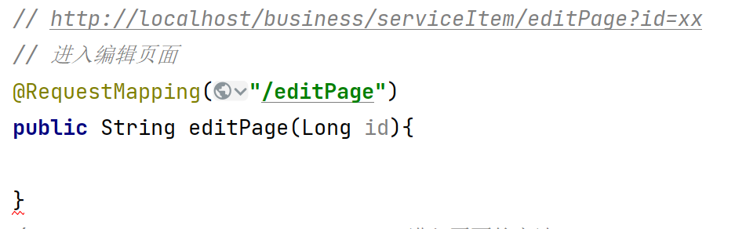

	3. 根据 id 查询出对象用于数据回显。

    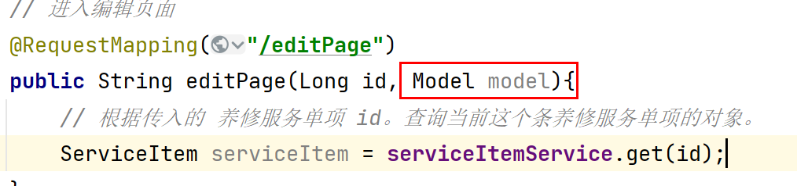

	4. 定义 Model 形参。 Model  的作用就是模型（数据）。其实本质页面展示的数据就是 视图 + 模型（数据）的渲染。

    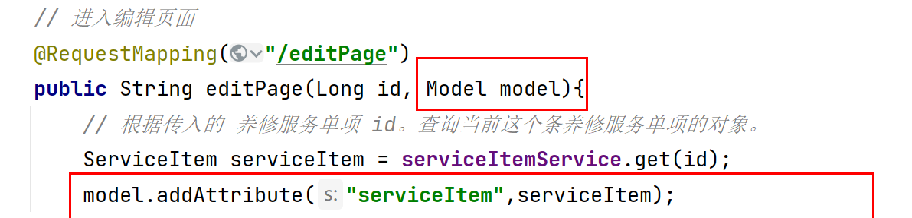

	5. model.addAttribute(Key,Value)

    - model 就可以实现将后台服务器的数据携带到前端做数据共享。
    - 前端页面根据对应的 Key 就可以拿到 对应的 Value 值。

	6. 最后响应到前端页面。前端页面就可以用我们共享的数据与视图进行合并渲染。最终将数据展示给我们。

    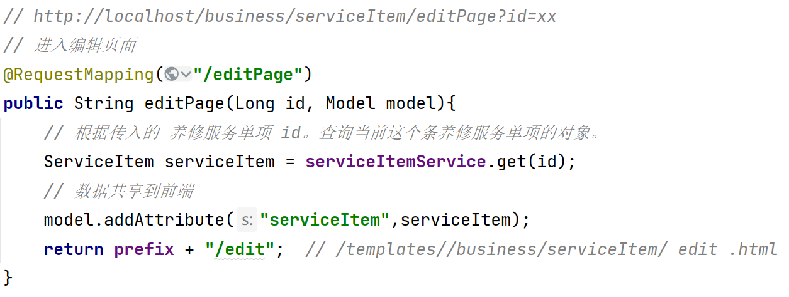

 7. 对于编辑。默认值的审核状态和上架状态是不能在这里面修改的。同时是否套餐也不能修改。能修改的值只有页面中可以看到的这五项。服务名称、服务原价、服务折扣价、服务分类、备注信息。所以会在后台我们需要重新编写一个 SQL 语句，而不能使用原始我们生成的 SQL 语句。

    - 因为若使用我们生成的 SQL 语句，那则是全字段更改。若存在一些别有用心的人。通过一些非法方式来为我们传递了不能修改项的参数。则会影响我们整体程序的安全。

 8. 当点击确定前端发起请求,我们就需要在  ServiceItemController 中接收用户的请求(同时接收用户携带的参数)。

    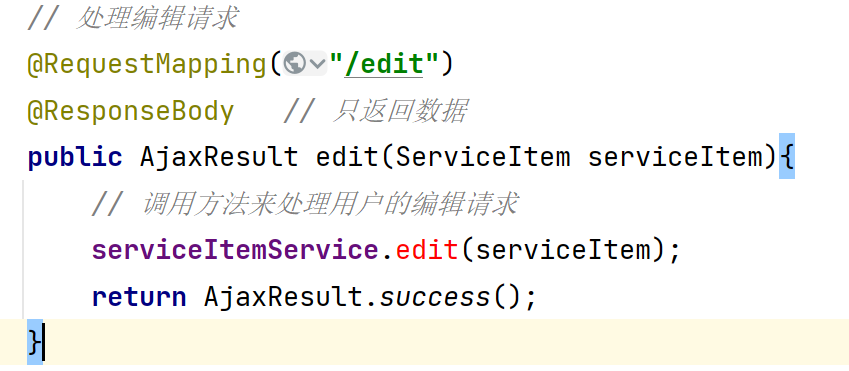

 9. 在 IServiceItemService 中创建对应的编辑方法

    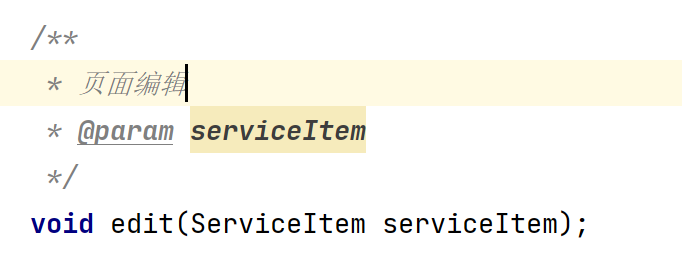

 10. 在 ServiceItemService 中创建页面编辑的实现方法。并完成业务逻辑

     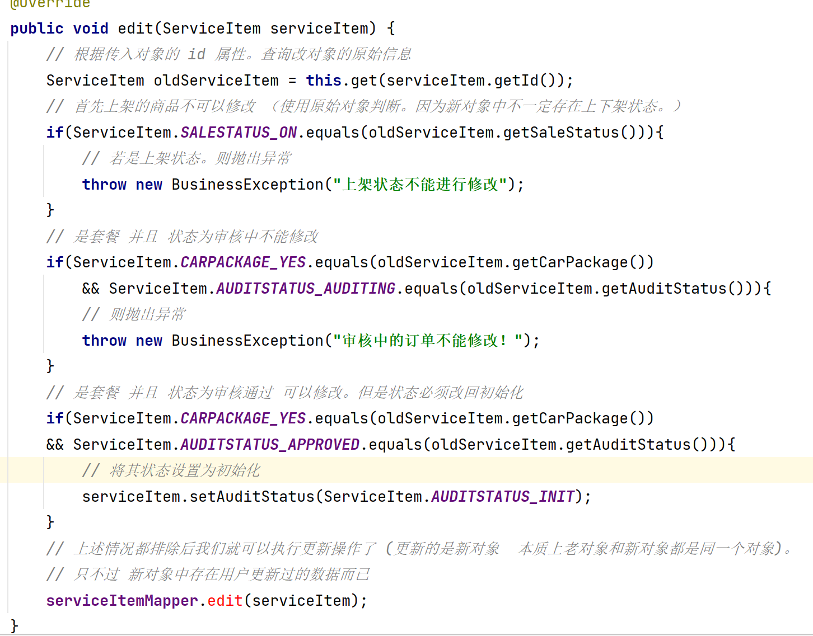

 11. 生成 Mapper 接口。（该方法只专注于修改前台传递的5个参数）。

     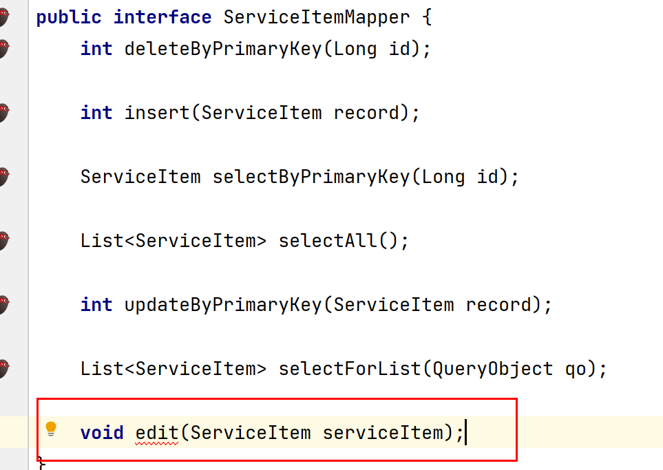

     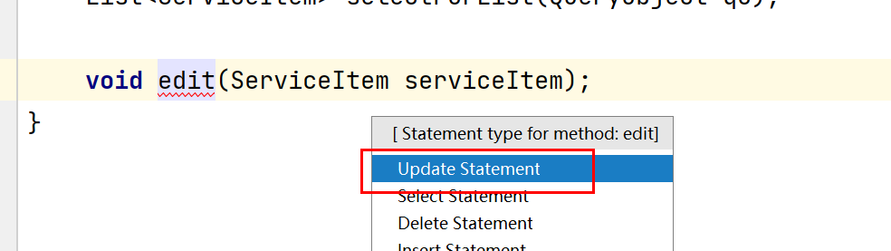

 12. 在 Mapper.xml 中书写 SQL 语句。

     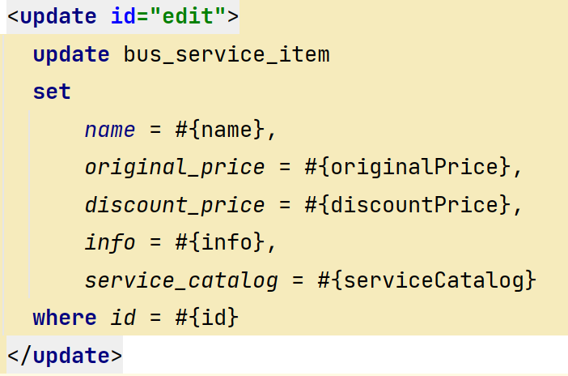

     13. 进行代码测试。

### 四、上架与下架功能分析

1. 上架
   - 商品必须为下架状态才可以进行上架的操作。
   - 商品分为是套餐与不是套餐
     - 若是套餐
       - 状态若为审核通过则可以上架。
       - 其他状态不能上架  （无需审核不算套餐）。
     - 不是套餐的商品可以直接上架。
2. 下架
   - 商品必须为上架状态才可以进行下架的操作。

### 五、上架与下架功能实现：

1. 当用户点击上架按钮时发起请求。后台 ServiceItemController 中接收用户请求。同时接收用户携带的 id 参数。

   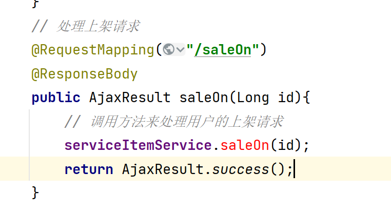

2. 创建 IServiceItemService 接口。并创建方法。

   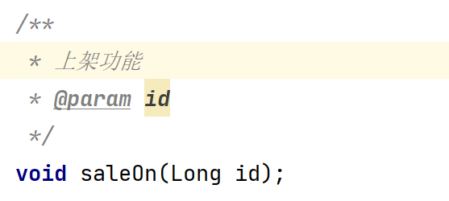

3. 编写 ServiceItemServiceImpl 实现类中的方法。

   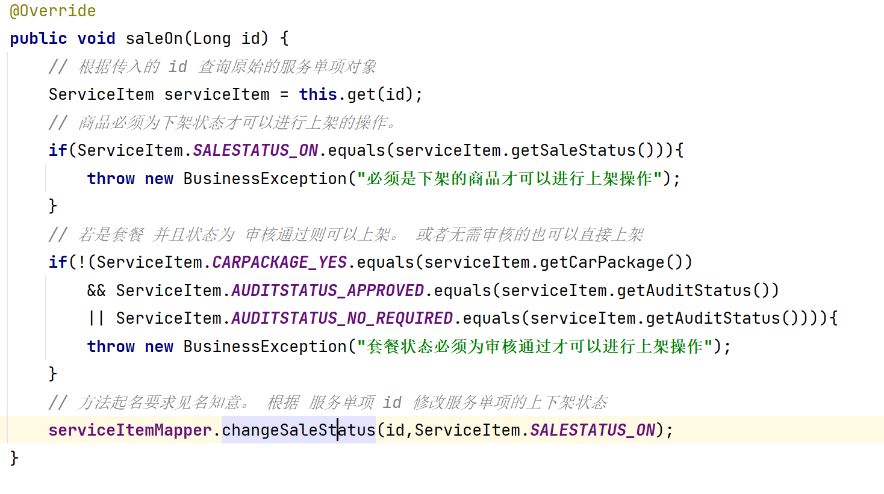

4. 生成对应的 ServiceItemMapper 接口。 此时我们的接口有多个参数（大于1个我们都称之为多个）。Mapper 接口的特性。他想接收多个参数。就必须使用 @Param("属性名")   属性名叫什么。在传入 Mapper.xml 文件中取值时就用什么名字取。

   - 我们快捷生成的方式就是在红线处，Alt + Enter 。前提是必须安装 MyBatisX 这个插件。

   **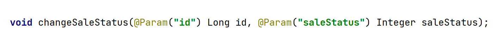**

5. 到 ServiceItemMapper.xml 文件中书写对应 SQL （名字必须一致）

   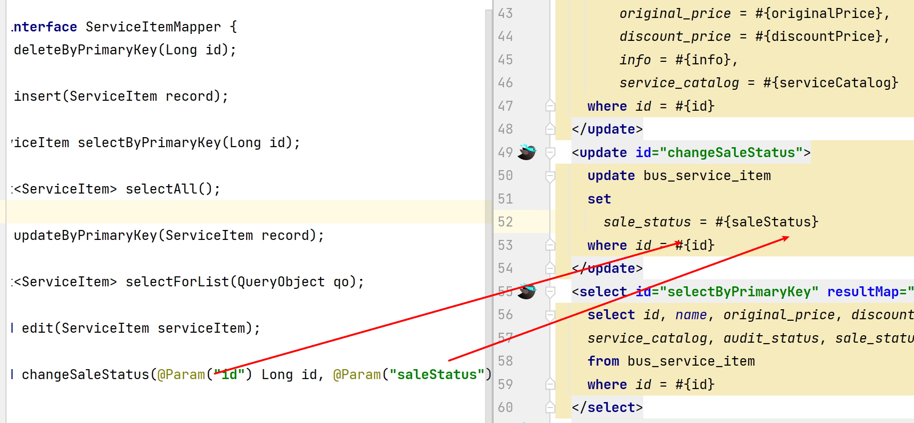

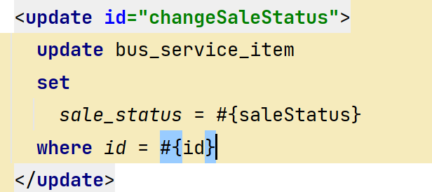

6. 测试完成。