### 一、养修服务单项中的下架功能：

 1. 必须是上架的商品才可以进行下架操作。

 2. 通过查看前台页面。我们找到了下架按钮。并找到其对应的单击事件中的方法。本质上就是发了要给 get 请求。同时携带养修服务单项的 id 作为参数。

 3. 我们就需要在 ServiceItemControler 中接收用户请求同事接收用户请求携带的参数

    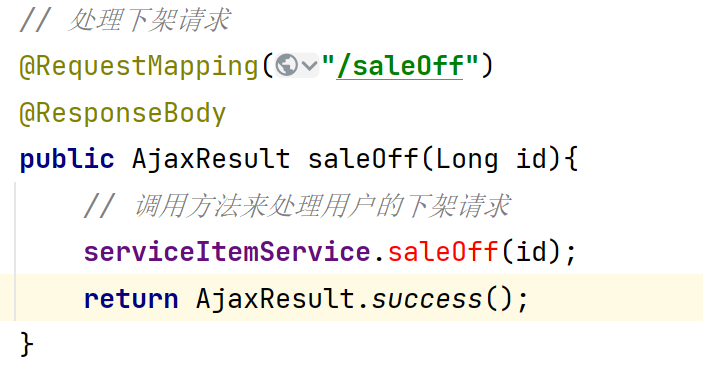

 4. 在Service层创建口。创建 IServiceItemService 中的下架方法。

    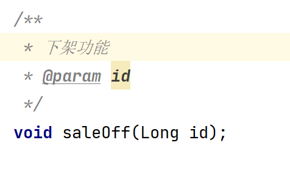

 5. 在 ServiceItemServiceImpl 实现类中书写下架逻辑及代码实现。

    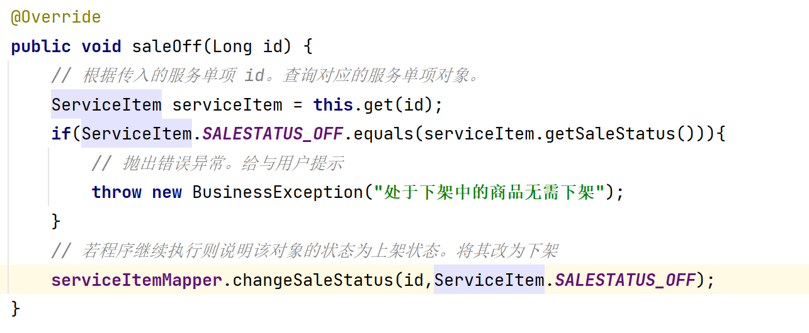

 6. Mapper 层在之前上级时该逻辑就已经写过了。直接调用对应的方法即可。

### 二、养修预约服务单分析

- 在实体类中。我们可以看到这么集中状态
  - 预约中：用户还在预约期间没有到店中来呢。
  - 已到店：用户预约了，并且信守承诺，在指定的时间来到了我们店中。
  - 用户取消：用户可能由于某些事情耽误了。用户主动打电话给我们，通知我们将该预约单取消。
  - 超时取消：用户在预定时间内并没有到店，但是也没有通过任何形式来告知我们（放鸽子）。一旦过了预约时间后。该用户的时间会自动改变为超时取消。
  - 已结算：用户已经挑选好商品了。进入到结算页面。（但是此时并没有付款）。
  - 已支付：用户已经将钱交给我们了。

- 编辑按钮
  - 在状态为预约中的情况下才可以使用。其他状态都不可以使用。
- 到店按钮
  - 在状态为预约中的情况下才可以使用。其他状态都不可以使用。并且将状态修改为到店。
- 取消按钮
  - 在状态为预约中的情况下才可以使用。其他状态都不可以使用。并且将状态修改为用户取消。
- 删除按钮
  - 在状态为预约中的情况下才可以使用。其他状态都不可以使用。
- 结算单（将后续功能实现之后我们才可以完善他。）

### 三、养修预约列表实现

 1. 使用 MyBatis 逆向工程根据表 appointment 将对应的实体类、Mapper接口和 Mapper.xml 文件生成出来。由于我们使用的都是同一个库同一个项目中的同一个模块。所以文件都是存放到一起的。我们只需要改 表名和 生成的实体类名字即可。

    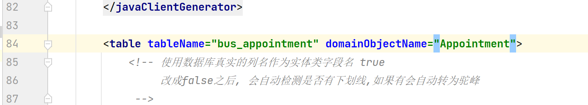

 2. 双击我们的插件。（注意双击依次即可）

    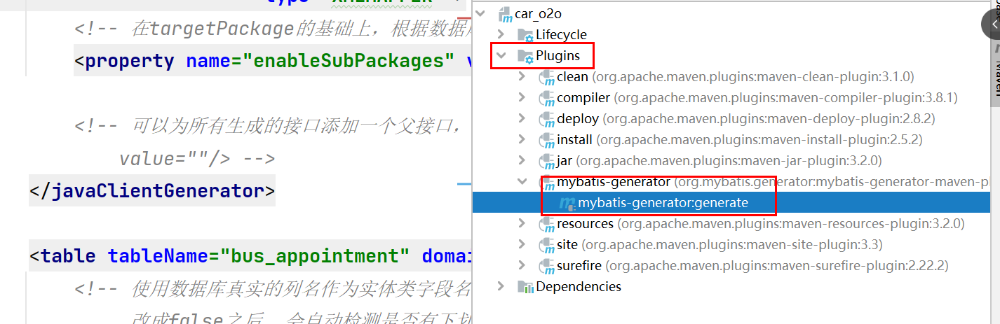

 3. 查看项目是否帮我们生成了对应的 实体类、Mapper接口、Mapper.xml 文件。

    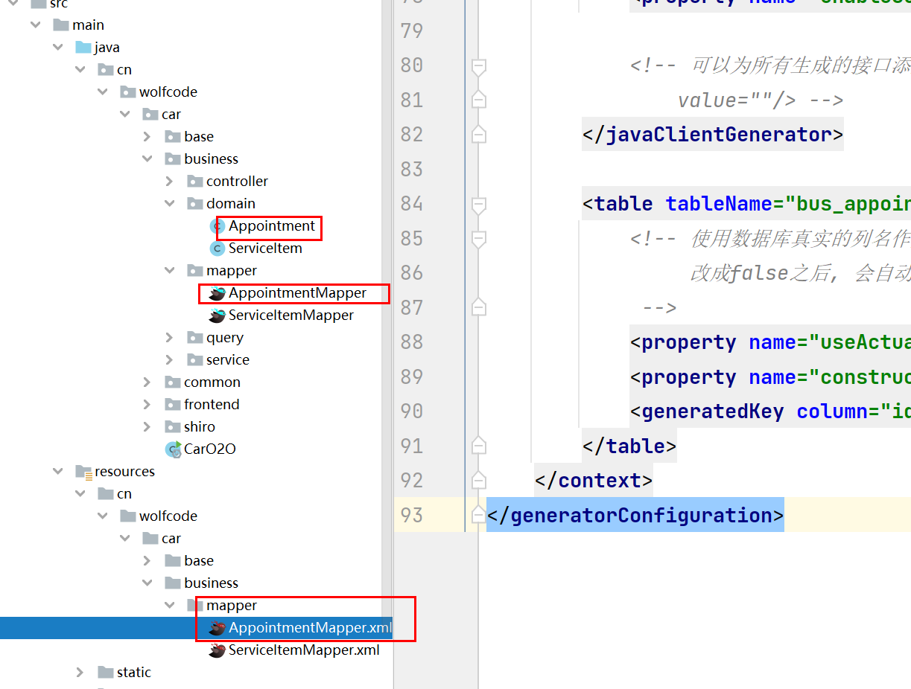

 4. 由于我们的实体类中有一些常量值的存在。所以我们使用文档中的实体类来替换掉我们的实体类。

 5. 创建养修预约服务接口  IAppointmentService。在内部添加对应的 CRUD 方法。

    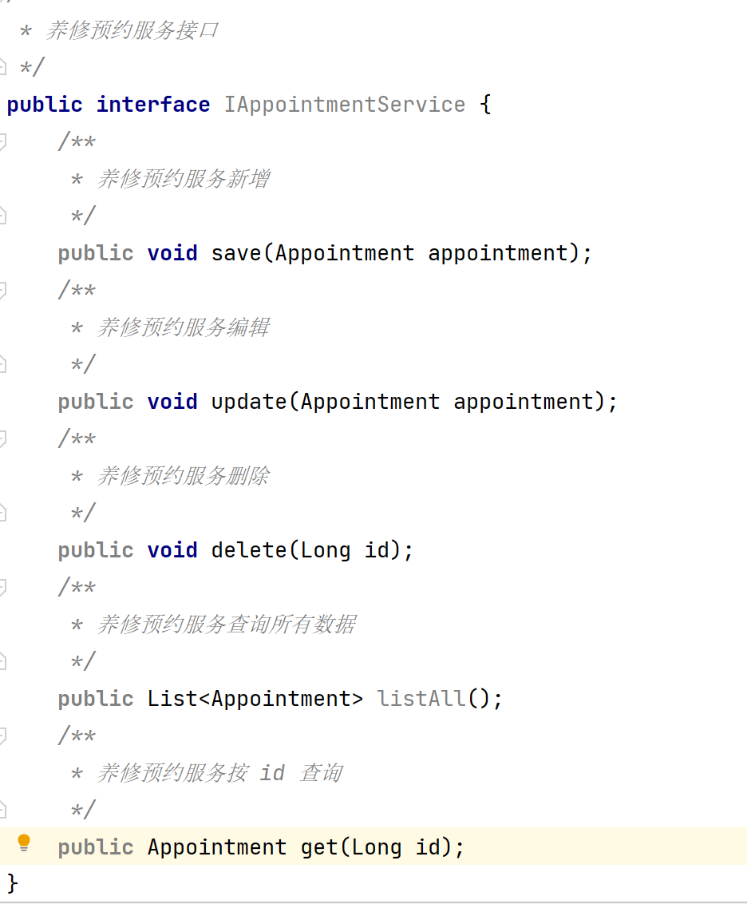

 6. 在 service -> impl 包中创建实现类 AppointmentServiceImpl 。并实现对应方法的基础CRUD逻辑。

    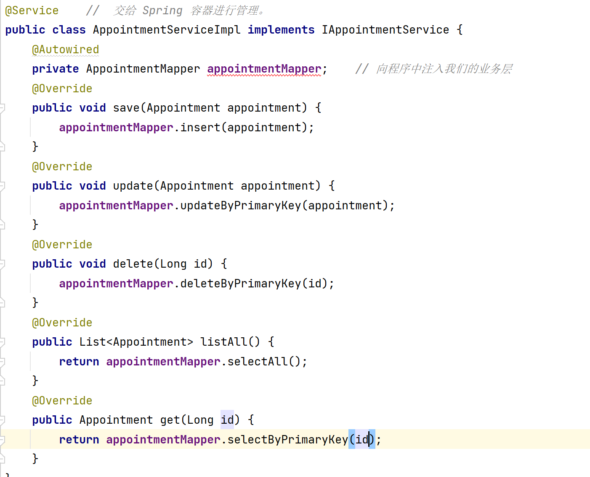

 7. 创建 AppointmentController 用来接收用户的请求并同时接收用户请求携带的参数。通过我们程序的页面请求发现路径为  http://localhost/business/appointment/listPage 。那我们就需要将 Controller 做二级路径。及返回页面的前缀。同时完善进入 养修预约列表页面的逻辑。

    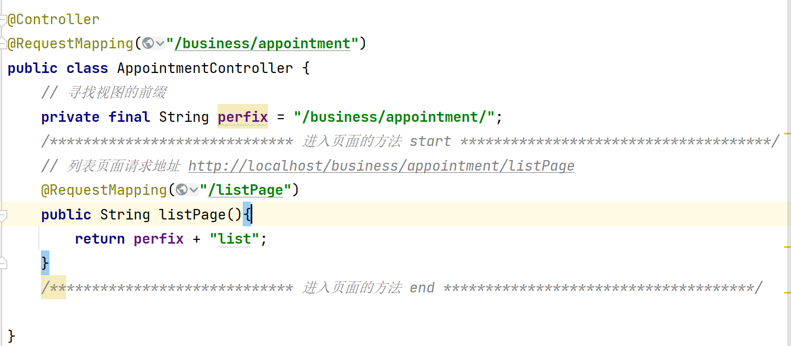

 8. 这样我们就可以进入养修预约服务的页面了。但是此时页面会弹一个错误的提示框。通过浏览器查看我们发现是一个请求页面数据的方法。这种请求数据的方法我们不需要返回一个页面。只需要返回数据即可。我们回到 AppointmentController 中接收请求。

 9. 由于在书写方法时，我们发现需要接收分页参数。后续还会接收高级查询参数。所以我们直接在 query 包中创建 AppointmentQuery 类。用来封装高级查询参数及继承分页条件。

    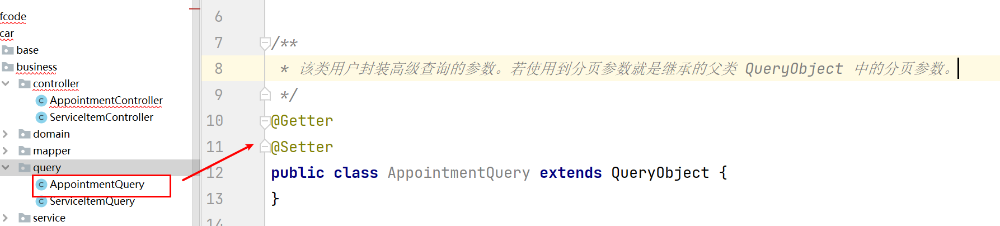

	10. 这样我们就可以接收对应的请求参数了。我们就可以完善我们  AppointmenController 中的 query 请求数据的方法。

     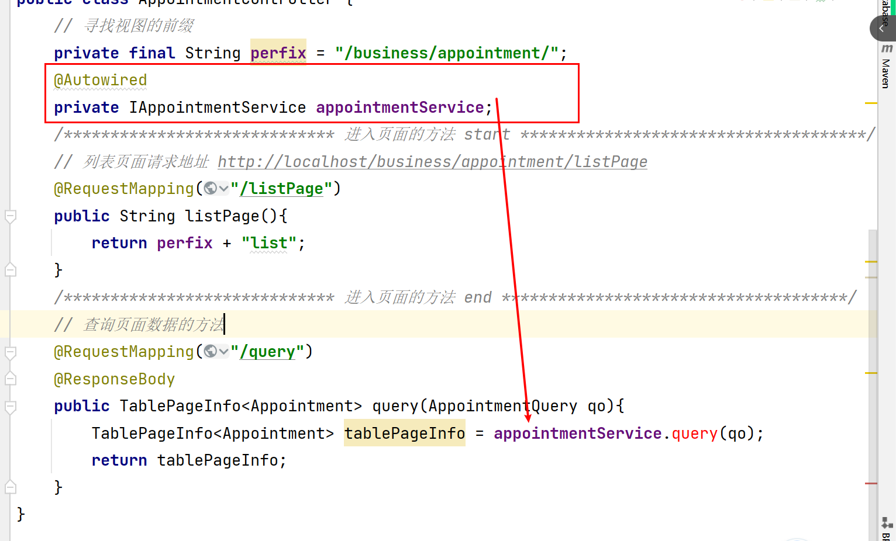

	11. 快速在对应的 IAppointmentService 接口中生成对应的方法。

     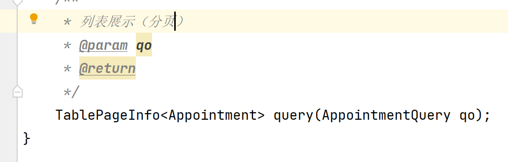

	12. 在对应实现类中生成相应的方法。并实现对应的逻辑。

     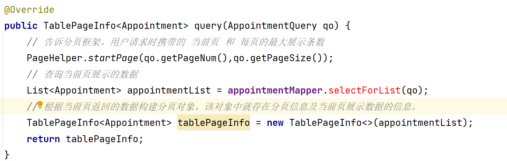

	13. 构建 AppointmentMapper 接口中构建分页查询的方法。

     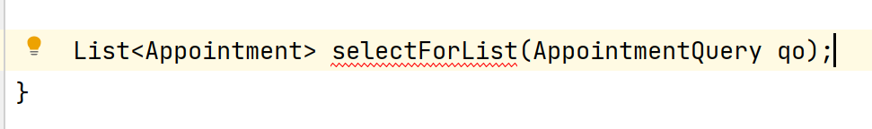

	14. 在 AppointmentMapper.xml 中创建对应的 SQL 传输语句。

     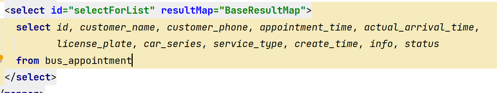

15. 重新启动程序进行测试。若列表分页展示则说明成功。

### 四、养修预约新增功能实现。

 1. 通过浏览器查询。我们可以得知进入新增页面的请求为  http://localhost/business/appointment/addPage

 2. 在 AppointmentController 中接收对应的请求。返回新增页面。

    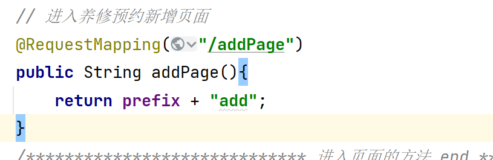

 3. 进入新增页面后。当我们填写好数据点击保存时。页面再次产生错误。因为我们没有处理该新增请求的方法。通过观察浏览器。我们可以得知请求的地址为   http://localhost/business/appointment/add  。同时携带了我们用户添加的请求参数。

    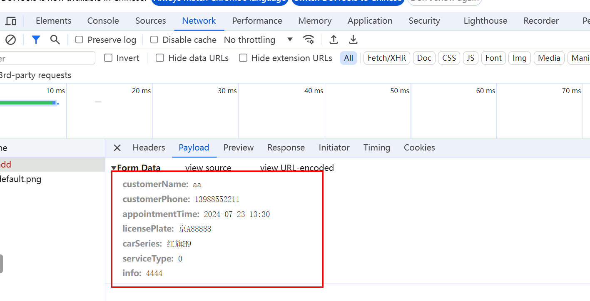

 4. 我们需要回到 AppointmentController 中来处理用户的新增请求。同时接收用户请求的参数。调用 service 方法处理请求。

    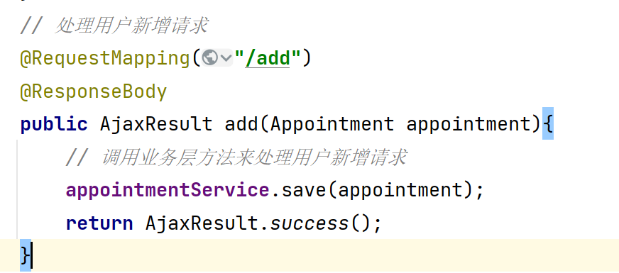

 5. 我们通过观察可以发现。用户传递了大部分的参数。但是个别参数还没有传递

    - 到店时间：actualArrivalTime  此参数必须等用户到店才能填写。所以正常添加预约单时没有是正常的。

    - 创建时间：createTime   此参数为当前这个预约单的创建时间。其实就是我们添加数据的时间。所以在 Service 层中我们需要像该对象传递一个当前系统时间  new Date()。

    - 状态：status。 状态我们通过查看实体类发现其有默认值。默认值就是 = 预约中。

      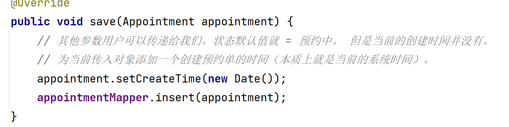

    - 这样我们的新增功能就实现了。测试添加数据是否成功。