### 一、养修预约编辑功能

 1. 首先我们要将需求搞清楚。所谓的编辑是对预约单进行编辑。所以必须状态为预约中才可以进行编辑操作。

 2. 通过前端页面或浏览请求。我们可以得知请求路径为 http://localhost/business/appointment/editPage?id=14 同时携带了当前行预约单的 id 作为参数。

 3. 我们就需要在 AppointmentController 中接收对应的请求。并接收请求携带的参数。

    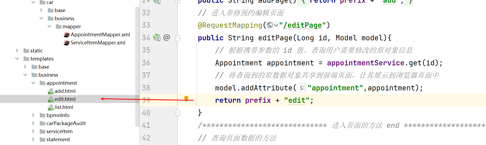

 4. 接下来当点击页面中编辑按钮确定时。我们需要接收用户请求。同时接收用户所需要更改的和未更改数据。

    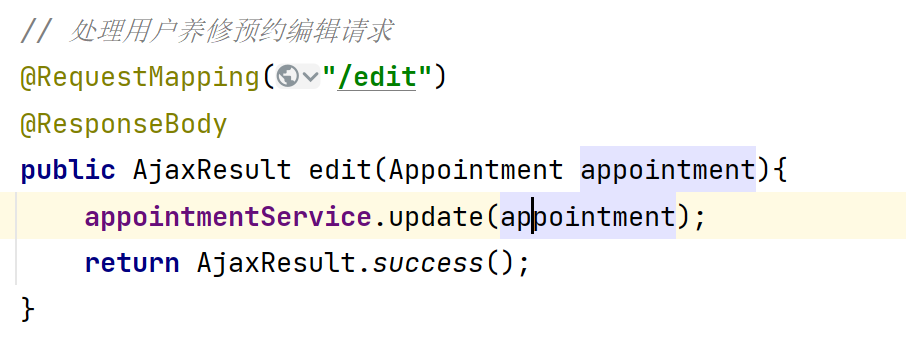

 5. 接下来我们到 AppointmentService 中书写我们的代码逻辑。

     	1. 必须状态为预约中的用户才可以进行编辑操作。
     	2. 前台传入什么数据，那我们就更新什么数据。

    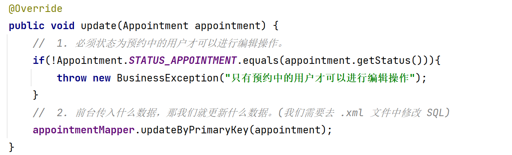

6. 接下来调用 AppointmentMappe 和 AppointmentMappe .xml 文件。我们需要在 AppointmentMappe .xml 文件中修改 SQL 语句。前台传递啥我们就修改啥。（这里主要是为了我们数据的安全性)。

   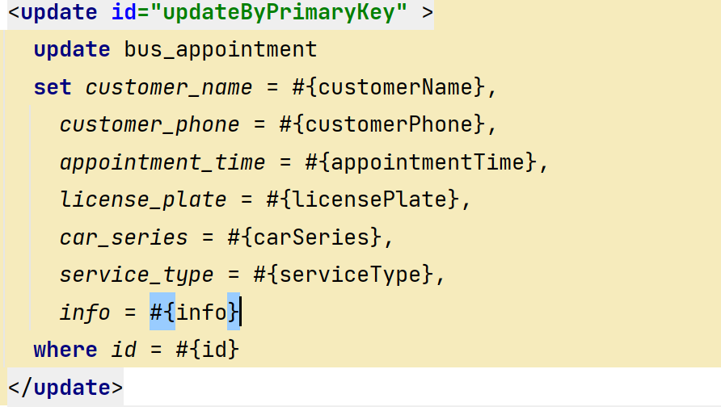

7. 编辑一条数据进行测试。

### 二、养修预约服取消、删除功能分析

- 若想完成取消和删除功能。则必须保证其状态为 预约中。 只有预约中状态的用户才可以进行取消和删除。

- 取消功能

  - 通过观察前台。我们发现取消时发送的请求为  localhost/business/appointment/cancel?id=14 同时携带当前需要取消的预约单id。

  - 到 AppointmentController 中接收取消请求。并调用 Service 层方法来处理请求。

    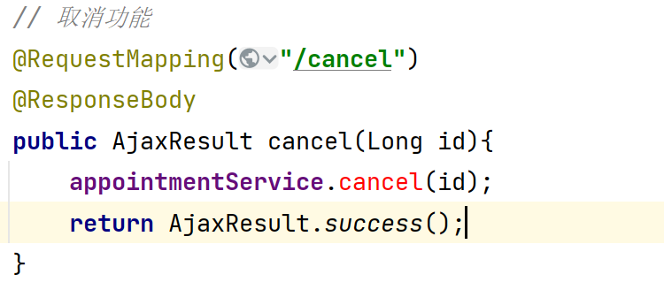

  - 在 IAppointmentService 接口中，创建取消方法的接口规范。

    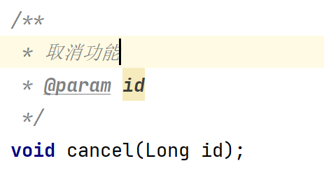

  - 在 AppointmentServiceImpl 实现类中创建方法来具体实现这组规范（取消功能）。本质上就是在修改用户的状态  预约中 -> 用户取消。

    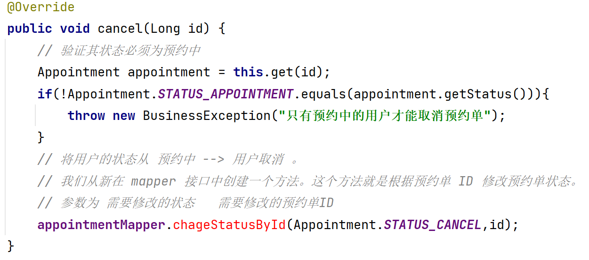

  - 在 AppointmentMapper 接口中创建修根据 ID 修改状态的方法

    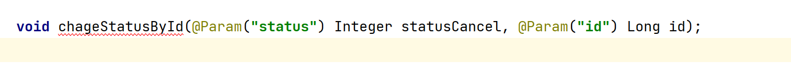

  - 在 AppointmentMapper.xml 文件中书写 SQL 语句。来实现编辑操作。

    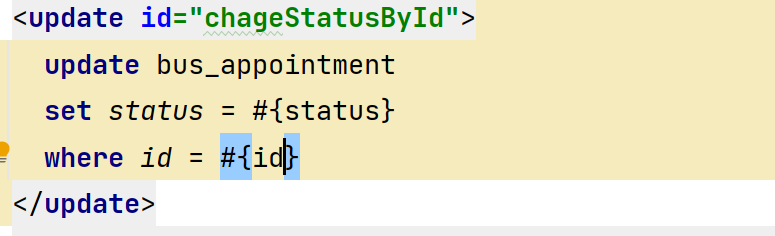

  - 最后测试。需要找一个用户状态为初始化的用户在进行测试(建议大家新建一个用户来测试)。

- 删除功能

  - 删除功能与取消功能类似。他与取消功能的区别在于。

    - 取消是将状态修改  预约中 -> 用户取消。
    - 删除本质上是使用 delete 语句。将该条记录从数据库中删除掉。

  - 通过观察前台。我们发现删除时发送的请求为 http://localhost/business/appointment/remove 同时携带当前需要取消的预约单ids。 之所以为 ids 是因为他支持批量删除。一次删除多个数据。所以我们后台需要使用一个数据来接收这个参数

  - 到 AppointmentController 中接收取消请求。并调用 Service 层方法来处理请求。

    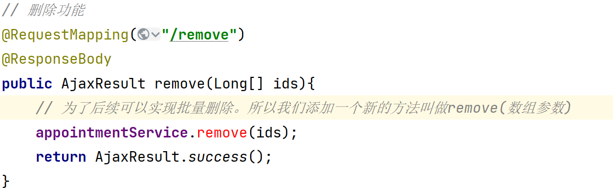

  - 在 IAppointmentService 接口中，创建删除方法的接口规范。

    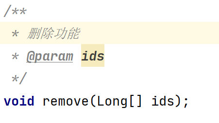

  - 在 AppointmentServiceImpl 实现类中创建方法来具体实现这组规范（删除功能）。本质上就是将我们的这条预约数据在数据库中删除。

    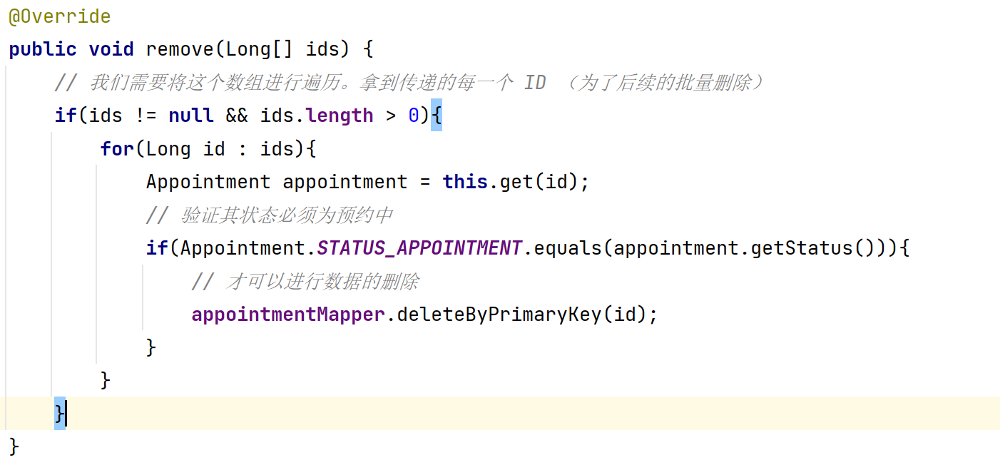

  - AppointmentMapper 和 AppointmentMapper.xml 文件中的代码我们之前生成过了。

  - 我们测试即可。

### 三、养修预约服务用户到店功能。

- 所谓的用户到店。就是通过预约已经构建成了预约单。并且用户在预约时间内到达了门店。这种就是到店。

- 能是到店状态，前提是一定已经生成过预约单了。  

- 我们需要做的就是将 用户的状态从  预约中  -->  已到店

- 同时我们需要想预约表中插入到店时间

- 我们完成到店功能

  - 通过观察前台或页面请求，我们得知用户到店的请求地址为 http://localhost/business/appointment/arrival?id=15 。同时携带了当前预约单的 id 作为参数。

  - 我们需要在 AppointmentController 中接收请求，同时接收该请求所携带的参数。调用 Service 层方法来处理请求。

    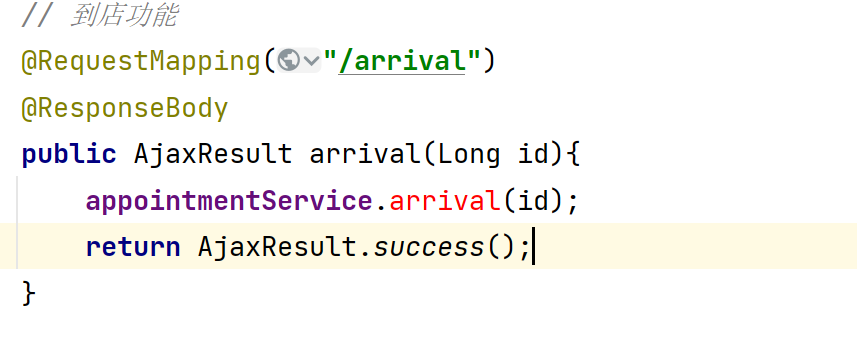

  - 在 IApoointmentService 接口中构建对应规范。（到店功能规范）。

    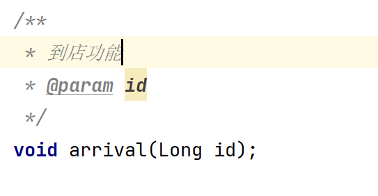

  - 在 AppointmentServiceImpl 实现类中。来实现具体到店需求。

    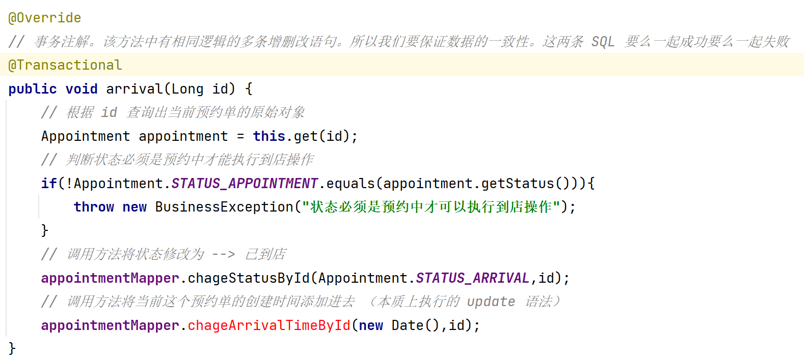

  - 修改状态的方法我们之前已经写过了。但是修改时间的方法还需要我们与之前一样去完成。

  - 需要在 AppoinetmentMapper 接口中创建修改时间的方法

    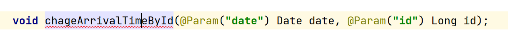

  - 需要在 AppoinetmentMapper.xml 文件中实现对应 SQL 语句。

    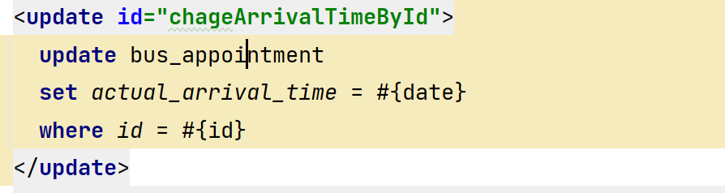

  - 我们运行测试即可。

### 四、结算单分析及基础代码搭建

- 结算单是分两种情况的。

  1. 用户自己主动来到门店消费（非预约的方式）。需要我们自己手动录入用户的信息。
  2. 通过预约的方式来到门店消费（预约单）。可以直接通过预约单将用户的信息带入到我们结算单中。

- 我们先来生成结算单的列表

  1. 需要使用 MyBatis 逆向工程将基础代码生成。

  2. 根据文档将实体类替换。

  3. 我们去创建 IStatementService 接口。并在其中定义 CRUD 相关的规范。

     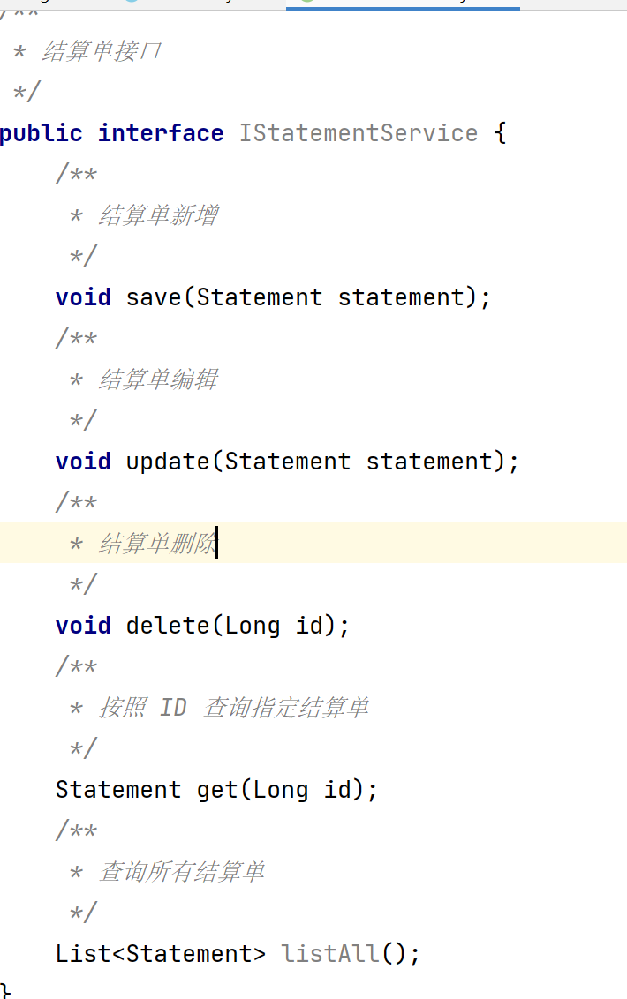

  4. 我们去创建 StatementServiceImpl 接口的实现类。并实现其定义的规范。

     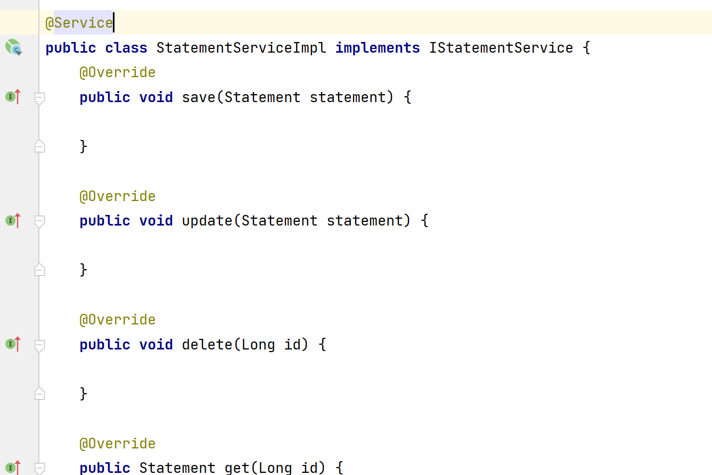

  5. 最后我们去创建 StatementController 。并做基础完善。

     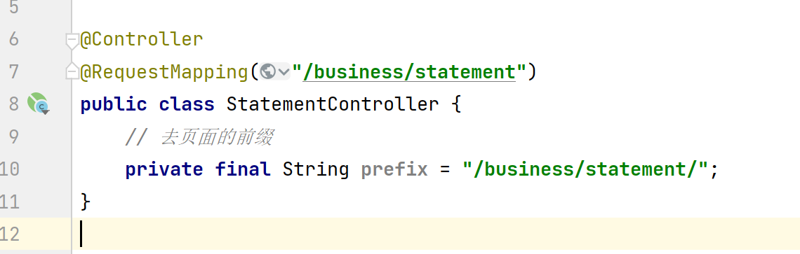

### 五、结算单列表功能

- 在前台页面中找到对应的请求列表页面地址。http://localhost/business/statement/listPage

- 我们就需要在 Controller 中创建对应方法来处理用户进入结算单列表页面的请求。

  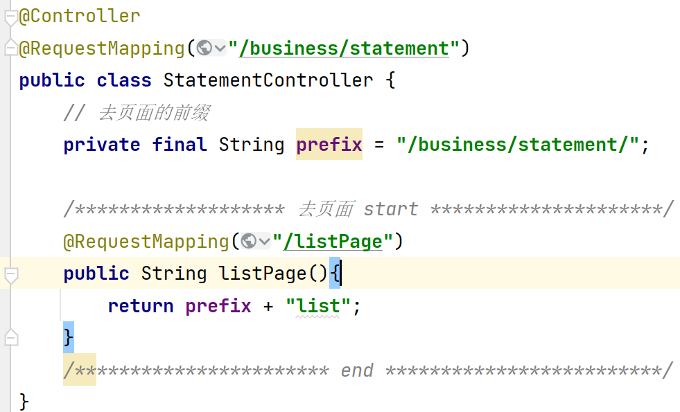

- 此时我们可以进入页面，但是页面会报错。通过查看浏览器或前台代码我们可以拿到请求的地址。 http://localhost/business/statement/query

- 我们还需要在 Controller 中定义一个方法来处理展示 结算单列表页面的方法。但是通过查看文档的图片。我们发现该页面依然需要分页及高级查询。所以我们需要提前在 qo 包中创建 StatementQuery 。并继承分页类 QueryObject

  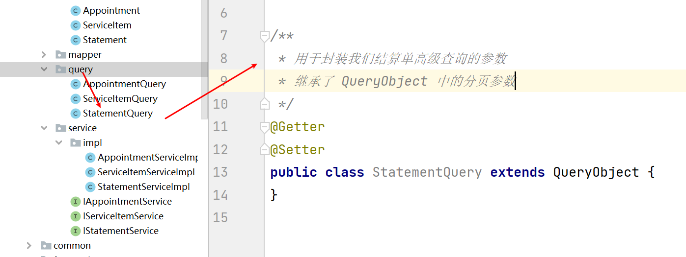

- 回到 StatementController 中创建方法。来处理 分页查询结算单数据的请求
  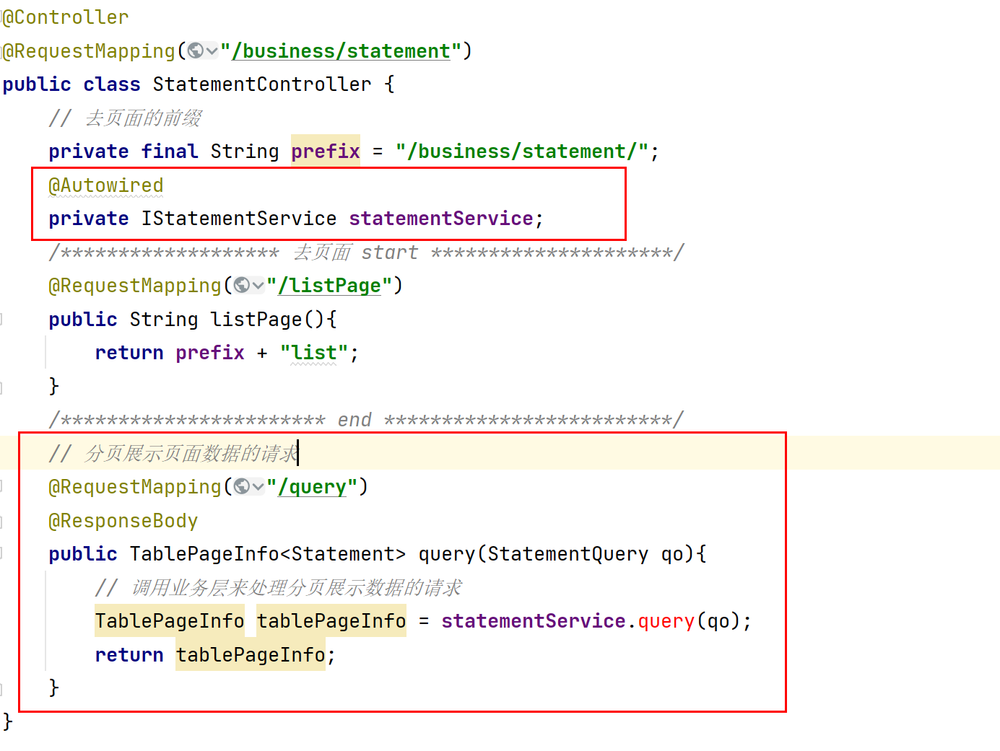

- 在 IStatementService 接口中定义分页查询的规范。

  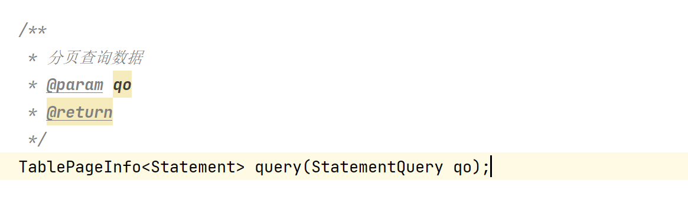

- 在 StatementServiceImpl 实现类中完善分页查询逻辑

  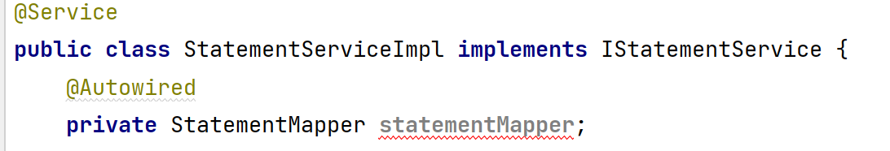

  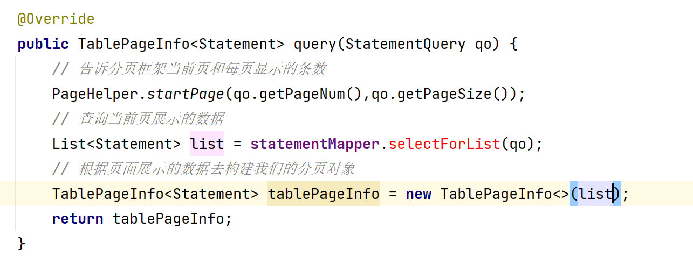

- 然后我们需要在 StatementMapper 接口中完善 selectForList(qo) 方法的规范。

  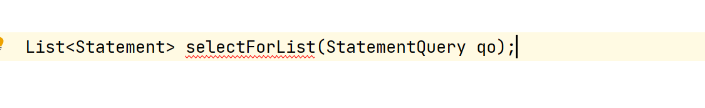

- 最后我们需要在 StatementMapper.xml 中完善 SQL 语句。

  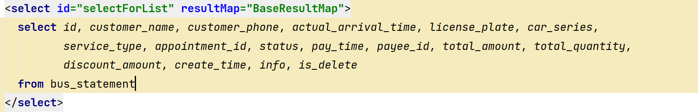

- 运行报错是因为我们实体类中存储的收款人是一个 USER 对象。而我们的数据库中存储的只是一个 Long 类型的数值。我们到  StatementMapper.xml 中修改最上面的 ResultMap

  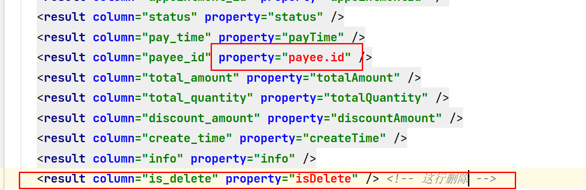