### 一、结算单高级查询

- 首先这里面是时间查询。

- 对于高级查询。我们需要到 StatementQuery 中添加需要高级查询的条件。

  - 首先我们需要到 StatementQuery 中添加对应的 高级查询条件。所谓的条件就是前端部分对应文本的 name 属性叫什么我们就定义什么。

  - 由于参数是日期类型比较特殊。所以我们还需要在高级查询类中贴上两个注解

    - @DateTimeFormat(pattern = "yyyy-MM-dd HH:mm:ss") ：接收日类行参数时使用。按照指定格式去接收。前台用户用什么格式去提交。我们就需要使用什么格式去接收。 yyyy-MM-dd HH:mm:ss    年4位-月2位-日2位 小时：分钟：秒

    - @JsonFormat(pattern = "yyyy-MM-dd HH:mm:ss",timezone = "GMT+8")：在页面展示数据时。若该数据是日期格式。那我们需要以什么样子去展示给用户。yyyy-MM-dd HH:mm:ss    年4位-月2位-日2位 小时：分钟：秒。若没有给固定格式。则默认为国外时间展示方式 。timezone = "GMT+8" 时区。我们中国是东八区。所以 我们需要在当前时区基础上 +8小时。

      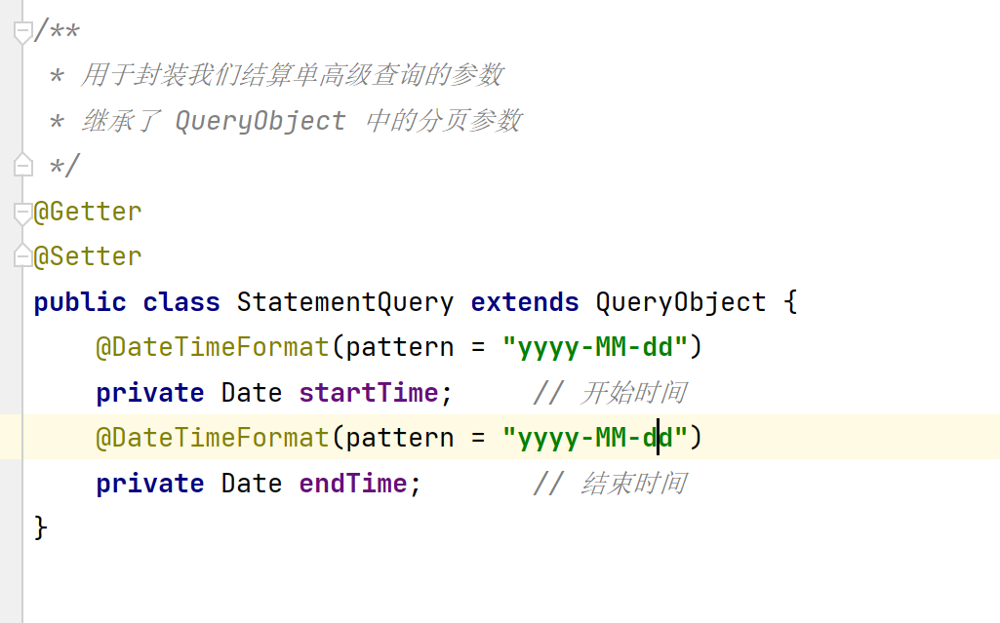

  - 我们在高级查询类 StatementQuery  中已经定义了对应参数。那么在 Controller 就会接收到对应的参数。在调用方法时会将对应的参数一路传下   Controller --> Service --> Mapper --> 最终通过 Mapper.xml 文件与 数据库进行交互。所以我们需要更改 Mapper.xml 分页查询数据的方法。使用 MyBatis 为其动态添加条件。

    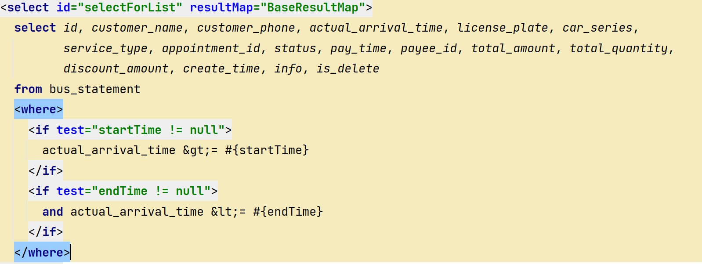

  - 但是此时有一个问题存在。若我们想搜索当天内容。正常我们开始时间与结束时间是同一天就会出现这种问题。

  - 解决的方案就是因为我们选择日期后。并没有指定具体的时间。所以默认选择某一天后。他的时间都为 00：00：00。所以我们需要将结束时间改为 23:59:59 秒。

  - 如何实现？

    - 我们在获取时候时本质上都是在调用 JavaBean 中的 get 方法。那我们就可以使用这一特性手写一个 endTime 的 Getter 方法。

    - 在该方法中为其将时间改为 23:59:59。 最简单的方式就是 +1 天  - 1秒。

      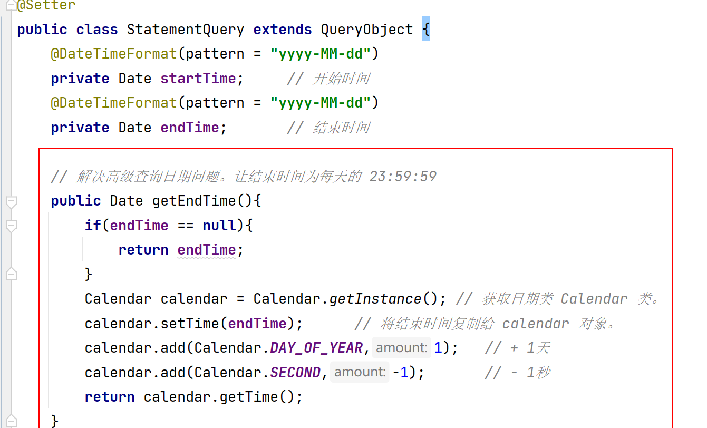

### 二、结算单添加功能

- 在浏览器中通过点击的方式或者在页面中我们也可以查询到进入新增页面的地址为 http://localhost/business/statement/addPage

- 在 StatementController 接收用户请求。并做页面跳转。

  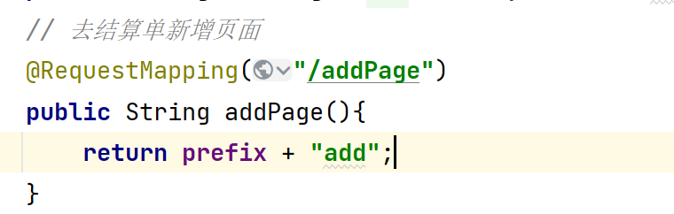

- 当用户点击保存时，发送一个   http://localhost/business/statement/add 的请求。那我们需要接收用户在前端页面书写的参数。调用 StatementController 中书写方法来处理这个新增请求。最后调用 IStatmentService 来处理这个请求。

  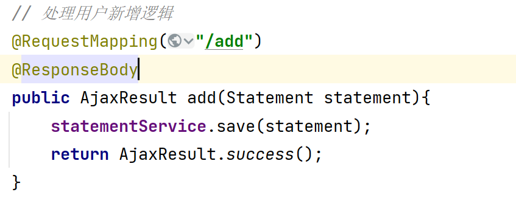

- 在 IStatementService 中书写新增逻辑（我们在之前基础代码中已经写过了）

- 调用 StatementServiceImpl 中的 save() 方法来处理这个请求。

  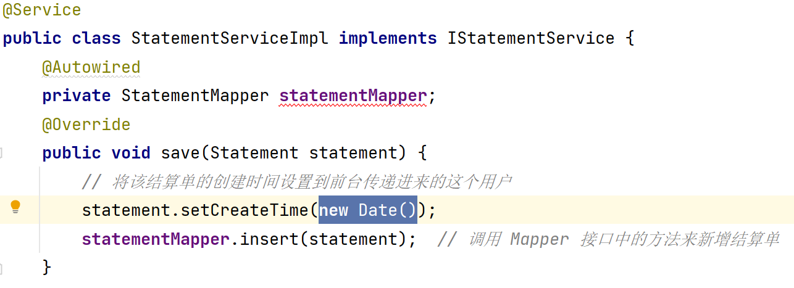

- 最终 StatementMapper 和 StatementMapper .xml 在基础代码中已经生成过了。

- 在测试的过程中。我们发现最终插入时存在问题。也就是有一个 payeeId 的属性找不到 Getter 方法。那是因为我们在实体类中定义的是一个 payee 对象而不是一个 int 类型属性。

- 解决方案：我们只需要将新增/编辑使用到 payeeId 属性的地方。传递值时我们用 对象.属性名的方式即可。

  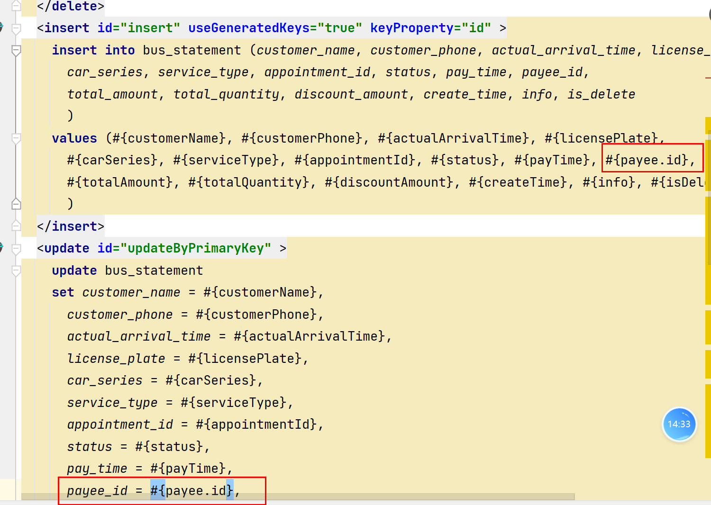

- 还会存在一个错误是属性 is_delete 没有对应的 getter 方法。因为我们的程序中并没有使用到这个字段。所以增加这样一个字段即可。

  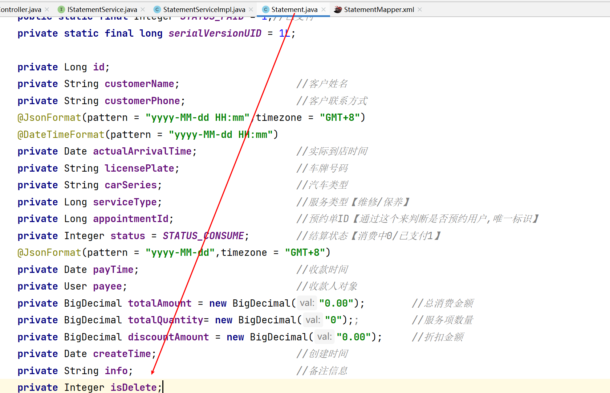

### 三、结算单编辑功能

- 只有状态 = 消费中的结算单才可以进行编辑

- 在浏览器中通过点击的方式或者在页面中我们也可以查询到进入编辑页面的地址为 http://localhost/business/statement/editPage?id=xx

- 在 StatementController 接收用户请求同时接收用户请求的参数。

  - 编辑需要将页面中的数据进行回显的。

  - 所以我们要拿到用户点击的这个数据。也就是拿到用户传递的 id。

  - 拿到这个 id 后根据 id 查询出对应的结算单数据，并将数据共享到前台页面。

  - 最终实现页面跳转

    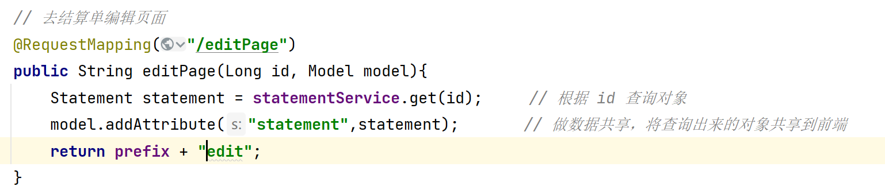

  - 这里面的 get() 方法我们当时只定义了该方法。但是并没有为完成。所以去晚上 StatementServiceImpl 中的 get() 方法。

    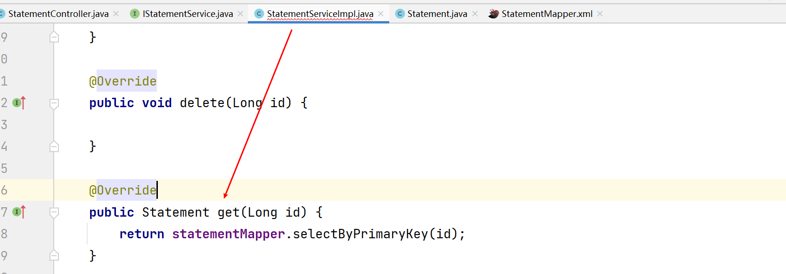

  - StatementMapper 中的基础代码是自动生成的。这样就完成了去新增页面的请求。

- 可以进入编辑页面后，当我们点击编辑页面的保存时。会发送一个  http://localhost/business/statement/edit。同时携带用户前台更改数据后的请求参数。

- 我们就需要在 StatementController 中定义对应的方法来接收请求并接收请求携带的参数。

  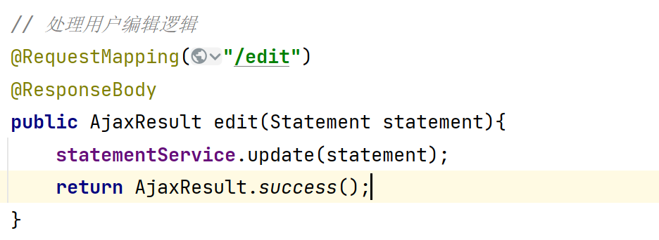

- 接收到用户请求后，调用 IStatementService 接口规范对应的 StatementServiceImpl 中的方法来处理请求。这个接口已经在基础代码中生成过了。我们只需要去实现类中将具体的编辑逻辑实现即可

  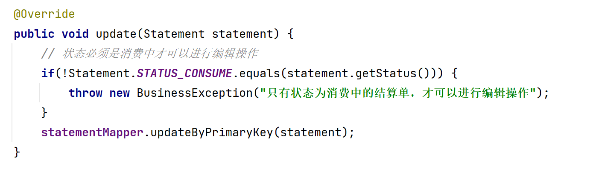

- 测试通过就OK了。

### 四、结算单删除功能

- 状态必须为消费中才可以进行删除操作。

- 在浏览器中通过点击的方式或者在页面中我们也可以查询到删除功能的地址为  http://localhost/business/statement/remove?id=xx

- 在 StatementController 接收用户请求同时接收用户请求的参数。

  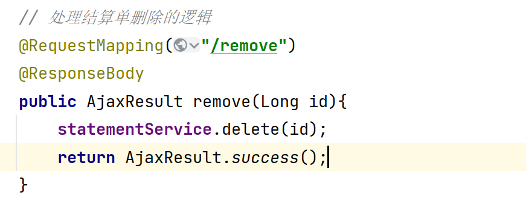

- 在 IStatmentServiceImpl 接口在基础代码中已经生成了。我们找到对应的实现类 StatementServiceImpl 中的 delete 方法书写逻辑。

  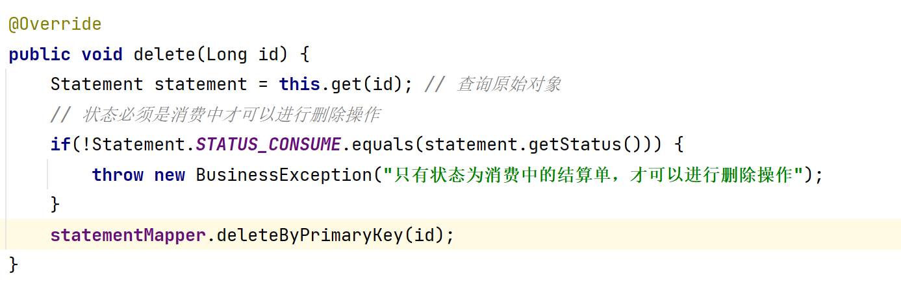

- StatementMapper 和 StatementMapper.xml 在基础代码中已经生成了。所以不必书写

