### 一、结算单明细分析

- 当我们在结算单页面点击明细时是有两种状态的。

  - 状态为消费中（没有付款）：需要进入结算单明细编辑页面。让用户可以去选择对应的消费产品。
  - 状态为已支付（已经付块）：需要进入结算单明细详情页面。让用户可以看到都消费了那些产品。

- 实现的逻辑就是通过观察页面或前端代码。我们可以得知。

  - 状态为消费中跳转的地址为 http://localhost/business/statementItem/itemDetail?statementId=14 参数为结算单id
  - 状态为已支付跳转的地址为 http://localhost/business/statementItem/itemDetail?statementId=14 参数为结算单id

- 那我们如何判定他是否支付呢？

  - 首先使用 MyBatis 逆向工程生成 StatementItem 结算单明细相应的基础代码 。

    - 在我们 domain 中的 StatementItem 实体类中将原始的 Getter Setter 方法替换为 Lombok。以便后续维护。

      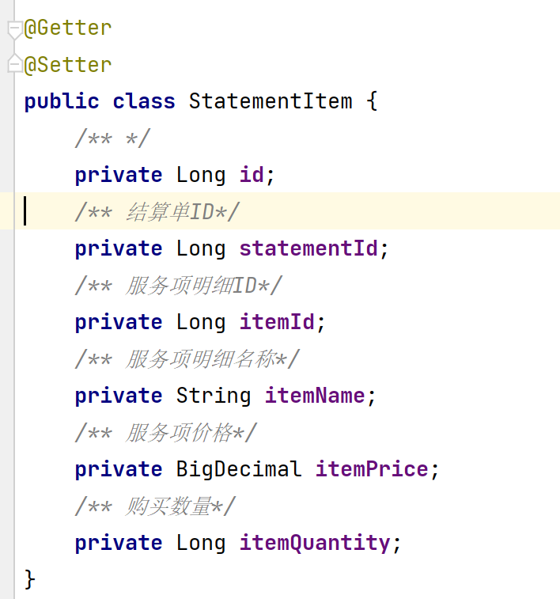

  - 完成 IStatementItemService 接口定义基础的 CRUD 规范。

    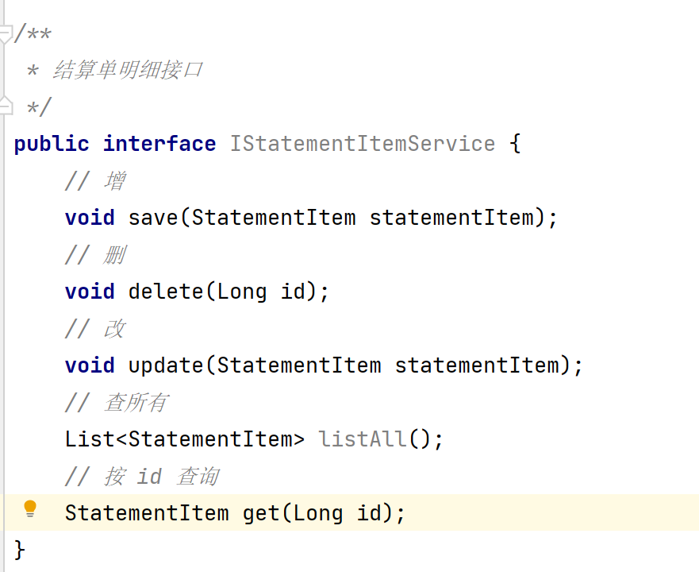

  - 完成 StatementItemServiceImpl 实现类接口。来实现 IStatementItemService  中的规范。

    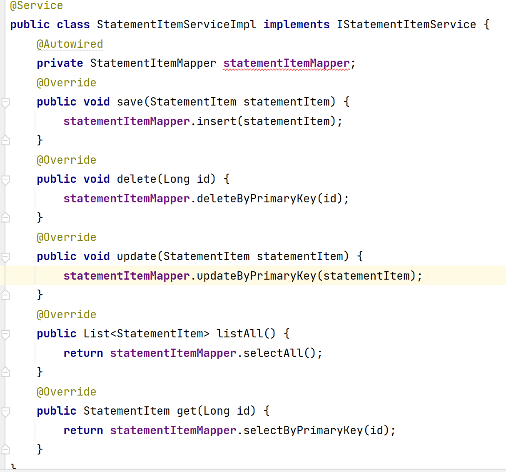

  - 创建 StatementItemController 。在其中定义一个接收用户请求跳转到结算单明细的方法。并接收用户携带的参数 结算单id

    - 首先根据携带的参数结算单id 查询对应的结算单对象。

    - 根据该对象中的状态来判断该用户是消费中还是已支付

      - 若是消费中就跳转到消费中页面

      - 若是已支付就跳转到已支付页面

        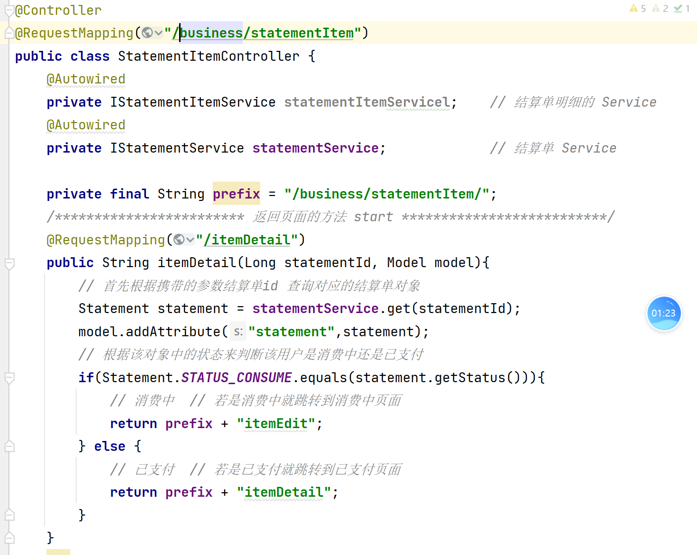

### 二、结算单明细页面列表展示

- 结算单明细修改页面展示的数据有三组

  - 到达该页面必须状态为消费中。

    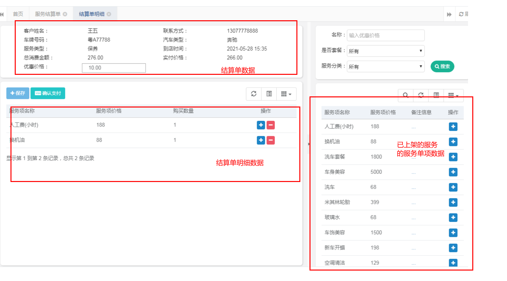

- 那我们已经有了结算单数据。（从 StatementItemController 中共享过来的）。已上架的服务单项数据

- 已上架的服务单项数据也已经存在了。本质上就是进入页面后立即发送了一个请求。请求就是分页查询所有服务单项，并传递参数为已上架。之前我们在做服务单项的过程中已经将该功能实现。所以已上架的服务单项数据已经展示。

- 最后我们需要解决的就是结算单明细分页查询并展示。

  - StatementItemController 中接收用户查询所有结算单明细数据，并接收用户请求携带的参数。返回分页信息及数据。http://localhost/business/statementItem/query?statementId=13。这里之所以传递了结算单 id。就是让我们根据结算单 id 展示当前结算单的所有结算单明细数据，并分页展示。

    - 我们在接收参数时，需要接收分页数据 （当前页和每页显示的长度）。还需要接受一个 statementId 。所以我们直接定义一个 StatementItemQuery 类中。将 statementId 作为高级查询内的参数即可。

      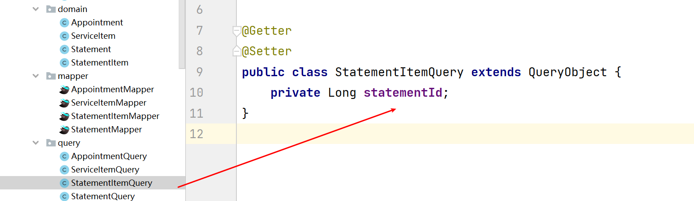

    - 有了这个类，他就可以帮我们接收分页参数及高级查询参数。所以我们 StatementItemController 中只需要接收这一个参数即可。

      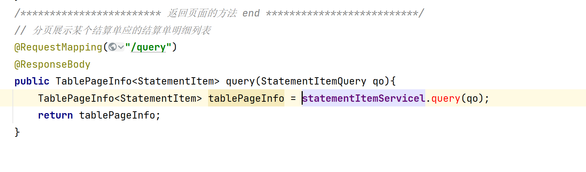

- 在 IStatementItemService 接口中定义分页查询的规范。

  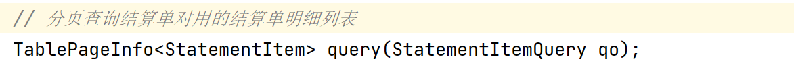

- 在 StatementItemServiceImpl 中具体实现接口中分页查询方法。

  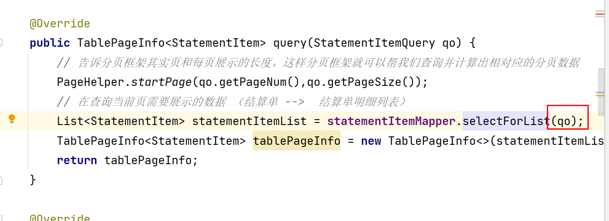

- 在 StatementItemMapper 接口中定义规范

  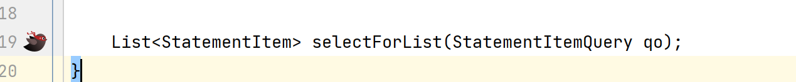

- StatementItemMapper.xml 中书写相关 SQL 语句即可。

  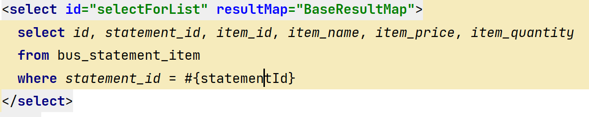

- 代码测试。进入编辑的结算单明细页面。

- 因为结算单明细修改部分和结算单明细部分是共用了查询数据的方法。所以两个页面现在都已经可以使用了。

### 三、结算单明细保存逻辑分析

- 当点击保存按钮，将数据保存后才可以进行支付操作。

- 所以当我们点击保存按钮本质上就是在执行新增操作。

  - 想执行保存按钮必须状态为消费中
  - 我们需要批量添加结算单明细数据
  - 更新结算单数据
    - 想在计算的前提必须是前端给我们传递了 disCountPrice 折扣价格。
    - 我们可以自己计算总数量
    - 总消费价格

- 那我们都携带那些参数？

  - List\<StatementItem> 结算单明细集合用于批量插入结算单明细。
  - 优惠价格。 用户计算总消费金额及优惠价格 更新到结算单表中。
  - 结算单 Id

- 由于参数携带过多我们就可以使用一种特殊的方式。额外参数携带。

  - List\<StatementItem> 这个集合中本质上就是装了一条一条的 StatementItem 对象 

  - 每一个对象中的属性类型分别为

    Long id;
    Long statementId;
    Long itemId;
    String itemName;
    BigDecimal itemPrice;
    Long itemQuantity;

  - 那我们就可以这样  StatementId 也是 Long 类型。 而 disCountPrices 是 BigDecimal 类型。
  - 我们就可以利用一数据类型相同这个特性
  - 将 StatementId  和 disCountPrices  假设他为 Long id  和 BigDecimal itemPrice 。
  - 那我们就可以将这两个数据也存入到一个 伪"StatmentItem" 对象中。在存储到集合的最后一位中。这样我们就可以在后台接收参数的时。将该集合的最后一位提出取来就是我们所需要的额外参数。

- 若用户选购了一定量的商品后，保存了。但是保存成功后。顾客在没付款之前又二次选择了商品。

- 若我们再次点击保存。那么将会出现二次插入的问题。就是将我们之前已经插入过的商品信息及用户新增的信息都一并插入。（数据重复问题）

- 解决的方案就是每次添加之前我不管之前是否存在数据。都先将所有的结算单明细列表全部删除。然后在重新将所有的数据批量添加一次即可。

### 四、结算单明细保存实现。

- 在我们的 StatementItemController 中创建方法来接收用户请求并同时接收用户请求携带的参数。请求地址为 http://localhost/business/statementItem/saveItems。携带的参数就是一个 List\<StatmenetItem> 集合

  @RequestBody 若前台是以 JSON 字符串的方式传递的参数。那么后台我们就需要使用一个@RequestBody注解去接收

  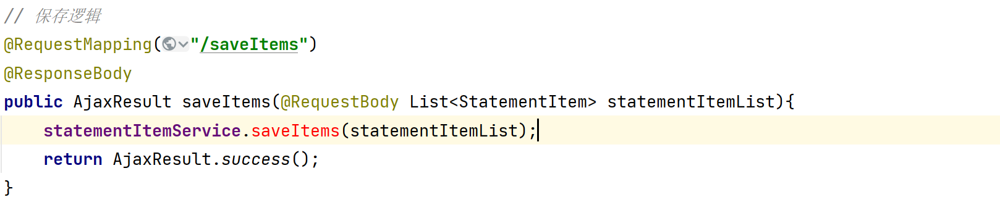

- 调用 IStatementItemService 接口中定义保存方法的规范。

  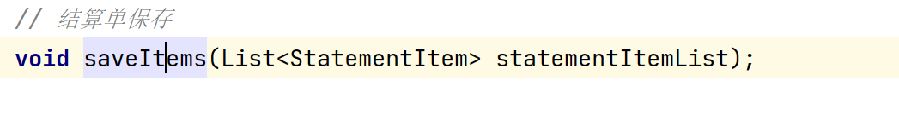

- 调用 StatementItemServiceImpl 中完成我们的逻辑

  1. 状态必须为消费中

  2. 判断若我们的集合不是 null 且 长度大于0  （合理化校验）说明前端传递的数据没有问题。

  3. 我们就获取获取出额外参数  statmenetId 和 disCountPrice

  4. 由于不确定用户是否保存后进行二次消费。所以我们需要先将这个结算单对应的所有结算单明细集合进行批量删除

  5. 将集合中剩余的数据进行批量插入操作。

  6. 计算 消费总金额。

  7. 计算 总数量

  8. 将新的数据更新到结算单对象中。

  9. 使用 Update 语句将结算单更新

  10. 由于使用了多条 增删改。所以我们需要添加事务

      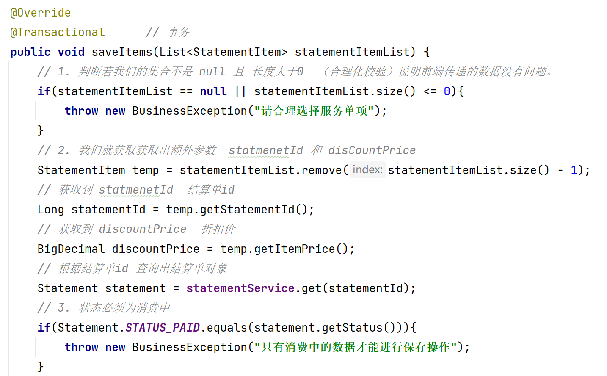

      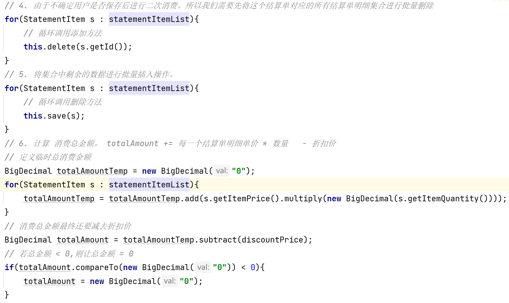

      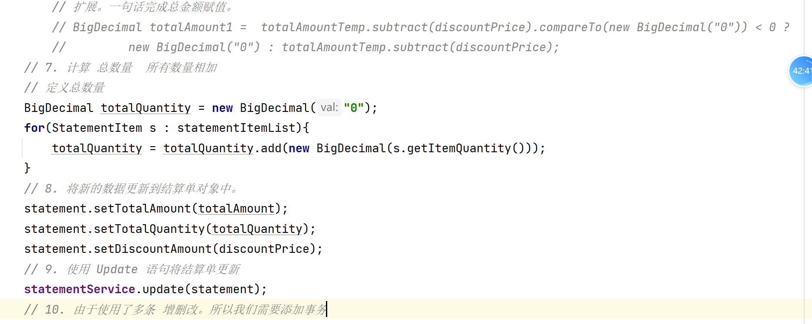