# 								MAVEN安装

1. 需要将MAVEN 的解压包解压到 D:/ 根目录下

2. 将 repository 解压包解压到 D:/ 根目录下

3. 打开 MAVEN 文件夹，找到 conf 文件夹打开。

   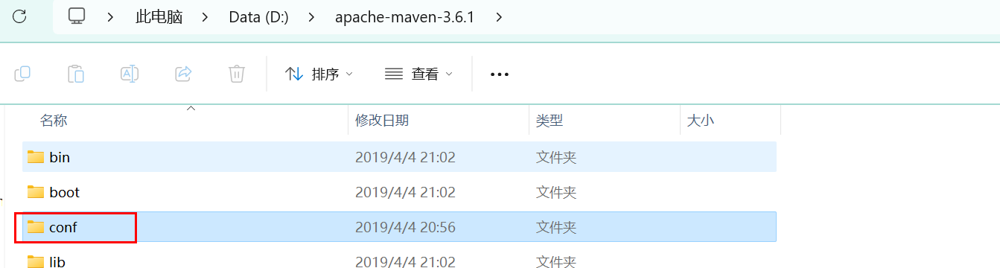

4. 找到 setting.xml 文件。使用记事本打开即可。

   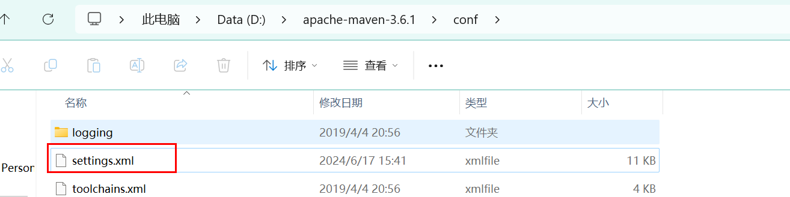

5. 修改对应位置的本地仓

   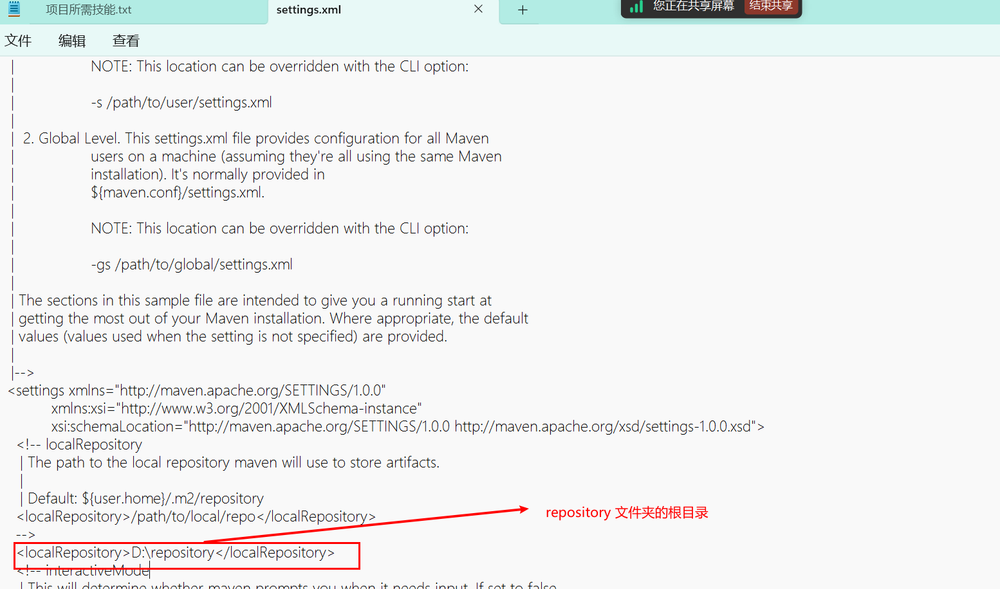

6. 粘贴镜像路径

   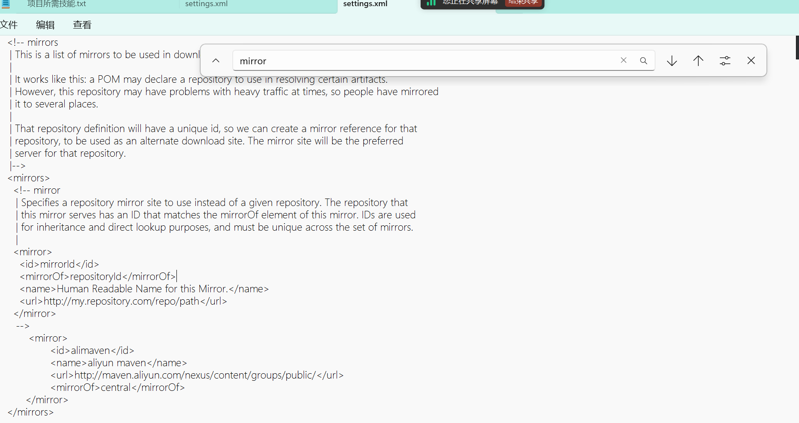

7. 开打配置环境变量

   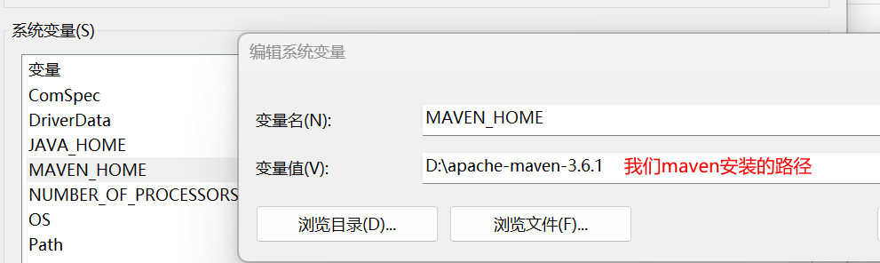

8. 打开 path 。添加环境变量

   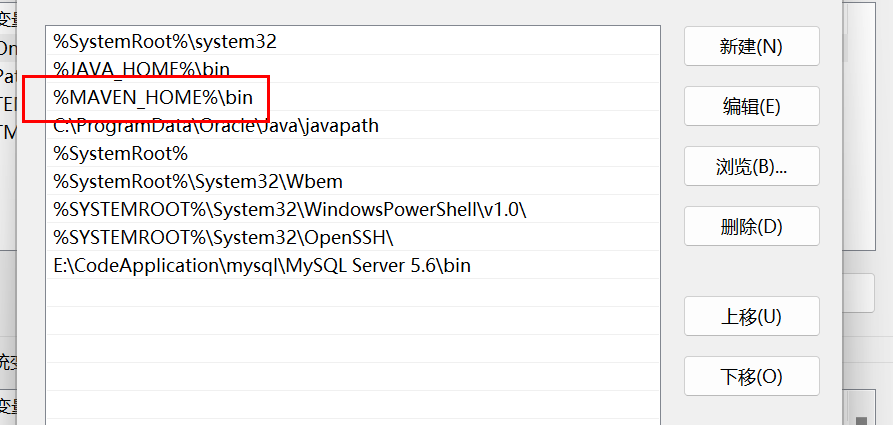

9. 检测是否安装成功。

   1. 开打控制台 WINDOW+R  输入 CMD

      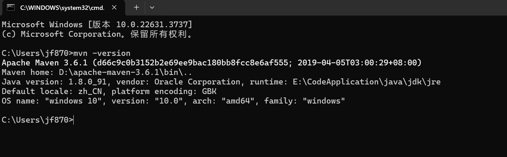

   2. 出现 3.6.1 的本版号即可。

10. 在 IDEA 中配置 MAVEN

    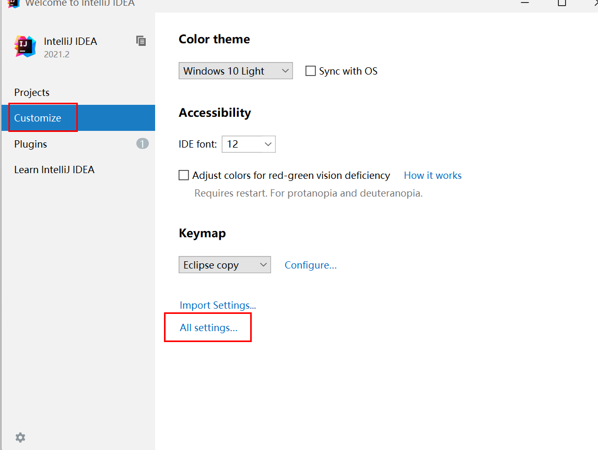

11. 找到 Build 进行自动更新设置

    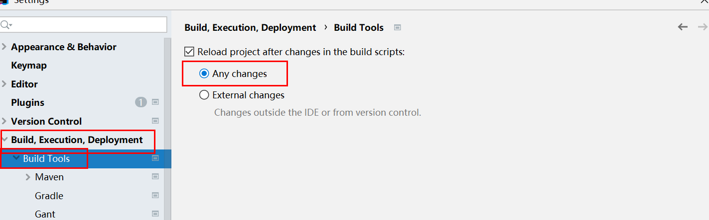

12. MAVEN 配置路径。

    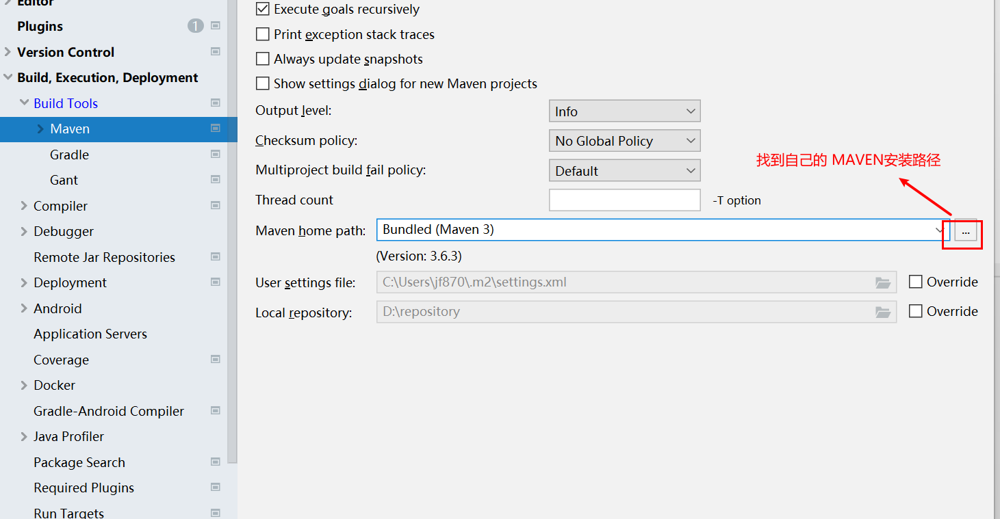

    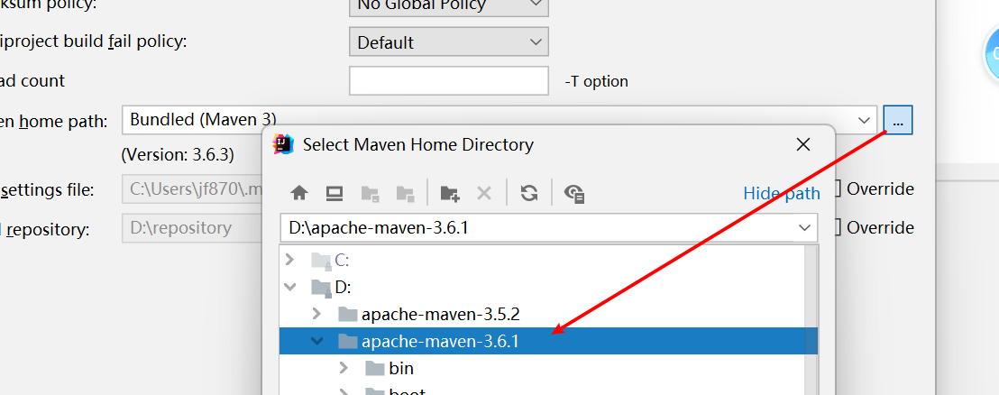

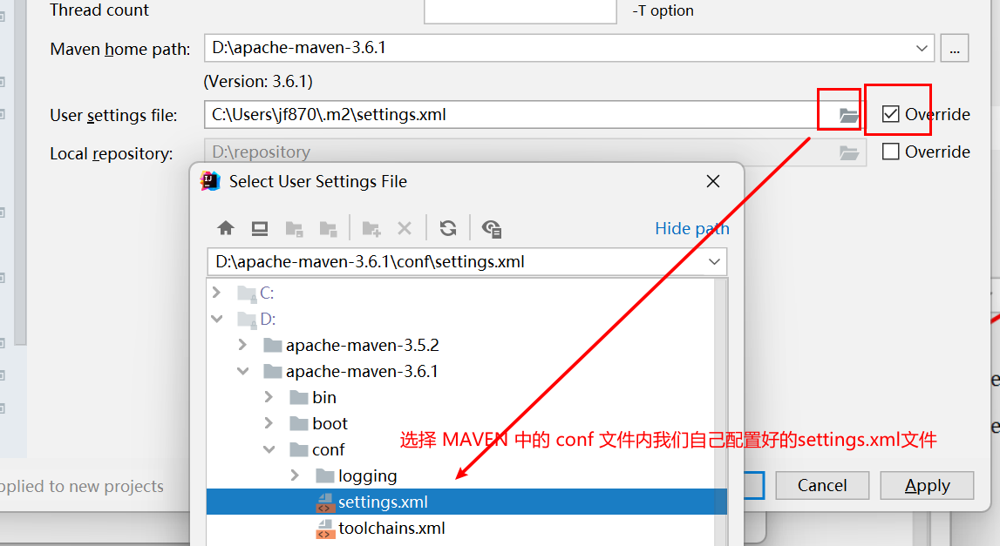