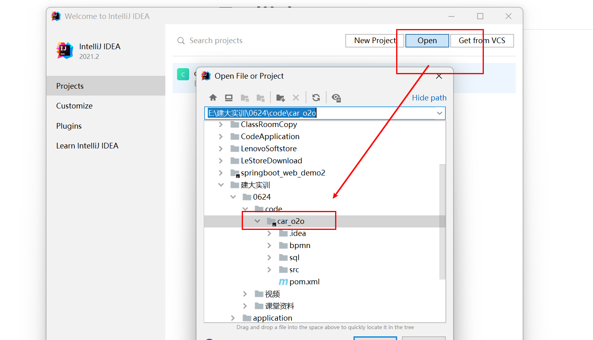
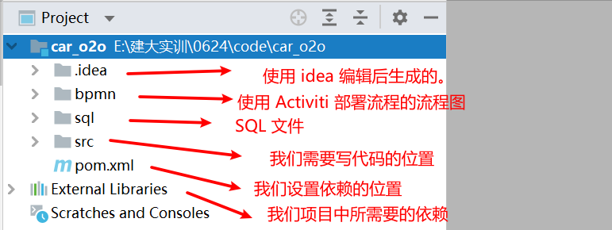
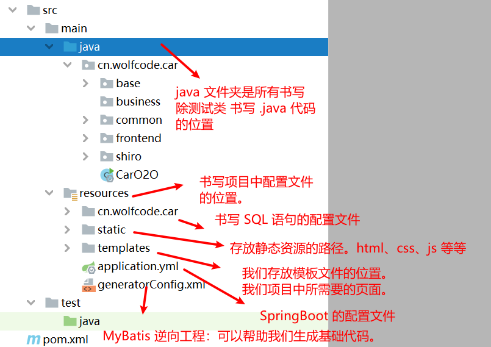
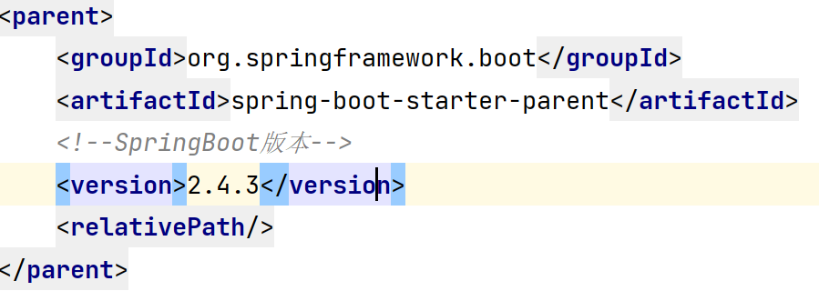
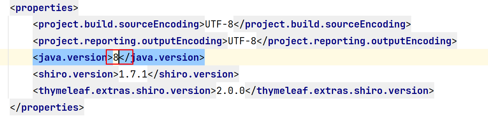

# 						项目搭建

一、项目导入

1. 导入文件夹中 car_o2o 项目。

​	

2. 项目目录结构（SpringBoot 的项目结构）

   

3. 对于代码书写的位置说明

   

4. 对于 pom.xml 文件简介

   - 每一个依赖都必须的独立存在的。因为将来要搜录到 MAVEN 库中的。所以使用三点定位的方式来决定该依赖。
     - groupId：公司域名的反写。
     - artifactId：模块名缩写
     - version：版本号。

   - parent 代表父工程 --> 在这里面我们看到了 SpringBoot 说明该项目是一个基于 SpringBoot 父级依赖的项目，所以是一个 SpringBoot 项目。

     

   - properties：对于我们项目中一些简单的属性配置。需要将 jdk 改为8

     

   - dependencies 中 每一个 dependency 就是一个依赖的配置（一个 jar 包）。

   - build --> plugins -->  plugin  就是一个 MAVEN 插件。可以帮我们更好的构建，管理我们的项目应用。