e店邦O2O平台

本文档描述了e店邦O2O平台系统的整体需求，包括功能性需求和非功能性需求等内容。本文档可以作为概要设计的参考资料。

# 项目背景

为了更好的进行商户门店运营，以及维护新老客户的信息，广州xxx汽车服务公司决定实施汽车门店管理系统。但市面上出售的系统价格昂贵，笨重，所以经过市场调研研究，单独对该公司，做一个轻量级的互联网门店运营系统，主要功能包括商铺维护，服务预约，消费结算，财务审核，客户关系维护，订单发货，物流跟踪，客户评价，报表分析等功能。

# 项目结构

e店邦O2O平台项目根据实际需要将项目拆分成2部分：前端官网(frontend)， 后端管理平台(car_o2o)。

### 前端官网(拓展)

核心模块：官网数据展示，养修服务预约，续保服务登记，购车相关的金融服务等

演示路径：http://localhost/frontend/home.html

### 后端管理平台

核心模块：系统管理模块， 系统监控， **流程管理， 业务功能，**个人中心等

演示路径：http://localhost/index

# 后端功能需求

根据课程的安排，本次课程重点放在流程管理，业务功能2个模块。

## 1：养修服务单项

### 功能描述

当前线下门店(4s店)能为客户爱车提供哪些服务。一般服务分2大类，一类是单项服务，一个是套餐服务(捆绑多个单项服务)。业务要求如果是套餐服务需要店长、财务审批之后才可以上架销售。

### 具体需求

1>养修服务单项查询列表

2>养修服务单项添加

3>养修服务单项编辑

4>养修服务单项上架/下架

5>养修服务套餐审核

### 需求实现

#### **需求1：养修服务单项列表**

**步骤1：表设计**

思考：养修服务单项表如何设计？

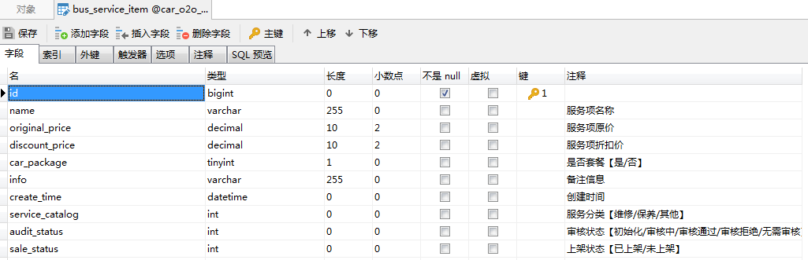

设计表之后，根据逆向工程创建domain,mapper.xml,mapper.java, 然后完成qo，service, serviceImpl, controller创建

养修服务单项状态

```java
/**
 * 服务单项
 */
@Setter
@Getter
public class ServiceItem {
    private static final long serialVersionUID = 1L;
    public static final Integer CARPACKAGE_NO = 0;//不是套餐
    public static final Integer CARPACKAGE_YES = 1;//是套餐
    public static final Integer AUDITSTATUS_INIT = 0;//初始化
    public static final Integer AUDITSTATUS_AUDITING = 1;//审核中
    public static final Integer AUDITSTATUS_APPROVED = 2;//审核通过
    public static final Integer AUDITSTATUS_REPLY = 3;//重新调整
    public static final Integer AUDITSTATUS_NO_REQUIRED = 4;//无需审核
    public static final Integer SALESTATUS_OFF = 0;//下架
    public static final Integer SALESTATUS_ON = 1;//上架

    private Long id;
    private String name;                //服务项名称
    private BigDecimal originalPrice;    //服务项原价
    private BigDecimal discountPrice;    //服务项折扣价
    private Boolean carPackage;          //是否套餐【是/否】
    private String info;                 //备注信息
    private Date createTime;             //创建时间
    private Integer serviceCatalog;      //服务分类【维修/保养/其他】
    private Integer auditStatus = AUDITSTATUS_NO_REQUIRED;       //审核状态【初始化/审核中/审核通过/审核拒绝/无需审核】
    private Integer saleStatus = SALESTATUS_OFF;                 //上架状态【已上架/未上架】
}
```

**步骤2：创建列表页面**

页面效果

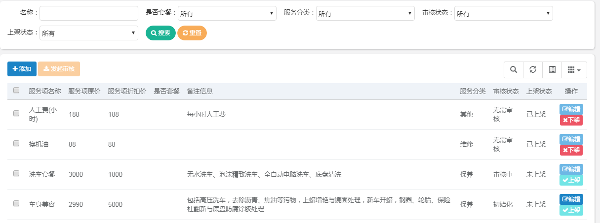

参考其他页面页面实现养修服务单项列表


**步骤3：编写请求方法跳转到list.html页面**

```java
@RequiresPermissions("business:serviceItem:view")
@RequestMapping("/listPage")
public String list(){
    return prefix + "list";
}
```

**步骤4：编写请求方法查询列表分页数据**

```java
@RequiresPermissions("business:serviceItem:list")
@RequestMapping("/query")
@ResponseBody
public TablePageInfo query(ServiceItemQuery qo){
    return serviceItemService.query(qo);
}
```


#### **需求2：养修服务单项添加**

**步骤1：修改list.html页面**

在list.html页面的列表的option中添加一个createUrl属性

```js
var options = {
    url: prefix + "/query",
    createUrl: prefix + "/addPage",
   ....
}
```

给添加按钮添加onclick="$.operate.add()" 事件

**步骤2：创建界面**

思考：预约界面应该设计成什么样子

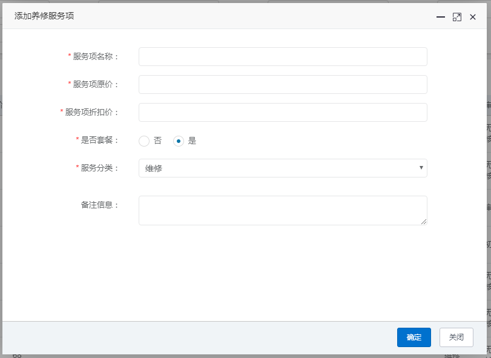

从项目其业务中拷贝一个add.html页面，修改成上面显示效

**步骤3：编辑页面跳转**

```java
@RequiresPermissions("business:serviceItem:add")
@RequestMapping("/addPage")
public String addPage(Model model){
    return prefix + "add";
}
```

**步骤3：表单提交**

```java
function submitHandler() {
    if ($.validate.form()) {
        $.operate.save(prefix + "/add", $('#form-serviceItem-add').serialize());
    }
}
```

**步骤4：实现添加请求**

养修预服务单项添加请求：add

```java
@RequestMapping("/add")
    @ResponseBody
    public AjaxResult add(ServiceItem serviceItem){
        serviceItemService.save(serviceItem);
        return AjaxResult.success();
    }
}
```

**注意：1: 异步请求，要求返回json格式数据, 2:添加时需要设置添加时间**


#### **需求3：养修服务单项编辑**

**步骤1：修改list.html页面**

在list.html页面的列表的option中添加一个createUrl属性

```js
var options = {
    url: prefix + "/query",
    updateUrl: prefix + "/editPage?id={id}",
   ....
}
```

在编辑按钮添加 onclick="$.operate.edit(\'' + row.id + '\')"事件

**步骤2：创建界面**

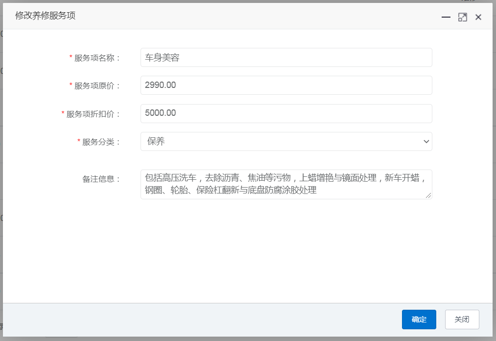

从项目其业务中拷贝一个edit.html页面，修改成上面显示效果

**步骤3：数据回显**

从editPage请求中获取共享预约对象，然后数据回显

```java
@RequiresPermissions("business:serviceItem:edit")
@RequestMapping("/editPage")
public String editPage(Model model, Long id){
    model.addAttribute("serviceItem", serviceItemService.get(id));
    return prefix + "edit";
}
```

**步骤4：参考其他页面


**步骤5：表单提交**

```js
function submitHandler() {
    if ($.validate.form()) {
        $.operate.save(prefix + "/edit", $('#form-serviceItem-edit').serialize());
    }
}
```

**步骤5：实现添加请求**

养修服务单项编辑请求：edit

```java
@RequiresPermissions("business:serviceItem:edit")
@RequestMapping("/edit")
@ResponseBody
public AjaxResult edit(ServiceItem serviceItem){
    serviceItemService.update(serviceItem);
    return AjaxResult.success();
}
```

update方法需要注意

```java
@Override
public void update(ServiceItem serviceItem) {
    ServiceItem oldObj = this.get(serviceItem.getId());
    //处于上架状态的商品不能修改
    if(ServiceItem.SALESTATUS_ON.equals(oldObj.getSaleStatus())){
        throw new BusinessException("上架服务项目不能修改，请下架后再修改");
    }else if(ServiceItem.AUDITSTATUS_AUDITING.equals(oldObj.getAuditStatus())){
        throw new BusinessException("服务项目正在审核中,不可修改");
    }
    //如果是审核通过，此时修改，需要将其状态变更为初始化
    if(ServiceItem.AUDITSTATUS_APPROVED.equals(oldObj.getAuditStatus())){
        serviceItem.setAuditStatus(ServiceItem.AUDITSTATUS_INIT);
    }
    serviceItem.setVersion(oldObj.getVersion());
    serviceItemMapper.updateByPrimaryKey(serviceItem);
}
```

**注意：异步请求，要求返回json格式数据**


#### 需求4：养修服务单项上下架

**步骤1：修改list.html页面，添加取消操作**

在上架按钮上添加：onclick="saleOff(\'' + row.id + '\')"

在下架按钮上添加：onclick="saleOn(\'' + row.id + '\')"

```js
function saleOff(id){
    $.modal.confirm("确认需要下架此服务项吗?", function() {
        $.operate.submit(prefix + "/saleOff?id="+id, "post");
    });
}
function saleOn(id){
    $.modal.confirm("确认需要上架此服务项吗?", function() {
        $.operate.submit(prefix + "/saleOn?id="+id, "post");
    });
}
```

**步骤2：编写上架/下架逻辑**

所谓的上架/下架，其实就是修改预约记录的状态：已上架/已下架

```java
@RequiresPermissions("business:serviceItem:saleOff")
@RequestMapping("/saleOff")
@ResponseBody
public AjaxResult saleOff(Long id){
    serviceItemService.saleOff(id);
    return AjaxResult.success();
}

@RequiresPermissions("business:serviceItem:saleOn")
@RequestMapping("/saleOn")
@ResponseBody
public AjaxResult saleOn(Long id){
    serviceItemService.saleOn(id);
    return AjaxResult.success();
}
```

update方法

```java
@Override
public void saleOff(Long id) {
    serviceItemMapper.updateSaleStatus(id,ServiceItem.SALESTATUS_OFF);
}
@Override
public void saleOn(Long id) {
    //合理化校验
    ServiceItem oldObj = this.get(id);
    if(oldObj!=null){
        //1.如果处于上架状态,不需要做事情
        if(ServiceItem.SALESTATUS_ON.equals(oldObj.getSaleStatus())){
            return;
        }
        //2.如果套餐且处于非审核通过,不允许进行上架操作
        if(ServiceItem.CARPACKAGE_YES.equals(oldObj.getCarPackage()) //是套餐
                && !ServiceItem.AUDITSTATUS_APPROVED.equals(oldObj.getAuditStatus())){
            throw new BusinessException("未审核通过套餐不允许上架");
        }
        //其他情况都可以进行上架
        serviceItemMapper.updateSaleStatus(id,ServiceItem.SALESTATUS_ON);
    }
}
```


#### 需求5：养修服务套餐审核【延后实现】

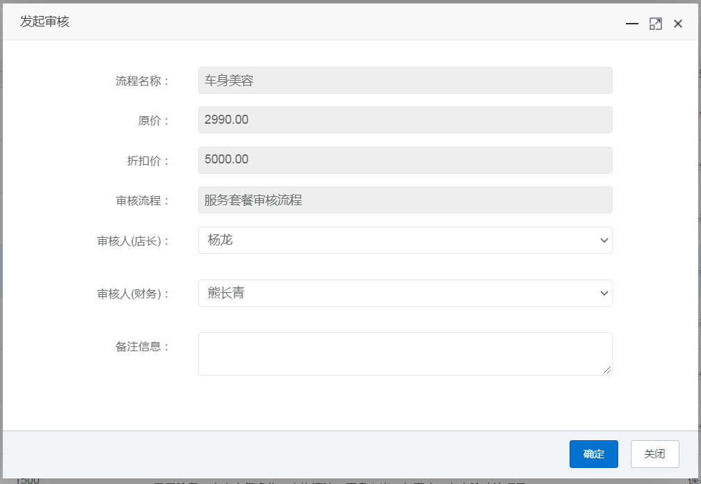


## 2：养修预约

### 功能描述

当客户爱车需要保养或者维修时，客户可以选择自己就近的门店进行养修服务消费，这个我们称之为线下消费，如果用户从官网填单或者电话通知的方法约定某个时间到店消费，这行为称之为预约。当前需求是针对预约行为。

### **预约方式**

1>电话咨询预约，店铺客服自行录入数据进入系统。【电话预约】

2>客户打开门户官网进行预约提交，则自动添加进入系统  。【官网填单预约】【拓展】

注意：本需求重点讲解【电话预约】方式

### 具体需求

1>养修预约记录列表查询

2>养修预约记录添加

3>养修预约记录编辑

4>养修预约取消

5>养修预约记录删除

6>到店消费，客户按照约定的时间到店消费后，实现消费

7>消费完成后，对客户消费服务项目进行结算

### 需求实现

#### **需求1：养修预约记录列表**

**步骤1：表设计**

思考：养修服务预约表应该怎么设计？

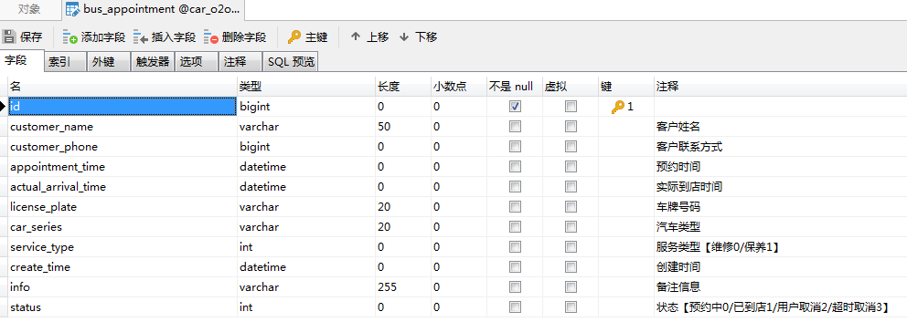

设计表之后，根据逆向工程创建domain,mapper.xml,mapper.java, 然后完成qo，service, serviceImpl, controller创建

```java
/**
 * 预约
 */
@Setter
@Getter
public class Appointment {
    private static final long serialVersionUID = 1L;
    public static final Integer STATUS_APPOINTMENT = 0;//预约中
    public static final Integer STATUS_ARRIVAL = 1;//已到店
    public static final Integer STATUS_CANCEL = 2;//用户取消
    public static final Integer STATUS_OVERTIME = 3;//超时取消
    public static final Integer STATUS_SETTLE  = 4;//已结算
    public static final Integer STATUS_PAID  = 5;//已支付

    private Long id;
    private String customerName;                    //客户姓名
    private String customerPhone;                   //客户联系方式
    @JsonFormat(pattern = "yyyy-MM-dd HH:mm",timezone = "GMT+8")
    @DateTimeFormat(pattern = "yyyy-MM-dd HH:mm")
    private Date appointmentTime;                   //预约时间
    @JsonFormat(pattern = "yyyy-MM-dd HH:mm",timezone = "GMT+8")
    @DateTimeFormat(pattern = "yyyy-MM-dd HH:mm")
    private Date actualArrivalTime;                 //实际到店时间
    private String licensePlate;                    //车牌号码
    private String carSeries;                       //汽车类型
    private Integer serviceType;                    //客服务类型【维修0/保养1】
    private Date createTime;                        //创建时间
    private String info;                            //备注信息
    private Integer status = STATUS_APPOINTMENT;    //状态【预约中0/已到店1/用户取消2/超时取消3】
}
```

**步骤2：创建列表页面**

页面效果

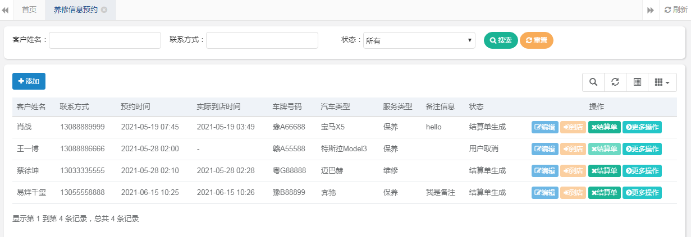

从项目其业务中拷贝一个list.html页面，修改成上面显示效果

操作按钮

按钮显示要求：

当记录状态是预约中， 编辑，到店，取消，删除可用，结算单不可用

当记录状态是已到店， 编辑，到店，取消，删除不可用, 结算单可用

当记录状态是用户取消，编辑，到店，取消，删除, 结算单不可用

当记录状态是结算单生成，编辑，到店，取消，删除不可用, 结算单可用

当记录状态已支付，编辑，到店，取消，删除不可用, 结算单可用

**步骤3：编写请求方法跳转list.html页面**

```java
@RequiresPermissions("business:appointment:view")
@RequestMapping("/listPage")
public String list(){
    return prefix + "list";
}
```

**步骤4：编写请求方法查询列表分页数据**

```java
@RequiresPermissions("business:appointment:list")
@RequestMapping("/query")
@ResponseBody
public TablePageInfo query(AppointmentQuery qo){
    return appointmentService.query(qo);
}
```


#### **需求2：养修预约记录添加**

**步骤1：修改list.html页面**

在list.html页面的列表的option中添加一个createUrl属性

```js
var options = {
    url: prefix + "/query",
    createUrl: prefix + "/addPage",
   ....
}
```

给添加按钮添加onclick="$.operate.add()" 事件

**步骤2：创建界面**

思考：预约界面应该设计成什么样子

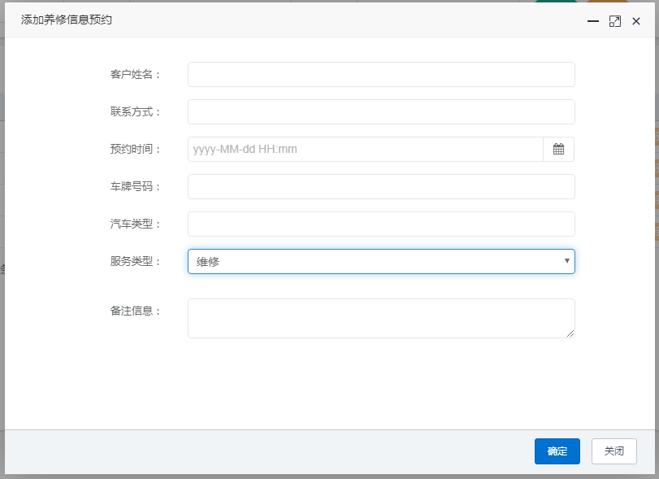


从项目其业务中拷贝一个add.html页面，修改成上面显示效果

**步骤3：编写请求方法跳转到add.html页面**

```java
@RequiresPermissions("business:appointment:add")
@RequestMapping("/addPage")
public String addPage(Model model){
    return prefix + "add";
}
```

知识点：时间控件

官网：https://www.datetimepicker.cn/example/

**使用方法**

引入插件

```js
<th:block th:include="common/include :: datetimepicker" />
```

注意：在<th:block th:include="common/include :: footer" /> 后面引入

配置插件

```html
<div class="form-group">    
    <label class="col-sm-3 control-label">预约时间：</label>
    <div class="col-sm-8">
        <div class="input-group date">
            <input name="appointmentTime" class="form-control" placeholder="yyyy-MM-dd HH:mm"
                    type="text" required>
            <span class="input-group-addon"><i class="fa fa-calendar"></i></span>
        </div>
    </div>
</div>
```

```js
$("input[name='appointmentTime']").datetimepicker({
    format: "yyyy-mm-dd hh:ii",
    autoclose: true
});
```

**步骤4：表单提交**

```java
function submitHandler() {
    if ($.validate.form()) {
        $.operate.save(prefix + "/add", $('#form-appointment-add').serialize());
    }
}
```

**步骤5：实现添加请求**

养修预约记录添加请求：add

```java
@RequiresPermissions("business:appointment:add")
@RequestMapping("/add")
@ResponseBody
public AjaxResult add(Appointment appointment){
    appointmentService.save(appointment);
    return AjaxResult.success();
}
```

**注意：异步请求，要求返回json格式数据**


#### **需求3：养修预约记录编辑**

**步骤1：修改list.html页面**

在list.html页面的列表的option中添加一个createUrl属性

```js
var options = {
    url: prefix + "/query",
    updateUrl: prefix + "/editPage?id={id}",
   ....
}
```

在编辑按钮添加 onclick="$.operate.edit(\'' + row.id + '\')"事件

**步骤2：创建界面**

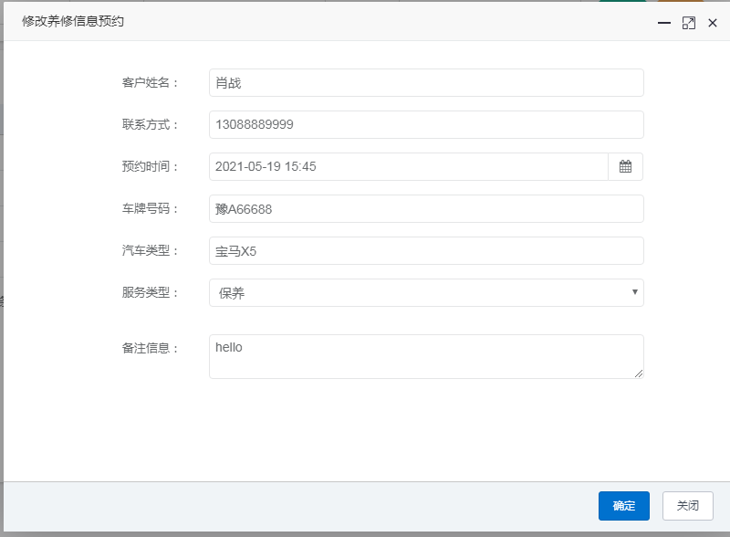

从项目其业务中拷贝一个edit.html页面，修改成上面显示效果

**步骤3：数据回显**

从editPage请求中获取共享预约对象，然后数据回显

```java
@RequiresPermissions("business:appointment:edit")
@RequestMapping("/editPage")
public String editPage(Model model, Long id){
    model.addAttribute("appointment", appointmentService.get(id));
    return prefix + "edit";
}
```


**步骤4：表单提交**

```js
function submitHandler() {
    if ($.validate.form()) {
        $.operate.save(prefix + "/edit", $('#form-appointment-edit').serialize());
    }
}
```

**步骤5：实现添加请求**

养修预约记录编辑请求：edit

```java
@RequiresPermissions("business:appointment:edit")
@RequestMapping("/edit")
@ResponseBody
public AjaxResult edit(Appointment appointment){
    appointmentService.update(appointment);
    return AjaxResult.success();
}
```

编辑的业务逻辑

```java
@Override
public void update(Appointment appointment) {
        Appointment oldObj = this.get(appointment.getId());
        if(!Appointment.STATUS_APPOINTMENT.equals(oldObj.getStatus())){
            //如果状态不是预约中，不能进行编辑操作
            throw new BusinessException("只有状态为预约中的预约单才能进行编辑操作");
        }
        appointmentMapper.updateByPrimaryKey(appointment);
}
```

SQL中需要注意，只更新需要修改的字段.


**注意：异步请求，要求返回json格式数据**

#### **需求4：养修预约取消**

**步骤1：修改list.html页面，添加取消操作**

在取消按钮上添加：onclick='cancelHandler(" + row.id + ")'

```js
function cancelHandler(id){
    $.modal.confirm("确认客户取消预约?", function() {
        $.operate.submit(prefix + "/cancel?id="+id, "get");
    });
}
```

**步骤2：编写取消逻辑**

所谓的取消，其实就是修改预约记录的状态：用户取消

```java
@RequiresPermissions("business:appointment:cancel")
@RequestMapping("/cancel")
@ResponseBody
public AjaxResult cancel(Long id){
    appointmentService.cancel(id);
    return AjaxResult.success();
}
```


#### **需求5：养修预约删除**

**步骤1：修改list.html页面，添加删除操作**

在list.html页面的列表的option中添加一个removeUrl属性

```js
var options = {
    url: prefix + "/query",
    removeUrl: prefix + "/remove",
   ....
}
```

给删除按钮添加 onclick='$.operate.remove(" + row.id + ")' 事件

**步骤2：编写删除逻辑**

```java
@RequiresPermissions("business:appointment:remove")
@RequestMapping("/remove")
@ResponseBody
public AjaxResult remove(String ids){
    appointmentService.deleteBatch(ids);
    return AjaxResult.success();
}
```

拓展需求: 实现预约信息的软删除.


#### **需求6：用户到店**

**步骤1：修改list.html页面，添加到店操作**

在到店按钮上添加：onclick="arrivalHandler(\'' + row.id + '\')

```js
function arrivalHandler(id){
    $.modal.confirm("确认客户已经到店?", function() {
        $.operate.submit(prefix + "/arrival?id="+id, "get");
    });
}
```

**步骤2：编写到店逻辑**

所谓的到店，其实就是修改预约记录的状态：已到店

```java
@RequiresPermissions("business:appointment:arrival")
@RequestMapping("/arrival")
@ResponseBody
public AjaxResult arrival(Long id){
    appointmentService.arrival(id);
    return AjaxResult.success();
}
```


#### 需求7：客户结算【延后实现】

**步骤1：修改list.html页面，添加用户结算操作**

在结算单按钮上添加： onclick="generateStatement(\'' + row.id + '\')

```js
function generateStatementOp(id){
	$.modal.confirm("是否需要生成结算单?",function(){
		$.operate.get(prefix+"/generateStatement?appointmentId="+id,function(result){
			if(result.code == web_status.SUCCESS){
				var url = "/business/statementItem/itemDetail?statementId="+result.data;
				$.modal.openTab("结算单明细",url);
			}else{
				$.modal.alertError(result.msg);
			}
		});
	});
}
```

这里注意逻辑，

如果状态是已经结算了，提示："是否需要查看对应的结算单明细"，直接去查看结算单明细

如果没有结算，提示："确认生成结算单吗?"，去添加并保存结算单


**步骤2：编写客户结算逻辑**

客户结算请求方法中，要完成2个分支逻辑

1>如果当前养修预约记录状态为已经结算了，跳转到结算单明细查看页面

2>如果当前养修预约记录状态为没有结算，此时需要创建结算单，并跳转到结算单明细编辑页面


## 3：服务结算单

### 功能描述

客户线下消费完成之后，服务结账，列举消费了哪些项目，使用结算单进行记录。这里会分2中情况进行结算

1>如果客户直接进店消费，由客服收到录入结算单

2>如果客户通过预约，然后履约消费，由程序自动录入结算单，此时的结算的预约单id属性有值

### 具体需求

1>结算单列表

2>结算单添加

3>结算单编辑

4>结算单明细(明细添加/明细查看)

5>结算到删除

### 需求实现

#### 需求1：结算单列表

步骤1：表设计

思考：结算单表该如何设计

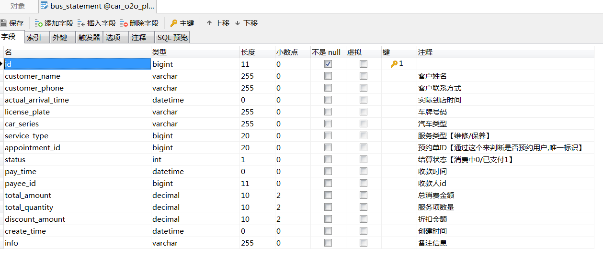

设计表之后，根据逆向工程创建domain,mapper.xml,mapper.java, 然后完成qo，service, serviceImpl, controller创建

```java
/**
 * 结算单
 */
@Setter
@Getter
public class Statement {

    public static final Integer STATUS_CONSUME = 0;//消费中
    public static final Integer STATUS_PAID = 1;//已支付
    private static final long serialVersionUID = 1L;

    private Long id;
    private String customerName;                    //客户姓名
    private String customerPhone;                   //客户联系方式
    @JsonFormat(pattern = "yyyy-MM-dd HH:mm",timezone = "GMT+8")
    @DateTimeFormat(pattern = "yyyy-MM-dd HH:mm")
    private Date actualArrivalTime;                 //实际到店时间
    private String licensePlate;                    //车牌号码
    private String carSeries;                       //汽车类型
    private Long serviceType;                       //服务类型【维修/保养】
    private Long appointmentId;                     //预约单ID【通过这个来判断是否预约用户,唯一标识】
    private Integer status = STATUS_CONSUME;        //结算状态【消费中0/已支付1】
    @JsonFormat(pattern = "yyyy-MM-dd",timezone = "GMT+8")
    private Date payTime;                           //收款时间
    private User payee;                             //收款人对象
    private BigDecimal totalAmount = new BigDecimal("0.00");        //总消费金额
    private BigDecimal totalQuantity= new BigDecimal("0");;         //服务项数量
    private BigDecimal discountAmount = new BigDecimal("0.00");     //折扣金额
    private Date createTime;                        //创建时间
    private String info;                            //备注信息
}
```

**步骤2：创建列表页面**

页面效果

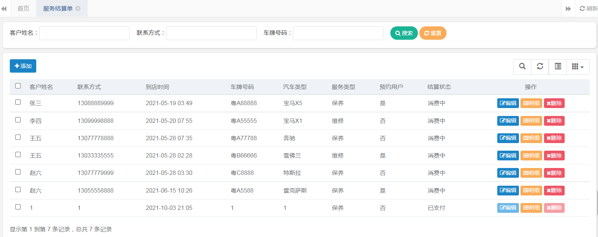

从项目其业务中拷贝一个list.html页面，修改成上面显示效果


操作按钮

按钮显示要求：

当结算当状态为消费中， 编辑，明细，删除可用

当结算当状态为已支付， 编辑，删除不可用，明细可用

**步骤3：编写请求方法跳转list.html页面**

```java
@RequiresPermissions("business:statement:view")
@RequestMapping("/listPage")
public String list(){
    return prefix + "list";
}
```

**步骤4：编写请求方法查询列表分页数据**

```java
@RequiresPermissions("business:statement:list")
@RequestMapping("/query")
@ResponseBody
public TablePageInfo query(StatementQuery qo){
    return statementService.query(qo);
}
```


#### 需求2：结算单添加

结算单的添加分2种情况

1>客户事先已预约，然后到店消费产生结算，此时结算单中的appointment_id属性有值

2>客户直接到店消费产生的结算，此时结算单中的appointment_id属性没值

第一种添加结算单添加在预约单列表中，点击结算按钮，进入结算页面跳转，跳转前实现结算单的添加。

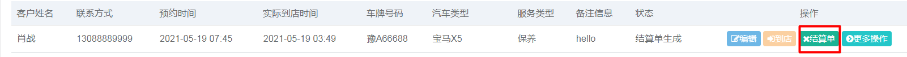

第二种，直接弹出添加页面实现添加

**步骤1：修改list.html页面**

在list.html页面的列表的option中添加一个createUrl属性

```js
var options = {
    url: prefix + "/query",
    createUrl: prefix + "/addPage",
   ....
}
```

给添加按钮添加onclick="$.operate.add()" 事件

**步骤2：创建界面**

思考：预约界面应该设计成什么样子

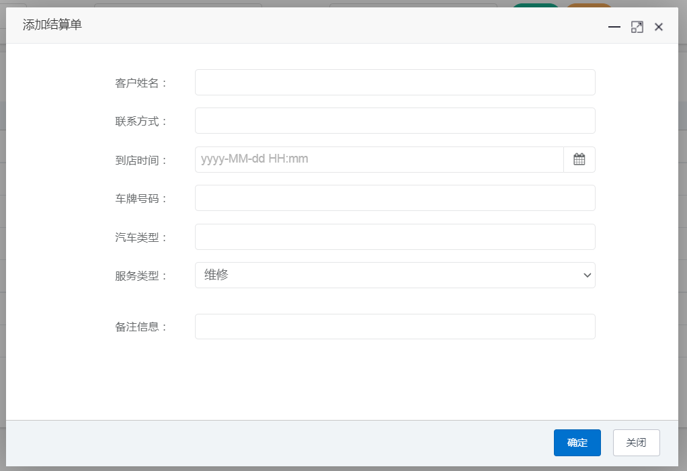

从项目其业务中拷贝一个add.html页面，修改成上面显示效果

```java
@RequiresPermissions("business:statement:add")
@RequestMapping("/addPage")
public String addPage(Model model){
    return prefix + "add";
}
```

**步骤2：表单提交**

```java
function submitHandler() {
    if ($.validate.form()) {
        $.operate.save(prefix + "/add", $('#form-statement-add').serialize());
    }
}
```

**步骤3：实现添加请求**

结算单添加请求：add

```java
@RequiresPermissions("business:statement:add")
@RequestMapping("/add")
@ResponseBody
public AjaxResult add(Statement statement){
    statementService.save(statement);
    return AjaxResult.success();
}
```

**注意：异步请求，要求返回json格式数据**

#### **需求3：结算单编辑**

**步骤1：修改list.html页面**

在list.html页面的列表的option中添加一个createUrl属性

```js
var options = {
    url: prefix + "/query",
    updateUrl: prefix + "/editPage?id={id}",
   ....
}
```

在编辑按钮添加 onclick="$.operate.edit(\'' + row.id + '\')"事件

**步骤2：创建界面**

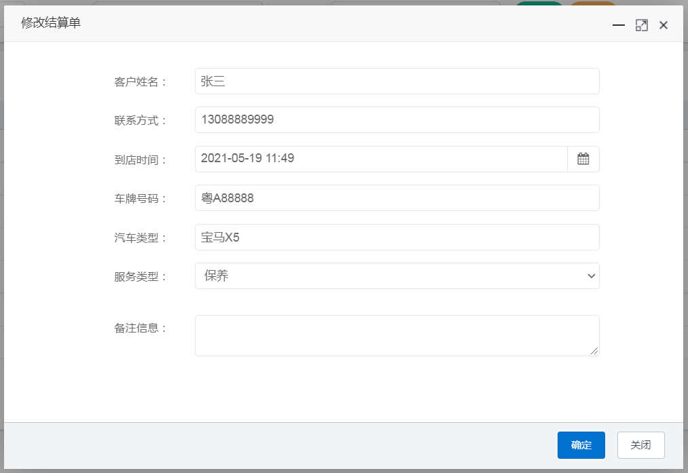

从项目其业务中拷贝一个edit.html页面，修改成上面显示效果


**步骤3：数据回显**

从editPage请求中获取共享结算单对象，然后数据回显

**步骤4：表单提交**

```js
function submitHandler() {
    if ($.validate.form()) {
        $.operate.save(prefix + "/edit", $('#form-statement-edit').serialize());
    }
}
```

**步骤5：实现编辑请求**

结算单编辑请求：edit

```java
@Override
public void update(Statement statement) {
        //只有处于消费中的预约单才可以进行修改.
        Statement oldObj = this.get(statement.getId());
        if(Statement.STATUS_PAID.equals(oldObj.getStatus())){
            throw new BusinessException("已经支付的结算单不能修改");
        }
        statementMapper.updateByPrimaryKey(statement);
}
```


**注意：异步请求，要求返回json格式数据**


#### 需求4：结算单明细(明细添加/明细查看)

**步骤1：明细单的跳转**

给明细按钮添加点击事件： onclick="detail(\'' + row.id + '\')"

```js
function detail(id) {
    var url= ctx + 'business/statementItem/itemDetail?statementId=' + id;
    $.modal.openTab("结算单明细", url);
}
```

根据传入结算单状态，跳转都不同的页面，

editDetail页面：当结算单是消费状态，跳转到结算单费用清算页面(算钱页面，注意此时用户还没支付)

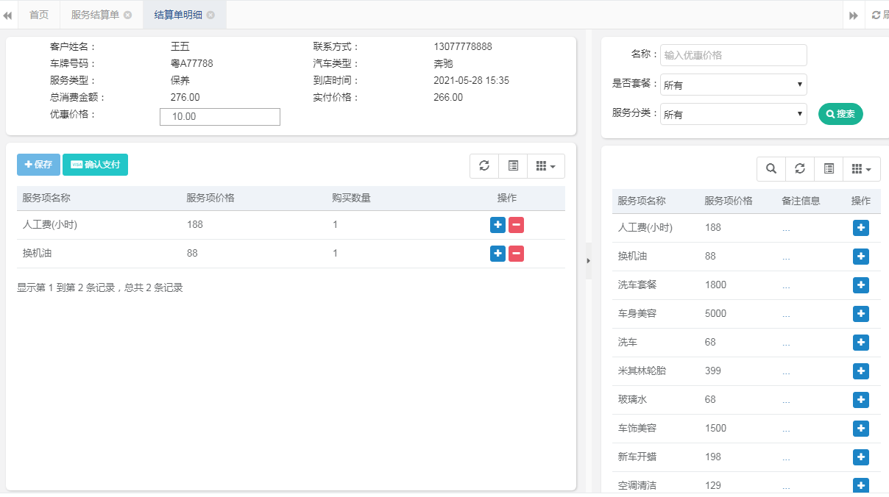


showDetail页面：当结算单位已支付，跳转到结算单明细查看页面(查看页面，注意此时用户已经完成支付了，不能再改动了)

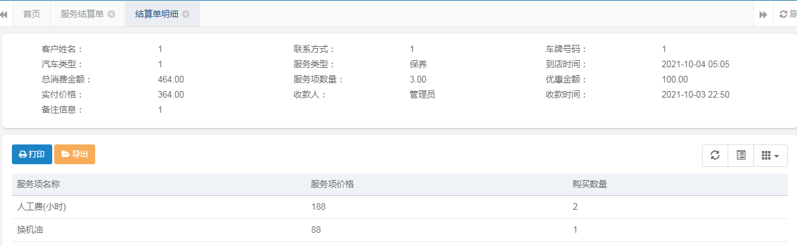


```java
@RequiresPermissions("business:statementItem:itemDetail")
@RequestMapping("/itemDetail")
public String editDetail(Model model, Long statementId){
    Statement statement = statementService.get(statementId);
    statement.setPayee(userService.get(statement.getPayeeId()));
    model.addAttribute("statement", statement);

    if(statement.getStatus() == Statement.STATUS_CONSUME){
        return prefix +"editDetail";
    }else{
        return prefix +"showDetail";
    }
}
```

**步骤2：明细编辑页面-editDetail**

编辑保存

```java
@RequiresPermissions("business:statementItem:saveItems")
@RequestMapping("/saveItems")
@ResponseBody
public AjaxResult saveItems(@RequestBody List<StatementItem> items){
    statementItemService.saveItems(items);
    return AjaxResult.success();
}
```

service saveItem

```java
@Override
@Transactional
public void saveItems(List<StatementItem> items) {
    //进行合理性校验
    if(items==null || items.size()<=0){
        throw new BusinessException("非法操作");
    }
    StatementItem tempItem = items.remove(items.size() - 1);
    Long statementId = tempItem.getStatementId();
    BigDecimal disCountPrice = tempItem.getItemPrice();
    Statement statement = statementService.get(statementId);
    if(Statement.STATUS_PAID.equals(statement.getStatus())){
        throw new BusinessException("已支付的结算不能进行保存操作");
    }
    //删除之前的明细的数据
    statementItemMapper.deleteByStatementId(statementId);
    BigDecimal totalAmount = new BigDecimal(0);
    BigDecimal totalQuantity = new BigDecimal(0);
    for(StatementItem item:items){
        //保存数据库中
        statementItemMapper.insert(item);
        totalAmount = totalAmount.add(item.getItemPrice().multiply(item.getItemQuantity()));
        totalQuantity = totalQuantity.add(item.getItemQuantity());
    }
    if(disCountPrice.compareTo(totalAmount)>0){
        throw new BusinessException("非法操作");
    }
    //更新结算单的总消费金额,总数量,总折扣金额
    statementService.updateAmount(statementId,totalAmount,totalQuantity,disCountPrice);
}
```

确认支付

真实开发，需要激活激光扫描枪，用于扫描客服支付二维码。这里就没条件折腾，简单弄：给个提示

```js
function payFun(){
   $.modal.confirm("是否要支付",function(){
       $.get("/business/statementItem/pay?statementId="+statementId,function(result){
           if(result.code==web_status.SUCCESS){
               $.modal.confirm(result.msg,function(){
                   $.modal.closeTab();
               });
           }else{
               $.modal.alertError(result.msg);
           }
       })
   });
}
```

```java
@RequiresPermissions("business:statementItem:payStatement")
@RequestMapping("/payStatement")
@ResponseBody
public AjaxResult payStatement(Long statementId){
    statementService.payStatement(statementId);
    return AjaxResult.success();
}
```

service

```java
@Override
public void pay(Long statementId) {
    Long userId = ShiroUtils.getUserId();
    //修改结算单状态
    statementService.pay(statementId,userId,Statement.STATUS_PAID);
    //判断当前结算单是否有对应预约单,如果有修改状态
    Statement statement = statementService.get(statementId);
    if(statement.getAppointmentId()!=null){
        appointmentService.changeStatus(statement.getAppointmentId(), Appointment.STATUS_PAID);
    }
}
```

#### 需求5：养修服务预约单结算

**步骤1：养修服务预约单预约按钮跳转**

在appointment/list.html 结算单按中添加事件：onclick="generateStatement(\'' + row.id + '\')"

```js
function generateStatementOp(id){
	$.modal.confirm("是否需要生成结算单?",function(){
		$.operate.get(prefix+"/generateStatement?appointmentId="+id,function(result){
			if(result.code == web_status.SUCCESS){
				console.log(result);
				var url = "/business/statementItem/itemDetail?statementId="+result.data;
				$.modal.openTab("结算单明细",url);
			}else{
				$.modal.alertError(result.msg);
			}
		});
	});
}
```

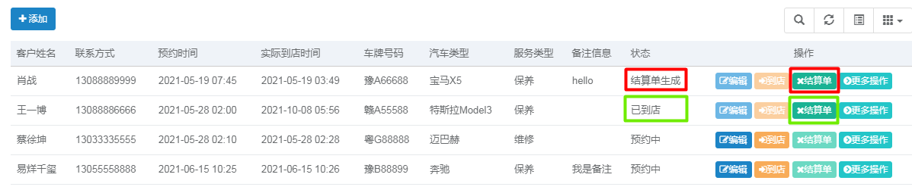

注意页面跳转的区别：

当预约单状态为：结算单生成，那么跳转到页面是结算单明细查看页面(statementItem/showDetail.html)

当预约单状态为：已到店，那么跳转到页面是结算单明细编辑页面(statementItem/editDetail.html)


**步骤2：当预约单位已到店处理逻辑**

当预约单状态为：已到店，此时结算单并没有创建，所有此时需要创建结算单，并设置结算的appointment_id属性值，表示当前的结算单是客户预约消费产生的。

```java
/**
 * 生成结算单
 */
@RequiresPermissions("business:carMaintenanceInfo:generateStatement")
@RequestMapping("/generateStatement")
@ResponseBody
public AjaxResult generateStatement(Long appointmentId) {
    Long statementId = appointmentService.generateStatement(id);
    return AjaxResult.success(statementId);
}
```

service

```java
@Override
@Transactional
public Statement generateStatement(Long appointmentId) {
    Appointment appointment = this.get(appointmentId);
    //合理性校验
    if(Appointment.STATUS_ARRIVAL.equals(appointment.getStatus())||
            Appointment.STATUS_SETTLE.equals(appointment.getStatus())||
            Appointment.STATUS_PAID.equals(appointment.getStatus())){
        //根据预约单id查询结算单对象
        Statement statement = statementService.getByAppointmentId(appointmentId);
        if(statement==null){
            //从预约单中把信息保存到结算单
            statement = new Statement();
            statement.setCustomerName(appointment.getCustomerName());
            statement.setCustomerPhone(appointment.getCustomerPhone());
            statement.setServiceType(appointment.getServiceType());
            statement.setCarSeries(appointment.getCarSeries());
            statement.setAppointmentId(appointmentId);
            statement.setLicensePlate(appointment.getLicensePlate());
            statement.setInfo(appointment.getInfo());
            statement.setActualArrivalTime(appointment.getActualArrivalTime());
            statement.setCreateTime(new Date());
            statementService.saveFromAppointment(statement);
            //修改预约单状态(结算单生成)
            appointmentMapper.changeStatus(appointmentId,Appointment.STATUS_SETTLE);
        }
        return statement;
    }else{
        throw new BusinessException("非法操作");
    }
}
```


#### 需求6：结算单删除

**步骤1：修改list.html页面，添加删除操作**

给删除按钮添加事件：onclick="deleteFun(\'' + row.id + '\')"

```js
function deleteFun(id){
    $.modal.confirm("确认此条消费单吗?此操作不可逆", function() {
        $.operate.post(ctx + "/business/statement/remove?id="+id,function(result){
            $.operate.ajaxSuccess(result);
        });
    });
}
```

**步骤2：编写删除逻辑**

```java
@RequiresPermissions("business:statement:remove")
@RequestMapping("/remove")
@ResponseBody
public AjaxResult remove(Long id){
    statementService.delete(id);
    return AjaxResult.success();
}
```

service

```java
@Override
public void delete(Long id) {
    statementMapper.deleteByPrimaryKey(id);
    statementItemService.deletByStatementId(id);
}
```


## 4：Springboot集成activiti7

**步骤1：在pom文件中添加SpringBoot集成Activiti7的依赖**

```xml
<!--添加activiti和SpringBoot整合的依赖
    MyBatis版本会有冲突，所以需要排除-->
<dependency>
    <groupId>org.activiti</groupId>
    <artifactId>activiti-spring-boot-starter</artifactId>
    <version>7.0.0.SR1</version>
    <exclusions>
        <exclusion>
            <artifactId>mybatis</artifactId>
            <groupId>org.mybatis</groupId>
        </exclusion>
    </exclusions>
</dependency>
<!--activiti可以绘制流程的的依赖-->
<dependency>
    <groupId>org.activiti</groupId>
    <artifactId>activiti-image-generator</artifactId>
    <version>7.0.0.SR1</version>
</dependency>
```

**步骤2：配置`application.yml`配置文件**

在`application.yml`配置文件中添加Activiti7的配置信息

```yaml
spring:
  activiti:
    database-schema-update: true
    db-history-used: true
    history-level: full
    check-process-definitions: false
    use-strong-uuids: false
```

- database-schema-update属性

  ```
  1.flase：默认值。activiti在启动时，对比数据库表中保存的版本，如果没有表或者版本不匹配，将抛出异常
  2.true： activiti会对数据库中所有表进行更新操作。如果表不存在，则自动创建
  3.create_drop： 在activiti启动时创建表，在关闭时删除表（必须手动关闭引擎，才能删除表）
  4.drop-create： 在activiti启动时删除原来的旧表，然后在创建新表（不需要手动关闭引擎）
  ```

- db-history-used

  ```
  检测历史表是否存在 activiti7默认没有开启数据库历史记录,true启动数据库历史记录
  ```

- history-level

  ```
  #记录历史等级 可配置的历史级别有none, activity, audit, full
  1.none：不保存任何的历史数据，因此，在流程执行过程中，这是最高效的。
  2.activity：级别高于none，保存流程实例与流程行为，其他数据不保存。
  3.audit：除activity级别会保存的数据外，还会保存全部的流程任务及其属性。audit为history的默认值。
  4.full：保存历史数据的最高级别，除了会保存audit级别的数据外，还会保存其他全部流程相关的细节数据，包括一些流程参数等。
  ```

- check-process-definitions

  ```
  #校验流程文件，默认校验resources下的processes文件夹里的流程文件
  ```

- use-strong-uuids

  ```
  是否使用UUID作为主键生成策略
  ```

**步骤3：排除Spring Security的自动装配**

Activiti7默认和Spring Security集成了,但是我们的项目中使用的是Shiro,所以我们需要在项目中排除掉Spring Security的自动装配配置,否则我们的登录页会被覆盖

```java
@SpringBootApplication(exclude = { DataSourceAutoConfiguration.class,
        SecurityAutoConfiguration.class,
        ManagementWebSecurityAutoConfiguration.class
})
@MapperScan(basePackages = {"cn.wolfcode.car.*.mapper"})
public class CarO2O {
    public static void main(String[] args) {
        SpringApplication.run(CarO2O.class, args);
    }
}
```

运行项目，如果在数据库中出现25张act_开头的表说明集成是没问题的.


## 5：审核流程定义

### 功能描述

上面也说了，可以消费结算单项里面有普通项，有套餐，普通单项不需要审核。因为套餐有优惠折扣跟最终定价，这就要求必须经过店长拍板才行，所以需要引入审核流程。而这里是对流程文件上传管理

### 具体需求

1>流程定义列表

2>流程文件部署

3>流程定义编辑

4>流程定义删除

5>查看流程文件-xml

6>查看流程文件-png

### 需求实现

#### 需求1：流程定义列表

**步骤1：表设计**

思考：流程定义表应该怎么设计？

**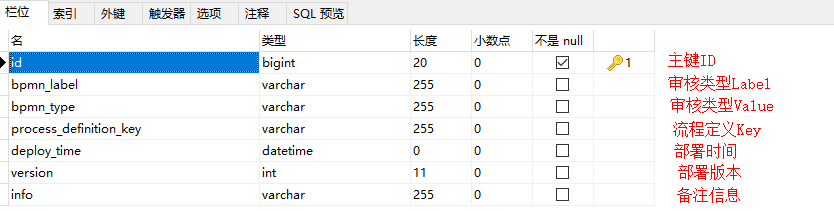**

设计表之后，根据逆向工程创建domain,mapper.xml,mapper.java, 然后完成qo，service, serviceImpl, controller创建

```java
/*
流程定义
*/
@Setter@Getter
public class BpmnInfo {
    /** 主键*/
    private Long id;
    /** 流程(图)名称*/
    private String bpmnLabel;
    /** 流程(图)类型*/
    private String bpmnType;
    /** 流程部署id*/
    private String processDefinitionKey;
    /** 部署时间*/
    @JsonFormat(pattern = "yyyy-MM-dd HH:mm:s",timezone = "GMT+8")
    private Date deployTime;
    /**版本号*/
    private Integer version;
    /** 描述信息*/
    private String info;
}
```

**步骤2：创建列表页面**

页面效果

**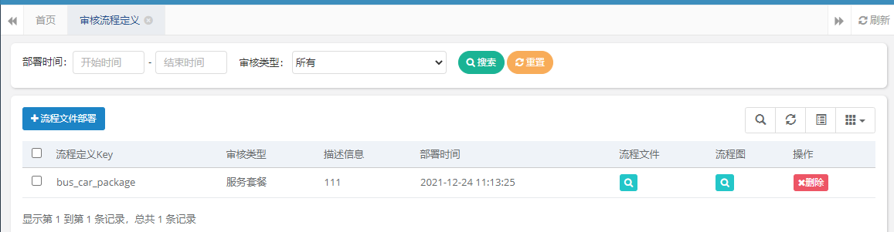**

从项目其业务中拷贝一个list.html页面，修改成上面显示效果


**步骤3：编写请求方法 跳转list.html页面**

```java
@RequiresPermissions("business:bpmnInfo:view")
@RequestMapping("/listPage")
public String list(){
    return prefix + "list";
}
```

**步骤4：编写请求方法列表分页**

```java
@RequiresPermissions("business:bpmnInfo:list")
@RequestMapping("/query")
@ResponseBody
public TablePageInfo query(BpmnInfoQuery qo){

    return bpmnInfoService.query(qo);
}
```


#### 需求2：流程文件部署

**步骤1：修改list.html页面**

给 流程文件部署 按钮添加点击事件

```html
<div class="btn-group-sm" id="toolbar" role="group">
    <a class="btn btn-success" onclick="deployMentlHandler()"shiro:hasPermission="business:serviceItem:add">
        <i class="fa fa-plus"></i> 流程文件部署
    </a>
</div>
```

跳转到上传流程图页面

```js
function deployMentlHandler(){
    $.modal.open("流程部署", prefix + "/deployPage");
}
```

**步骤2：创建部署页面**

**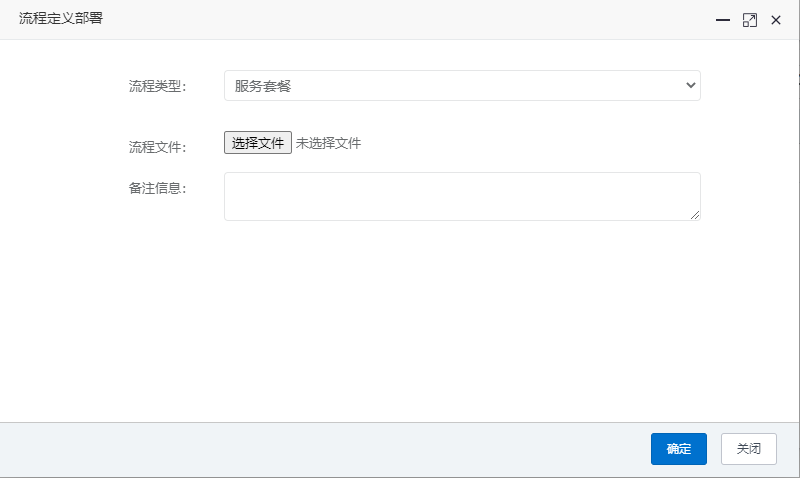**

定义跳转页面

```java
@RequestMapping("/deployPage")
public String deployPage(){
    return prefix+"deploy";
}
```


**步骤3：实现部署逻辑**

```js
function submitHandler() {
    if ($.validate.form()) {
        var file = $("[name='bpmnFile']")[0].files[0];
        if(!file){
            $.modal.alertError("请选择需要上传的流程文件");
            return;
        }
        var fd = new FormData();
        fd.append("file",file);
        fd.append("bpmnType",$("[name='bpmnType']").val());
        fd.append("bpmnLabel",$("[name='bpmnType'] option:selected").text());
        fd.append("info",$("[name='info']").val());
        $.ajax({
            url:prefix+'/deploy',
            method:'post',
            // 数据不需要编码
            contentType: false,
            // 数据对象不需要转换成键值对格式
            processData: false,
            data:fd,
            success:function(result){
                $.operate.successCallback(result);
            }
        });
    }
}
```

后台处理逻辑

```java
@RequestMapping("/deploy")
@ResponseBody
public AjaxResult deploy(MultipartFile file,String bpmnLabel,String bpmnType,String info) throws IOException {
    bpmnInfoService.deploy(file,bpmnLabel,bpmnType,info);
    return AjaxResult.success("部署成功");
}
```

```java
@Override
@Transactional
public void deploy(MultipartFile file, String bpmnLabel, String bpmnType, String info) throws IOException {
    String originalFilename = file.getOriginalFilename();
    String extName = originalFilename.substring(originalFilename.lastIndexOf(".")+1);
    if(!"bpmn".equalsIgnoreCase(extName)){
        throw new BusinessException("只能上传bpmn格式的流程文件");
    }
    Deployment deploy = repositoryService.createDeployment()
            .addInputStream(file.getOriginalFilename(), file.getInputStream())
            .deploy();
    ProcessDefinition processDefinition = repositoryService.createProcessDefinitionQuery()
            .deploymentId(deploy.getId()).singleResult();
    BpmnInfo bpmnInfo = new BpmnInfo();
    bpmnInfo.setBpmnLabel(bpmnLabel);
    bpmnInfo.setBpmnType(bpmnType);
    bpmnInfo.setProcessDefinitionKey(processDefinition.getKey());
    bpmnInfo.setVersion(processDefinition.getVersion());
    bpmnInfo.setDeployTime(new Date());
    bpmnInfo.setInfo(info);
    bpmnInfoMapper.insert(bpmnInfo);
}
```


#### 需求3：流程定义文件删除

**步骤1：修改list.html文件**

给删除按钮添加点击事件：onclick="deleteHandler(\'' + row.id + '\')

```js
function deleteHandler(id){
    $.modal.confirm("确认删除选中流程定义么?", function() {
        $.operate.submit(prefix + "/delete?id="+id, "get");
    });
}
```

**步骤2：实现流程定义文件删除**

```java
@RequiresPermissions("business:bpmnInfo:delete")
@RequestMapping("/delete")
@ResponseBody
public AjaxResult delete(Long id){
    bpmnInfoService.delete(id);
    return AjaxResult.success();
}
```

```java
@Override
@Transactional
public void delete(Long id) {
    BpmnInfo bpmnInfo = bpmnInfoMapper.selectByPrimaryKey(id);
    String processDefinitionKey = bpmnInfo.getProcessDefinitionKey();
    //TODO 查询所有的流程实例，找到业务标识，更新业务标识信息
    //删除bpmnInfo
    bpmnInfoMapper.deleteByPrimaryKey(id);
    //把部署文件删除掉
    ProcessDefinition processDefinition = repositoryService.createProcessDefinitionQuery()
            .processDefinitionKey(processDefinitionKey)
            .processDefinitionVersion(bpmnInfo.getVersion())
            .singleResult();
    //删除流程定义
    repositoryService.deleteDeployment(processDefinition.getDeploymentId());
}
```

#### 需求4：查看流程文件

**步骤1：修改list.html文件**

添加2个超链接

```js
{
    field: 'resourceName',
    title: '流程文件',
    formatter:function(value, row, index) {
        var url = prefix+"/readResource?id="+row.id+"&type=xml";
        return '<a class="btn btn-info btn-xs " href="' + url + '" target="_blank"><i class="fa fa-search"></i></a> ';
    }
},
{
    field: 'diagramResourceName',
    title: '流程图',
    formatter:function(value, row, index) {
        var url = prefix+"/readResource?id="+row.id+"&type=png";
        return '<a class="btn btn-info btn-xs " href="' + url + '" target="_blank"><i class="fa fa-search"></i></a> ';
    }
},
```

**步骤2：实现流程文件查看**

```java
@RequestMapping("/readResource")
@ResponseBody
public void readResource(HttpServletResponse response,Long id,String type) throws IOException {
    InputStream inputStream = bpmnInfoService.getFileInputStream(id,type);
    IOUtils.copy(inputStream,response.getOutputStream());
}
```

```java
@Override
public InputStream getFileInputStream(Long id, String type) {
    InputStream inputStream = null;
    //获取流程定义
    BpmnInfo bpmnInfo = this.get(id);
    ProcessDefinition processDefinition = repositoryService.createProcessDefinitionQuery()
            .processDefinitionKey(bpmnInfo.getProcessDefinitionKey())
            .processDefinitionVersion(bpmnInfo.getVersion())
            .singleResult();
    if("xml".equalsIgnoreCase(type)){
        //获取xml的文件
        String resourceName = processDefinition.getResourceName();
        inputStream = repositoryService.getResourceAsStream(processDefinition.getDeploymentId(),resourceName);
    }else{
        BpmnModel bpmnModel = repositoryService.getBpmnModel(processDefinition.getId());
        //获取png的文件
        DefaultProcessDiagramGenerator generator =new DefaultProcessDiagramGenerator();
        //generateDiagram(bpmn模型,需要高亮节点ID集合,需要高亮连线ID集合)
        inputStream = generator.generateDiagram(bpmnModel,
                Collections.EMPTY_LIST,
                Collections.EMPTY_LIST,
                "宋体",
                "宋体",
                "宋体"
                );
    }
    return inputStream;
}
```

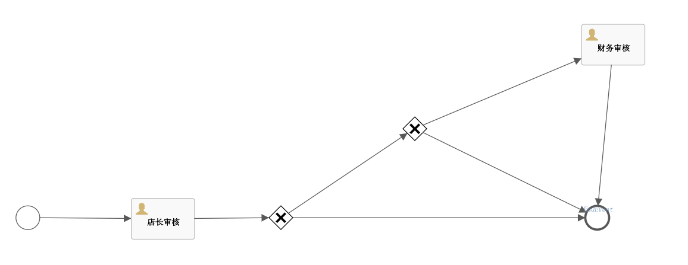

## 6：套餐审核列表

### 功能描述

上面也说了，可以消费结算单项里面有普通项，有套餐，普通单项不需要审核。因为套餐有优惠折扣跟最终定价，这就要求必须经过店长拍板才行，所以需要引入审核流程。

需求要求：

1>如果套餐最终定价店长不同意，审核流程结束，审核失败

2>如果套餐最终定价店长同意，且套餐优惠价小于3000，直接流程结束，审核通过

3>如果套餐最终定价店长同意，且套餐优惠价大于等于3000，需要财务审核，

​		如果财务同意则流程结束，审核通过，

​		如果财务部不同意则流程结束，审核失败

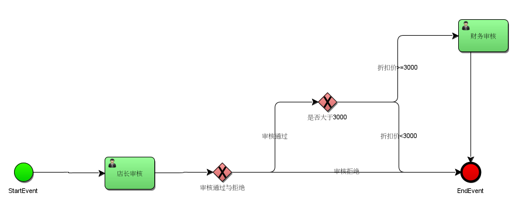

### 具体需求

1>服务套餐发起审核

2>套餐审核列表

3>查看审核进度

4>套餐审核撤销

### 需求实现

#### 需求1：套餐审核列表

**步骤1：表设计**

思考：套餐审核表应该怎么设计？

**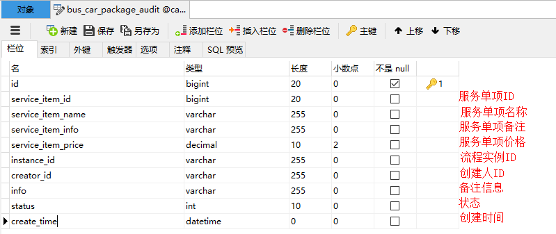**

设计表之后，根据逆向工程创建domain,mapper.xml,mapper.java, 然后完成qo，service, serviceImpl, controller创建

```java
/**
 * 套餐审核对象
 */
@Setter@Getter
public class CarPackageAudit {
    public static final String AUDIT_TYPE = "car_package";//数据字典的value
    public static final Integer STATUS_IN_ROGRESS = 0;//审核中
    public static final Integer STATUS_REJECT = 1;//审核拒绝
    public static final Integer STATUS_PASS = 2;//审核通过
    public static final Integer STATUS_CANCEL = 3;//审核撤销
    private static final long serialVersionUID = 1L;
    /** 主键*/
    private Long id;
    /** 服务单项id*/
    private Long serviceItemId;
    /** */
    private String serviceItemName;
    /** 服务单项备注*/
    private String serviceItemInfo;
    /** 服务单项审核价格*/
    private BigDecimal serviceItemPrice;
    /** 流程实例id*/
    private String instanceId;
    /** 创建者*/
    private String creatorId;
    /** 创建时间*/
    @JsonFormat(pattern = "yyyy-MM-dd HH:mm:ss",timezone = "GMT+8")
    private Date createTime;
    /** 备注*/
    private String info;
    /** 状态【进行中0/审核拒绝1/审核通过2/审核撤销3】*/
    private Integer status= STATUS_IN_ROGRESS;;
}
```

创建页面

**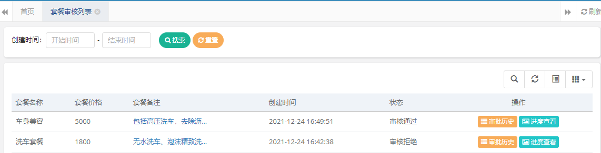**


编写请求方法跳转到list.html页面

```java
@RequestMapping("/listPage")
public String list(){
    return prefix + "list";
}
```

编写请求方法完成列表分页数据

```java
@RequiresPermissions("business:carPackageAudit:view")
@RequestMapping("/query")
@ResponseBody
public TablePageInfo<CarPackageAudit> query(CarPackageAuditQuery qo){
    qo.setUserId(ShiroUtils.getUserId());
    return carPackageAuditService.query(qo);
}
```


#### 需求2：服务套餐发起审核

打开养修服务单项，找审核状态为初始化的套餐，点击发起审核

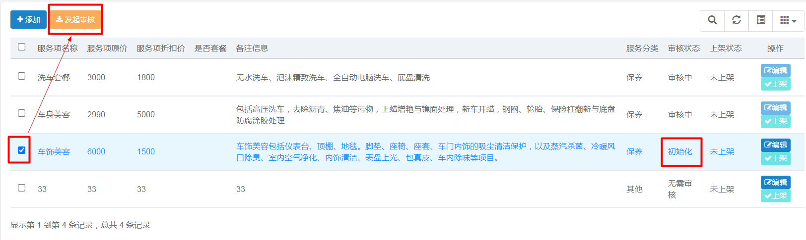


修改：serviceItem/list.html文件，添加触发点击事件

```html
<a class="btn btn-warning auditBtn" onclick="startAudit()" >
    <i class="fa fa-download"></i> 发起审核
</a>
```

```js
function startAudit(){
    var row = $('#bootstrap-table').bootstrapTable('getSelections')[0];
	$.modal.open("审核页面",prefix+"/auditPage?id="+row.id);
}
```

跳转请求

```java
@RequestMapping("/auditPage")
public String auditPage(Long id,Model model){
    ServiceItem serviceItem = serviceItemService.get(id);
    model.addAttribute("serviceItem", serviceItem);
    //shopOwners
    List<User> directors = userService.queryByRoleKey("shopOwner");
    model.addAttribute("shopOwners",directors);
    if(serviceItem.getDiscountPrice().compareTo(new BigDecimal(3000L))>0){
        //finances
        List<User> finances = userService.queryByRoleKey("financial");
        model.addAttribute("finances",finances);
    }
    return prefix+"audit";
}
```

跳转到audit.html

**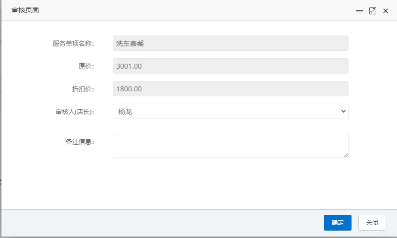**

**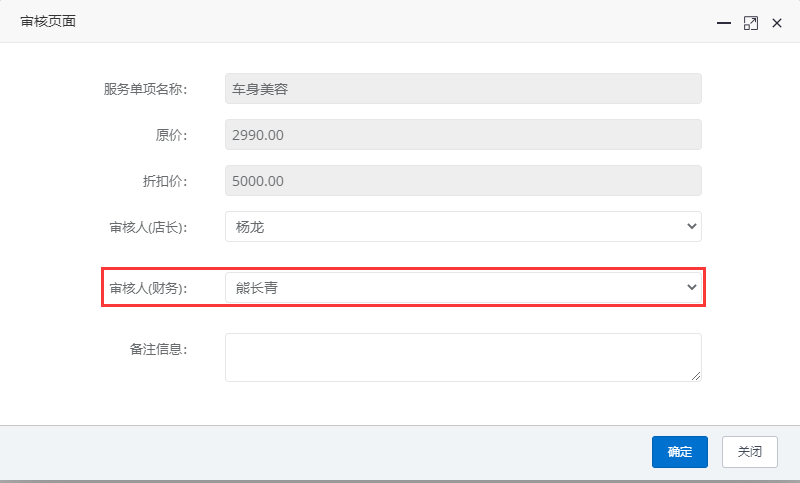**

最后完成启动审核流程

```js
function submitHandler() {
    if ($.validate.form()) {
        $.operate.save(prefix + "/startAudit", $('#form-bpmnInfo-edit').serialize());
    }
}
```

启动流程请求

```java
@RequestMapping("/startAudit")
@ResponseBody
public AjaxResult startAudit(Long id,Long showOwnerId,Long financeId,String info){
    serviceItemService.startAudit(id,showOwnerId,financeId,info);
    return AjaxResult.success();
}
```

思考启动流程需要注意什么

```java
@Override
@Transactional
public void startAudit(Long id,Long showOwnerId,Long financeId,String info) {
    ServiceItem serviceItem = this.get(id);
    //合理化校验
    if(!ServiceItem.CARPACKAGE_YES.equals(serviceItem.getCarPackage())){
        throw new BusinessException("非法操作");
    }
    //说明是套餐
    if(ServiceItem.AUDITSTATUS_AUDITING.equals(serviceItem.getAuditStatus()) || //处于审核中
            ServiceItem.AUDITSTATUS_APPROVED.equals(serviceItem.getAuditStatus()) //审核通过
    ){
        throw new BusinessException("非法操作");
    }
    //封装CarPackageAudit对象
    CarPackageAudit audit = new CarPackageAudit();
    audit.setServiceItemId(serviceItem.getId());
    audit.setServiceItemName(serviceItem.getName());
    audit.setServiceItemPrice(serviceItem.getDiscountPrice());
    audit.setServiceItemInfo(serviceItem.getInfo());
    audit.setInfo(info);
    audit.setCreatorId(ShiroUtils.getUserId().toString());
    audit.setCreateTime(new Date());
    carPackageAuditService.save(audit);//保存到数据库中,回填ID
    //查询BpmnInfo
    BpmnInfo bpmnInfo = bpmnInfoService.getByBpmnType(CarPackageAudit.AUDIT_TYPE);
    if(bpmnInfo==null){
        throw new BusinessException("请先上传流程定义");
    }
    //获取流程定义Key
    String definitionKey = bpmnInfo.getProcessDefinitionKey();
    //业务标识BusinessKey
    String businessKey = audit.getId().toString();
    //存储流程变量
    Map<String,Object> params = new HashMap<>();
    params.put("shopOwnerId",showOwnerId);
    if(financeId!=null){
        params.put("financeId",financeId);
    }
    params.put("disCountPrice",serviceItem.getDiscountPrice().longValue());//将Bigdecimal转成Long类型
    //启动流程获取到流程实例对象
    ProcessInstance processInstance = runtimeService.startProcessInstanceByKey(definitionKey, businessKey, params);
    //流程审核对象关联流程实例对象
    audit.setInstanceId(processInstance.getId());
    carPackageAuditService.update(audit);
    //更新服务单项的状态
    serviceItemMapper.changeAuditStatus(serviceItem.getId(),ServiceItem.AUDITSTATUS_AUDITING);
}
```

#### 需求3：查看审核进度

修改list.html 给查看进度按钮添加点击事件：onclick="showProcessImgDialog(\'' + row.id + '\')

```js
function showProcessImgDialog(id) {
    var url = prefix + '/processImg?id=' + id;
    $.modal.open("查看流程图", url);
}
```

发起请求获取流程图

```java
@RequestMapping("/processImg")
@ResponseBody
public void processImg(Long id, HttpServletResponse response) throws IOException {
    InputStream inputStream = carPackageAuditService.getProcessImg(id);
    IOUtils.copy(inputStream,response.getOutputStream());
}
```

service

```java
@Override
public InputStream getProcessImg(Long id) {
    InputStream inputStream = null;
    //根据ID查询CarPackageAudit对象
    CarPackageAudit audit = this.get(id);
    List<String> highLightedActivities = null;
    String processDefinitionKey = null;
    if(CarPackageAudit.STATUS_IN_ROGRESS.equals(audit.getStatus())){
        //流程正在流转,查找当前节点,高亮当前节点
        highLightedActivities = runtimeService.getActiveActivityIds(audit.getInstanceId());
        ProcessInstance processInstance = runtimeService.createProcessInstanceQuery()
                .processInstanceId(audit.getInstanceId())
                .singleResult();
        processDefinitionKey = processInstance.getProcessDefinitionKey();
    }else{
        //流程已经结束,不需要高亮节点
        highLightedActivities = Collections.EMPTY_LIST;
        HistoricProcessInstance historicProcessInstance = historyService.createHistoricProcessInstanceQuery()
                .processInstanceId(audit.getInstanceId())
                .singleResult();
        processDefinitionKey = historicProcessInstance.getProcessDefinitionKey();
    }
    //可以通过bpmnInfo获取流程定义的Id
    //判断流程是否正在进行中,如果正在进行中,需要高亮节点,如果已经结束,只需要看到流程图,不需要高亮节点
    ProcessDefinition processDefinition = repositoryService.createProcessDefinitionQuery()
            .processDefinitionKey(processDefinitionKey)
            .singleResult();
    BpmnModel bpmnModel = repositoryService.getBpmnModel(processDefinition.getId());
    DefaultProcessDiagramGenerator generator =new DefaultProcessDiagramGenerator();
    //generateDiagram(bpmn模型,需要高亮节点ID集合,需要高亮连线ID集合)
    inputStream = generator.generateDiagram(bpmnModel,
            highLightedActivities,
            Collections.EMPTY_LIST,
            "宋体",
            "宋体",
            "宋体"
    );
    return inputStream;
}
```

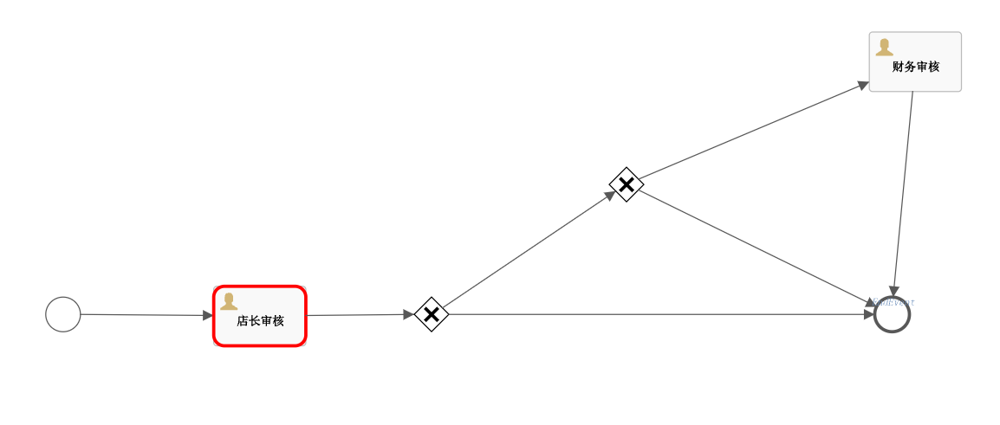

#### 需求4：套餐审核撤销

修改list.html页面，给撤销按钮添加点击事件：onclick="cancelApply(\'' + row.id + '\')

```js
function cancelApply(id) {
    $.modal.confirm("确认要撤销申请吗?", function() {
        var url = prefix + "/cancelApply?id=" + id;
        $.operate.submit(url, "post", "json");
    });
}
```

发起请求实现流程撤销

```java
@RequestMapping("cancelApply")
@ResponseBody
public AjaxResult cancelApply(Long id){
    carPackageAuditService.cancelApply(id);
    return AjaxResult.success();
}
```

service

这里注意，流程撤销，服务单项状态要复原，审核记录状态改为撤销，审批流程实例要删除

```java
@Override
@Transactional
public void cancelApply(Long id) {
    //1.合理性校验
    CarPackageAudit audit = this.get(id);
    if(!CarPackageAudit.STATUS_IN_ROGRESS.equals(audit.getStatus())){
        throw new BusinessException("非法操作");
    }
    //2.更新CarPackageAudit对象状态
    carPackageAuditMapper.changeStatus(id,CarPackageAudit.STATUS_CANCEL);
    //3.更新ServiceItem的状态
    serviceItemService.changeStatus(audit.getServiceItemId(), ServiceItem.AUDITSTATUS_INIT);
    //4.删除流程实例
    runtimeService.deleteProcessInstance(audit.getInstanceId(),"流程撤销");
}
```


## 7：我的待办

### 功能描述

我的待办，也就是我的待办任务，即某个流程点负责人准备要审核的哪些流程。

### 具体需求

1>我的待办列表

2>审批实现

3>查看审核进度

### 需求实现

#### 需求1：我的待办列表

**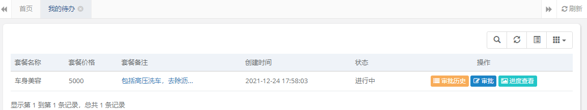**

比如上图，当前审核人是杨龙老师，那么必须使用杨龙老师登录才能看得到

**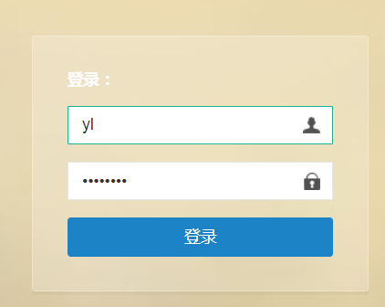**


编写请求跳转到todoPage.html页面

```java
@RequestMapping("/todoPage")
public String todoPage(){
    return prefix + "todoPage";
}
```

编写请求查询列表的分页数据

```java
@RequestMapping("/todoQuery")
@ResponseBody
public TablePageInfo<CarPackageAudit> todoQuery(CarPackageAuditQuery qo){
    //查询状态进行中的数据
    return carPackageAuditService.todoQuery(qo);
}
```

```java
@Override
public TablePageInfo<CarPackageAudit> todoQuery(CarPackageAuditQuery qo) {
    BpmnInfo bpmnInfo = bpmnInfoService.getByBpmnType(CarPackageAudit.AUDIT_TYPE);
    //查询总数
    long total = taskService.createTaskQuery()
            .processDefinitionKey(bpmnInfo.getProcessDefinitionKey())
            .taskAssignee(ShiroUtils.getUserId().toString())
            .count();
    if(total==0){
        return TablePageInfo.EMPTY_DATA;
    }
    //分页查询查询
    List<Task> taskList = taskService.createTaskQuery()
            .processDefinitionKey(bpmnInfo.getProcessDefinitionKey())
            .taskAssignee(ShiroUtils.getUserId().toString())
            .listPage((qo.getPageNum() - 1) * qo.getPageSize(), qo.getPageSize());
    List<String> businessKeyList = new ArrayList<>();
    //遍历封装成id集合
    for(Task task:taskList){
        ProcessInstance processInstance = runtimeService.createProcessInstanceQuery()
                .processInstanceId(task.getProcessInstanceId())
                .singleResult();
        businessKeyList.add(processInstance.getBusinessKey());
    }
    //查询数据库
    List<CarPackageAudit> carPackageAuditList = carPackageAuditMapper.selectByBusinessKeyList(businessKeyList);
    return new TablePageInfo<>(total,carPackageAuditList);
}
```


#### 需求2：审批实现

编辑todaoPage.html页面， 给审批按钮添加点击事件：onclick="showAuditPage(\'' + row.id + '\')

```js
//审批
function showAuditPage(id) {
    var url = prefix + "/auditPage?id=" + id;
    $.modal.open("流程审核", url);
}
```

通过请求跳转到审批页面

```java
@RequestMapping("/auditPage")
public String auditPage(Long id,Model model){
    model.addAttribute("id",id);
    return prefix + "auditPage";
}
```

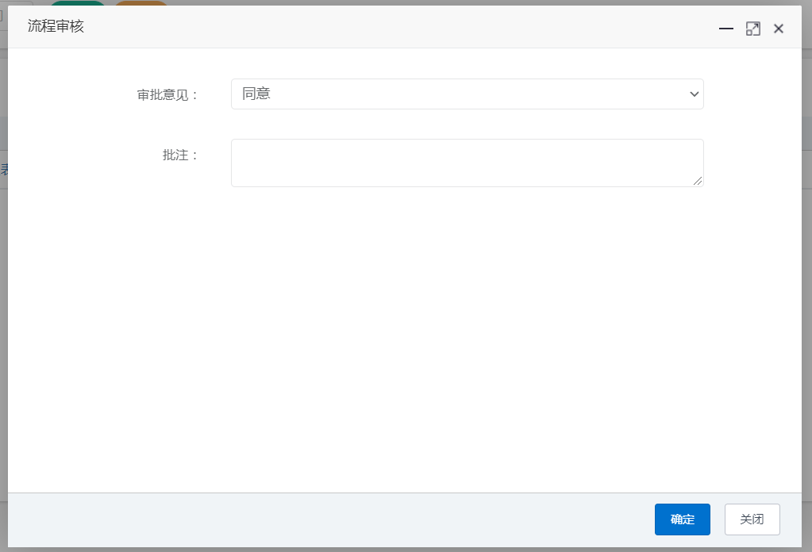


点击确定，发起请求完成审批

```java
@RequestMapping("/audit")
@ResponseBody
public AjaxResult audit(Long id,String auditStatus,String info){
    carPackageAuditService.audit(id,auditStatus,info);
    return AjaxResult.success();
}
```

service

思考：审核流程步骤

```java
@Override
@Transactional
public void audit(Long id, String auditStatus, String info) {
    boolean auditStatusBoolean = BooleanUtils.toBoolean(auditStatus);
    //进行合理化校验
    CarPackageAudit audit = this.get(id);
    if(!CarPackageAudit.STATUS_IN_ROGRESS.equals(audit.getStatus())){
        //处于审核中的记录才能进行审核
        throw new BusinessException("非法操作");
    }
    User currentUser = ShiroUtils.getUser();
    //获取流程实例目前的任务
    Task currentTask = taskService.createTaskQuery()
            .processInstanceId(audit.getInstanceId())//根据流程实例ID查询活动节点
            .singleResult();
    //完成任务设置流程变量
    String auditLabel = auditStatusBoolean?"同意":"拒绝";
    String comment = currentUser.getUserName()+"["+auditLabel+"],审批意见:"+info;
    //添加批注信息
    taskService.addComment(currentTask.getId(),audit.getInstanceId(),comment);
    taskService.setVariable(currentTask.getId(),currentTask.getTaskDefinitionKey(),true);
    taskService.complete(currentTask.getId());
    //判断同意还是拒绝
     if(auditStatusBoolean){
        //同意
        //判断是否有下一个节点
        Task nextTask = taskService.createTaskQuery()
                .processInstanceId(audit.getInstanceId())//根据流程实例ID查询活动节点
                .singleResult();
        if(nextTask==null){
            //修改CarPackageAudit对象审核状态
            carPackageAuditMapper.changeStatus(audit.getId(),CarPackageAudit.STATUS_PASS);
            //修改ServiceItem的状态
            serviceItemService.changeStatus(audit.getServiceItemId(),ServiceItem.AUDITSTATUS_APPROVED);
        }
    }else{
        //拒绝
        //修改CarPackageAudit对象审核状态
        carPackageAuditMapper.changeStatus(audit.getId(),CarPackageAudit.STATUS_REJECT);
        //修改ServiceItem的状态
        serviceItemService.changeStatus(audit.getServiceItemId(),ServiceItem.AUDITSTATUS_REPLY);
    }
}
```

#### 需求3：查看审核进度

操作同之前：套餐审核列表中的查看审核进度

## 8：我的已办

### 功能描述

我的已办，即查看当前登录用户参与过审核的流程历史任务

### 具体需求

1>我的已办列表

2>查看审核进度

### 需求实现

#### 需求1：我的已办列表

**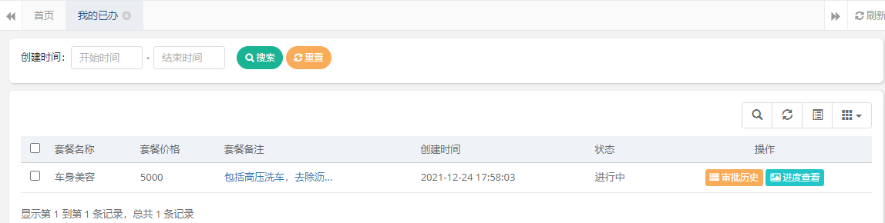**


编写请求，跳转到donePage.html页面

```java
@RequestMapping("/donePage")
public String donePage(){
    return prefix + "donePage";
}
```

编写请求，获取已办任务列表

```java
@RequestMapping("/doneQuery")
@ResponseBody
public TablePageInfo<CarPackageAudit> doneQuery(CarPackageAuditQuery qo){
    return carPackageAuditService.doneQuery(qo);
}
```

```java
@Override
public TablePageInfo<CarPackageAudit> doneQuery(CarPackageAuditQuery qo) {
    BpmnInfo bpmnInfo = bpmnInfoService.getByBpmnType(CarPackageAudit.AUDIT_TYPE);
    //查询总数
    long total = historyService.createHistoricTaskInstanceQuery()
            .processDefinitionKey(bpmnInfo.getProcessDefinitionKey())
        	.finished()
            .taskAssignee(ShiroUtils.getUserId().toString())
            .count();
    if(total==0){
        return TablePageInfo.EMPTY_DATA;
    }
    //分页查询
    List<HistoricTaskInstance> taskList = historyService.createHistoricTaskInstanceQuery()
            .processDefinitionKey(bpmnInfo.getProcessDefinitionKey())
        	.finished()
            .taskAssignee(ShiroUtils.getUserId().toString())
            .listPage((qo.getPageNum() - 1) * qo.getPageSize(), qo.getPageSize());
    List<String> businessKeyList = new ArrayList<>();
    //封装id
    for(HistoricTaskInstance task:taskList){
        HistoricProcessInstance processInstance = historyService.createHistoricProcessInstanceQuery()
                .processInstanceId(task.getProcessInstanceId())
                .singleResult();
        businessKeyList.add(processInstance.getBusinessKey());
    }
    List<CarPackageAudit> carPackageAuditList = carPackageAuditMapper.selectByBusinessKeyList(businessKeyList);
    return new TablePageInfo<>(total,carPackageAuditList);
}
```

#### 需求2：审批历史

**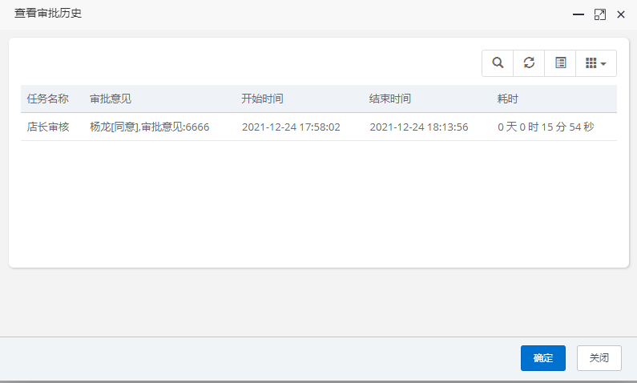**

添加实体

```java
@Setter@Getter
public class HistoricComment {
    private String taskName;//任务名称
    private String comment;//批注信息
    private String startTime;//开始时间
    private String endTime;//结束时间
    private String durationInMillis;//耗时
}
```


添加请求页面

```javascript
/* 查看审批历史 */
function showHistoryDialog(instanceId) {
    var url = prefix + '/historyList?instanceId=' + instanceId;
    $.modal.open("查看审批历史", url);
}
```

```java
@RequestMapping("/historyList")
public String historyList(String instanceId, Model model){
    model.addAttribute("instanceId", instanceId);
    return prefix + "/historyList";
}
```

```java
@RequestMapping("/listHistory")
@ResponseBody
public TablePageInfo listHistory(String instanceId) {
    return carPackageAuditService.listHistory(instanceId);
}
```

```java
@Override
public TablePageInfo listHistory(String instanceId) {
    List<HistoricTaskInstance> historicTaskInstances = historyService.createHistoricTaskInstanceQuery()
            .processInstanceId(instanceId)
            .finished()
            .orderByHistoricTaskInstanceEndTime().asc()
            .list();
    List<HistoricComment> historicCommentList = new ArrayList<>();
    SimpleDateFormat sdf = new SimpleDateFormat("yyyy-MM-dd HH:mm:ss");
    for(HistoricTaskInstance task:historicTaskInstances){
        HistoricComment historicComment = new HistoricComment();
        historicComment.setTaskName(task.getName());
        historicComment.setStartTime(sdf.format(task.getStartTime()));
        if(task.getEndTime()!=null){
            historicComment.setEndTime(sdf.format(task.getEndTime()));
        }
        if(task.getDurationInMillis()!=null){
            historicComment.setDurationInMillis(task.getDurationInMillis().toString());
        }
        List<Comment> comments = taskService.getTaskComments(task.getId(), "comment");
        if (!CollectionUtils.isEmpty(comments)) {
            historicComment.setComment(comments.get(0).getFullMessage());
        }
        historicCommentList.add(historicComment);
    }
    return  new TablePageInfo(Long.valueOf(historicCommentList.size()),historicCommentList);
}
```


#### 需求3：查看审核进度

操作同之前：套餐审核列表中的查看审核进度
