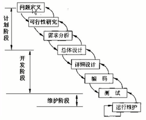
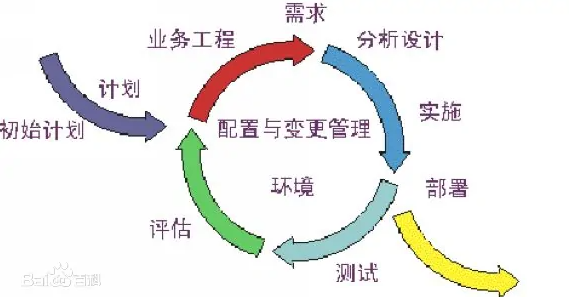
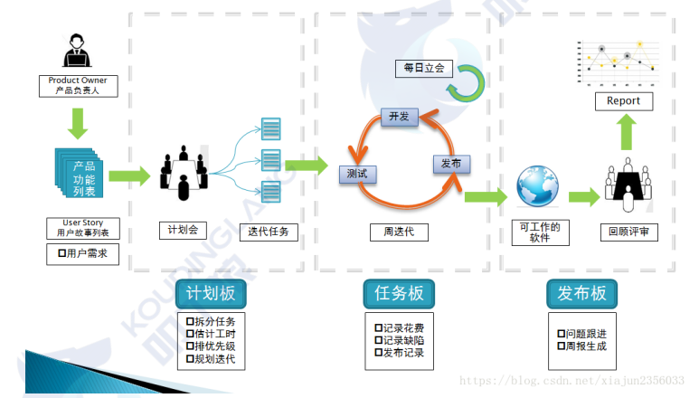
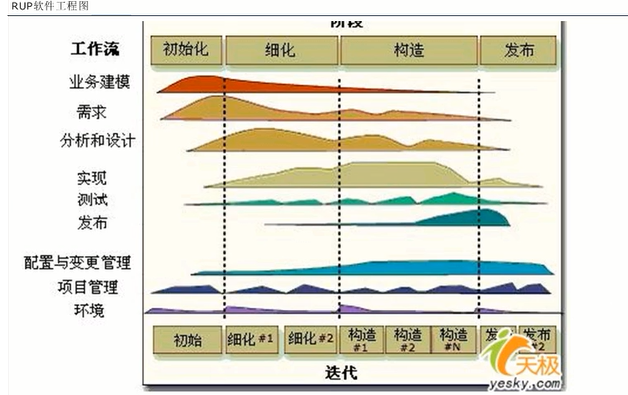
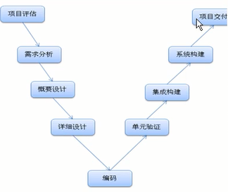
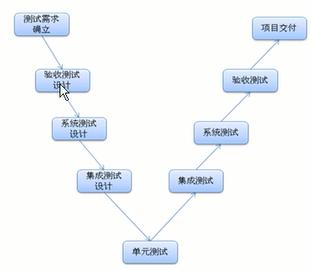
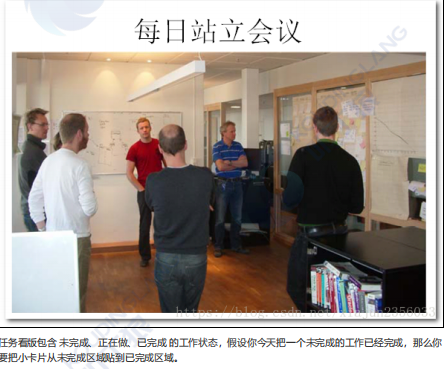

# 实训:软件工程

## 一 企业团队人员说明

https://www.kdocs.cn/l/cn9LyI0OIJSp [金山文档] 企业团队人员工作说明.pof

https://www.kdocs.cn/l/chYDTn1H64lI [金山文档] 企业人员岗位说明-200-250人.pof

## 二 \软件工程

### 1\软件开发模型

#### 1\瀑布模型

​     适合,大型项目,对外项目,

​     特点:文档比较多.耗时比较长

​     需求必须明确, 开发风险低的项目

​     如果需求改动,后期修改压力特别大.

#### 2\迭代式开发(RUP)

​     一个项目按照功能,进行一期,二期开发,需求改变,归入二期.

每一期,功能小,方便改变.

​    开发过程还是比较复杂.文档较多.

模型

​       

#### 3\敏捷开发模型

​    与迭代开发类似,只是开发更加简单,文档更加少. 

​	**1) 什么是敏捷开发** 

敏捷开发(Agile Development)是一种以人为核心、迭代、循序渐进的开发方法。 

怎么理解呢？首先，我们要理解它不是一门技术，它是一种开发方法，也就是一种软件开发的流程，它 

会指导我们用规定的环节去一步一步完成项目的开发；而这种开发方式的主要驱动核心是人；它采用的 

是迭代式开发； 

​	**2)为什么说是以人为核心** 

瀑布开发模型，它是以文档为驱动的，为什么呢？因为在瀑布的整个开发过程中，要写大量的文档，把 

需求文档写出来后，开发人员都是根据文档进行开发的，一切以文档为依据；而敏捷开发它只写有必要 

的文档，或尽量少写文档，敏捷开发注重的是人与人之间，面对面的交流，所以它强调以人为核心。 

​	**3) 什么是Scrum** 

Scrum的英文意思是橄榄球运动的一个专业术语，表示“争球”的动作；把一个开发流程的名字取名为 

Scrum，我想你一定能想象出你的开发团队在开发一个项目时，大家像打橄榄球一样迅速、富有战斗激 

情、人人你争我抢地完成它，你一定会感到非常兴奋的。 

而Scrum就是这样的一个开发流程，运用该流程，你就能看到你团队高效的工作。

​        **4) 模型**

### 2\RUP开发过程

大项目分解为一些子项目(一期,二期等)
RUP是一个迭代、递增的开发过程

### 3-RUP软件工程图

横轴代表了指定开发过程的时间,体现了这个过程的动态结构.他以**周期**(如一周) ,**阶段**(如一个月),**迭代**(不断循环),**里程碑**(一次需求,一个设计,产品发布等)来表达.

纵轴表现了过程的静态结构,如何用属于**活动**(如开会),**产物**(如文档,安装包,源代码),**角色**(需求,架构设计师,开发,测试人员,质量等)和**工作流**(一堆活动的集合,需求,设计实现等.)来描述

迭代循环分为**初始阶段**,**细化阶段**,**构造阶段**,**交付阶段**.

工作流:

  业务建模,需求,分析和设计,实现,测试,发布  属于**核心工作流**

  配置与变更管理(版本控制等),项目管理(日报,月报等),环境(软件,硬件,框架,网络等.) 属于**辅助(支持)工作流**.

### 4\RUP的W图形

开发V图,开发流程

 测试V图,质量控制流程.

两个V重叠在一起,形成开发的基本W模型. 开发和质量控制阶段都是一一对应.

### 5\核心工作流

#### 1\项目评估

​    项目评估的目标: 评估项目的**规模**,**风险**,项目需要投入的**资源**,并且出可行性方案.

​     本阶段是非常重要的阶段,就是项目的基石.若项目评估未通过,则直接不在继续下面的步骤,并且反馈给相关人.若项目评估通过,则需要确定项目**规模**,项目的**组织结构**,项目**其他事项**等.这个阶段关注的是项目进行中的业务需求方面主要风险.对于建立在原有系统上的开发项目来说,项目评估阶段的时间可能很短.

​	本阶段的主要目标如下:

- 明确客户各期使用目标以及软件基本架构

- 估计出潜在风险(业务需求)

- 评估项目的使用人力,财力,物力等资源

- 对整个项目做最初的项目成本及日程估计

- 确立软件项目立项是否可行

  这个阶段的产物

- 项目评估表

- 项目立项书(若通过评估),包括业务上下文,验收规范,成本预计等.

- 原始核心需求文档(客户提供)

- 项目计划V1(概要)

  阶段结束时一个里程碑标准,项目评估里程碑

- 就是否参与这个项目已经定论

- 项目规模级别已经定论

- 项目投入资源以及主要风险承担者已经定论

- 风险承担者就范围定义,成本/日程估计达成共识

- 项目开发环境搭建完成

  如果无法公布这些里程碑,则项目可以被取消或者仔细的重新考虑

​	阶段评审的工作和需要达到的状态列表

| 产品                                      | 责任人               | 应该达到的状态                                               |
| ----------------------------------------- | -------------------- | ------------------------------------------------------------ |
| 项目评估表                                | ps(Project Senate)   | 完成                                                         |
| 项目立项书                                | PM(project Manager)  | 完成                                                         |
| 概要原始需求书                            | PM                   | 具备                                                         |
| 项目计划V1(包含项目开发计划,项目测试计划) | PM PDM               | 完成项目计划的第一个版本,也就是原始版本,不划分到具体的人员分配和具体功能细节 |
| 开发服务器及开发环境                      | SE(Support Engineer) | 完成或者确立                                                 |
| 项目管理服务器及管理环境                  | SE                   | 完成或者确立                                                 |
| 项目仓库框架                              | SE                   | 完成                                                         |
| 责任人确立                                | PS(Project Senate)   | 确立项目经理,开发经理,测试经理以及项目外的干系人(客户方代表) |
| 用户接口原型(可选)                        | UID(UI Designer)     | 主要负责界面原型                                             |

文不如表,表不如图,图不如实

​    文字--->表--->UML--->原型

#### 2\需求分析

项目需求分析需要达到的目标是明确分析客户的需求,并且**量化**成需求分析设计文档.已达到确立**商业用例**及**系统边界**的目的.

体系结构的决策必须在理解整个系统的基础上作出:他的范围,主要功能和性能等非功能需求.

项目分析阶段是项目成功细化的关键保障,我们对需求的确立也是我们后面阶段工作的前提保障.常用的一句话:"正确的需求才有正确的软件".

要点: 

​	不能产生歧义.多使用陈述句.

需求分析由两部分构成: 功能需求(用户管理,角色管理......),非功能需求(安全性,质量.性能)

本阶段需要达到的目标:

- 置上而下明确客户系统模块划分
- 明确80%客户系统的商业用例
- 明确角色分配以及流程走向
- 使用UML用例量化需求,完成需求报告.

这个阶段的产出: uml,原型

- 蓝图文档:核心项目需求,关键特色,主要约束的总体蓝图
- 原始用户模型(完成80%)
- 原始项目术语表
- 原始商业案例,包括业务的上下文,验收规范,成本预计.
- 原始的风险评估
- 一个或者多个原型

后台管理 http://demo.axureshop.com/?url=http://cloud.axureshop.com/OKFKHK&buyurl=https://www.axureshop.com/a/1301832.html

物流运输小程序 https://modao.cc/community/mtkknd85w58c7p4n?title=%E7%89%A9%E6%B5%81%E8%BF%90%E8%BE%93%E5%B0%8F%E7%A8%8B%E5%BA%8F

这个阶段里程碑的界定:

- 风险承担者就范围定义,成本/日程估计达成共识
- 以客观的主要用例证实对需求的理解
- 成本/日程,优先级,风险和开发过程的可信度
- 被开发体系结构原型的深度和广度
- 实际开支与计划开支的比较

如果无法通过这些里程碑,则项目可能被取消或者仔细的重新考虑

阶段评审工作需要达到的状态列表

| 产品                                     | 责任人                      | 应该达到的状态                       |
| ---------------------------------------- | --------------------------- | ------------------------------------ |
| 需求分析图UML                            | PDA(Project Demand Analyst) | 完成                                 |
| UI原型                                   | UID(UI Designer)            | 原型覆盖率100%                       |
| 需求分析报告                             | PDA Leader                  | 具备                                 |
| 项目计划V2(需求阶段的详细计划及执行情况) | PDA                         | 细化到需求阶段的每日工作量和人员分配 |
| 客户沟通记录及确认签字                   | PDA Customer                | 每次沟通的记录表以及客户签字确认     |

#### 3\概要设计

项目概要设计阶段主要是指根据业务用例和用户需求所做的架构设计,我们也称之为系统设计.这部分包括设计的描述(画出设计图).而概要设计也是项目的骨架搭建,关注与接口之间的端对端关系.

概要设计需要达到的目标:

- 完成概要设计图
- 明确模型以及模块之间的接口定义
- 覆盖原型的所有主要功能模块

产出:uml

- 概要设计图
- 概要设计书
- 项目框架代码,接口定义代码

里程碑

- 风险承担者对目前的项目框架达成一致
- 架构设计基本完成
- 模块与接口设计完成
- 需求不断迭代确立

阶段评审工作所需要达到的状态列表

| 产品                     | 责任人                    | 应该达到的状态                           |
| ------------------------ | ------------------------- | ---------------------------------------- |
| 概要设计图UML            | AD(Architecture Designer) | 完成                                     |
| 概要设计书               | AD                        | 完成                                     |
| DBMS实现                 | AD                        | 完成                                     |
| 项目计划V3(架构设计阶段) | PDA                       | 细化到概要设计阶段的每日工作量和人员分配 |
| 概要设计评估表           | PS                        | 通过                                     |
| 概要设计代码实现         | AD                        | 实现代码结构                             |

UI和前端做5~8个页面个基础页面(首页,一级,二级,三级页面等) (html)

数据库的设计

​     设计的粒度:表

PowerDesigner165 是数据库设计的软件.

#### 4\详细设计

详细设计主要是为了对各个功能模块和各个子系统进行细节白盒设计,如果说架构设计是采用黑盒的分析方式,则详细设计就要关注流程,路径和逻辑.属于白盒的范畴.详细设计要完成对各个功能的函数级别的设计.但无需完成具体代码.

详细设计需要达到的目标:

- 完成详细设计UML
- 实现详细设计的代码(公共模块的代码)

产出

- 详细设计图 UML

- 详细设计书

- 详细的模块级别源代码

-  静态页面(前端,UI参与) 

-  数据库的详细设计  

里程碑

阶段评审工作所需要达到的状态列表

| 产品                     | 责任人             | 应该达到的状态                           |
| ------------------------ | ------------------ | ---------------------------------------- |
| 各模块详细设计图UML      | MD(Model Designer) | 完成数量不定的各个模块详细设计           |
| 详细设计书               | MD                 |                                          |
| DBMS实现                 | MD                 |                                          |
| 项目计划V4(详细设计阶段) | PDA                | 细化到详细设计阶段的每日工作量和人员分配 |
| 详细设计评估表           | PS                 | 通过                                     |
| 详细设计代码实现         | MD                 | 实现代码结构                             |

#### 5\代码实现

编码实现是工程的最下层细化阶段,其目的就是根据架构设计和详细设计实现完成每个函数,每个类,每个模块,每个子系统,最终构成我们整个源代码部分.

这个阶段所有剩余的构建和应用程序功能被开发并集成为产品,所有的功能被详尽的单元测试.

编码实现的目标:

- 根据设计完成具体函数的编写工作
- 所有的功能代码被单元测试

产出

- 开发日志
- 源代码及相关文件
- 单元测试源代码文件
- Code Review报告

里程碑

阶段评审工作需要达到的状态列表

| 产品                 | 责任人    | 应该达到的状态 |
| -------------------- | --------- | -------------- |
| 开发日志             | Developer | 持续填写       |
| 源代码及相关文件     | Developer |                |
| 单元测试源代码       | Developer |                |
| CodeReview(代码审查) | PM        |                |

#### 6\单元构建

单元构建的目的是保证我们每个Unit编码的健壮性.我们要求手动编码的单元验证函数覆盖率在100%,流程分支覆盖率在80%以上,条件分支覆盖率在80%以上,边界值以及等价类覆盖率在50%以上.

单元验证实现目标:

- 根据完成的功能函数进行单元构建,验证健壮性
- 对完成代码进行边界值验证,分支验证,等价类验证以及常规验证.

产出

单元构建代码

单元构建的用例

阶段评审工作需要达到的状态列表

| 产品             | 责任人    | 应该达到的状态 |
| ---------------- | --------- | -------------- |
| 单元构建源代码   | Developer |                |
| 单元构建结果报告 | Developer |                |

#### 7\集成构建

集成构建主要是 指非表现层的各个模块之间,各个层次之间的接口组合.

集成构建的目的是出了界面层的最后搭建之外,其余层次之间的接口组合要完成.并且通过质量控制组的测试.

产出

- 集成构建进度表
- 集成构建覆盖率

阶段评审工作需要达到的状态列表

| 产品           | 责任人    | 应该达到的状态 |
| -------------- | --------- | -------------- |
| 集成构建进度表 | Developer |                |
| 集成构建覆盖率 | Developer |                |
| 集成构建评估表 | Developer |                |

#### 8\系统构建

系统构建首先是要对表现层与集成构建结果进行对接,其次系统构建要与非业务功能模块进行对接.

系统构建目的是完成系统的整体构建,达到内部测试的要求产出.

- 完成的系统产品
- 系统构建的进度表
- 系统构建覆盖表
- 系统构建评估表

阶段评审工作需要达到的状态列表

| 产品           | 责任人    | 应该达到的状态 |
| -------------- | --------- | -------------- |
| 系统构建进度表 | Developer |                |
| 完整的系统产品 | Developer |                |
| 系统构建覆盖表 | Developer |                |
| 系统构建评估表 | Developer |                |

#### 9\项目交付

主要包括

​	软件打包,安装软件,提供用户手册,证实验收等.

阶段评审工作需要达到的状态列表

| 产品           | 责任人    | 应该达到的状态 |
| -------------- | --------- | -------------- |
| 项目验收检查表 | Developer |                |
| 项目竣工表     | Developer |                |
| 项目用户手册   | Developer |                |
| 项目内侧报告   | Developer |                |

#### 10\质量控制阶段

测试需求确立

- 验收测试设计

- 系统测试设计

- 集成测试设计

- 单元测试设计和检验

- 系统测试

- 验收测试

- 项目交付

### 6\支持工作流

#### 1\项目管理工作流

#####      1\主要工作内容

-  管理项目框架,如禅道等

- 项目实践准则,包括项目计划,项目配备,项目执行,项目监控等

- 管理风险的框架

#####     2 团队结构,

​	主要做项目团队的人员构成计划, 团建结构评估等工作.

#####      3\计划:

​     	目标管理中指定各种计划,

- 里程碑计划: 指定各个阶段的时间节点等.
- Sprint计划(冲刺计划): 在里程碑里面的各个小阶段计划,如周计划.
-  backlog计划(日计划)  

#####      4\战力会议(短)

​        每日工作等内容.每日会议(早会),控制在20分钟之内.

​        每天做啥,完成情况,需要的帮助      

#####      5\每天日志

​        个人的日计划 

​      日报:

​            昨天完成情况,今天的计划, 负责模块的完成度.

​            第一天 50%  第二天 90%  第三天 91% 第四天 92%      

​	    日报程序员发给组长,抄送项目经理和hr

​       周报 ,

​             周报发给组长,项目经理             

​       月报(里程碑报告)

​             组长写月报,发给项目经理.

​       项目经理,通常要与客户开一次会议. 汇报一下项目进度, 项目开发过程中,遇到的那些业务问题,需要解答.       

#### 2\配置和变更管理

##### 1\主要工作内容

- 并发开发

- 分布式开发

- 自动化创建工程

- 每周构建Daily Build

     每个人的代码,每周需要合并到一起,进行测试,形成一个完整版本.

     不是人工,而是通过软件进行, 比如 SVN,Git

- 缺陷自动报告

     bug 自动报告,也不是人工,书写,发邮件.也可以通过相关的软件来完成.

  ​	如:Bugzilla (优秀) ,禅道(软件). 可以进行统计分析.

- 源代码版本控制

  ​       每周都会构建,正常情况下,是每天都构建.就会有,一个文件,被提交多次.这个多次的文件.名称相同,内容不同.

  ​	需要每个都保留在对应的服务器上.

  ​        产品经理需要增加一个模块, 三天后,程序员实现了, 产品经理这个模块需要修改某些功能.  三天后,还是实现了.  产品经理通过跟客户沟通,发现这个修改后的功能,不好,还是原来的好. 程序员疯了.

  ​          版本控制的软件: SVN 多用于单体项目. ,Git 多用户互联网,分布式和微服务项目.

- 文档版本控制

   如:VSS

- 需求变更控制

  ​    需求的变更,必须记录,并且必须用户签字. 涉及增加预算,增加工期等一系列的内容.

- 资源变更控制

##### 2\每日构建

​    每天项目都整合到一起,把有效代码合并.如ant,git,svn等.

##### 3\版本控制

   如:cvs,svn,git等,防止文件丢失.

##### 4\bug 列表

   测试bug的台账,,可以使用软件,如禅道,bugzilla等.

##### 5\质量报告

   测试报告,

   QC 质量控制

​           现场发现问题

   QA 质量保障

​         未雨绸缪的,级别比QC高

##### 6\需求变更

​    项目做到一半,用户需求改变,一定需要找人签字.

   需求-->项目经理-->老板-->客户

##### 7\资源管理

​    制定资源文件夹及其文件的命名规范等.

##### 8\资源变更

​    程序员离职,需要资源变更记录和风险评估.

#### 3\环境工作流

#####   1\主要工作内容

​     给开发团队提供开发环境,过程,工具.包括定制的开发工具,采用的SDK版本等.

#####    2\工具共享库

​       开发工具仓库等.

#####    3\沟通管理

​        有问题,多沟通,保留沟通记录.方便后期查.    如微信群,邮件等      

​       收件人:  收件人的邮箱  ,希望收件人给你回复.

​       标题: 内容概要

​        抄送: 收件人的邮箱, 领导或者干系人.不需要他回复信息.

​       暗送:收件人的邮箱 , 只有发送人能看到暗送的信息. 其他干系人不清楚.

​       附件: 文本之类的东西

​        正文: 邮件内容    

​      

### 7\软件工程生产的静态结构

开发流程定义了"谁""何时"做"某事",四种主要的建模元素来表达.

#### 1\角色

软件工程角色及其职能如下:

| 角色(中英文)                   | 工作职能描述                                                 | 担任此角色能力界定                                           |
| ------------------------------ | ------------------------------------------------------------ | ------------------------------------------------------------ |
| PM(项目经理)                   | 1\项目及产品研发管理,对项目成败直接负责. 2\项目用人建议及成员的挑选 3项目参与人员的培养和训练 4\与外包客户的沟通,包括售前,售后 5\参与售前项目的需求工作 | 1\5年以上相关软件开发经验 2\熟悉相关项目语言 3\带领过8人以上团队开发过成熟商业项目,有成功案例 |
| PDM(项目开发经理)              | 1\项目对产品进行开发管理,主要管理项目中的开发团队,直接对项目经理负责 2\积极接受培养及自我培养,负责对各个小组的组长直接管理 3\指定产品开发计划,把握产品开发进度 4\协调与测试团队的合作,紧密的与测试经理配合 | 1\3年以上相关软件开发经验 2\熟悉相关项目语言 3\能独立完成同类项目 4\具有多个商业项目开发成功案例 |
| PTM(项目测试经理)              | 1\项目及产品测试管理,主要管理项目中的测试团队,直接对项目经理负责. 2\积极接受培养及自我培养,负责对各个测试小组的组长直接管理 3\制定产品测试计划,带领测试团队完成测试任务,把握产品测试流程 4\监控产品开发进度,监控开发团队开发质量 5\协调与开发团队的合作,紧密把握开发团队质量及进度 | 1\3年以上相关软件开发及软件测试经验 2\熟悉相关项目语言 3\能独立完成同类项目 4\具有多个商业项目开发及测试成功案例 5熟悉软件测试各个流程 6\具备一定的技术管理能力 |
| SE(支持工程师)                 | 1\开发服务器及开发环境平台搭建 2\项目管理服务器及管理环境搭建 3\项目仓库构建 4\进行每日构建 5\项目中相关文档的搜集,整理及汇总 6\进行项目配置管理 | 1\熟悉各类服务器系统,window,linux,unix 2\熟悉各种系统上软件项目开发环境搭建 3\熟悉网络基础 4\熟练掌握各版本控制系统的管理 5\系统的学习过关键配置管理内容 6\熟练搭建各类应用服务器,web服务器 7\具有软件开发能力,能进行每日构建工作 |
| UED(用户体验设计师)            | 1\根据用户体验设计软件布局,美化等工作 2\根据需求原型文件,做出美化后的软件界面效果图 3\参与到需求过程中,设计用户体验 4\根据设计的效果图,发布成静态网页,并且提供切好的素材(logo,按钮等) | 1\具有较强的客户沟通能力 2\具有较强的美术功底及审美能力 3\具有软件界面设计经验 4\熟练掌握各类设计工具(PS,DW,CodeDraw等) 5\具有强烈的改善客户体验意识 |
| UIE(用户接口工程师,前端工程师) | 1\根据UED提供的效果图及素材,规划整体页面设计 2\编写DIV+CSS的界面实现 3\公用界面组件的编写和规划 4\Mastepage公用模板的编写及规划 5\公用界面客户端脚本库的编写 | 1\深厚的网页制作功底 2\对ps,fireworks,Vue等前端工具及框架基本掌握 3\熟练编写DIV+CSS的页面布局方式 4\熟练编写JS等客户端脚本 5\熟悉项目相关语言及开发工具,有一定的前端代码编写能力 |
| PDA(项目需求分析师)            | 1\项目需求阶段进行需求分析的主要人员 2\与项目经理,UED一起参与项目的需求阶段 3\负责需求阶段素材及资料的收集整理 4\负责需求阶段与客户确认工作 5\完成需求规格说明书的编写 6\配合UED完成界面原型的设计和实现 7\负责需求分析报告的编写 | 1\较强的沟通能力及逻辑思维 2\熟练使用StartUML等UML建模工具 3\熟练使用office等各类制图,成文工具 4\有较强的方案文字功底 5\系统的学习和研究过软件需求分析过程与技能 6\有较强的自我学习能力 |
| AD(架构设计师)                 | 1\项目及产品的架构设计 2\完成项目概要设计 3\完成项目概要设计相关文档 4\指定各类集成接口 | 1\3个以上项目的架构设计经验 2\熟悉软件开发各类模式,并且善于总结模式 3\熟练使用UML工具 4\熟悉项目开发语言及工具 5\具有较强的编程功底 |
| MD(模块设计师)                 | 1\根据概要设计,完成分配的模块的详细设计 2\详细设计文档的实现 3\详细设计代码的实现 | 1\熟练使用UML工具 2熟悉项目开发语言及工具 3\具有较强的编程功底 |
| DE(开发工程师)                 | 1\根据详细设计进行编码实现 2\完成自己模块的单元测试 3\填写开发日志 | 1\熟练项目开发语言及工具  2\能正面压力工作 3\不排斥加班 4\熟练使用UML及版本控制工具 |
| TE(测试工程师)                 | 1\根据开发工程师提交代码进行各阶段测试 2\设计测试用例 3\执行测试工作 4\填写BugList 5\填写测试日志 | 1\熟悉项目开发语言及工具 2\能正面压力工作 3\不排斥加班 4\熟练使用UML及版本控制工具 5\熟悉测试理论 6\熟练编写测试用例 7\熟练使用各类测试工具(LoadRunner等) |
| DG(开发组长)                   | 1\管理7人以内的开发工程师 2\指定短期目标点 3\抓小组成员执行力,监督小组开发工作 4\也是一名开发工程师,参与开发 5\指定小组开发计划 | 1\熟悉项目开发语言及工具 2\能正面压力工作 3\不排斥加班 4\熟练使用UML及版本控制工具 5\具有较强的责任心 6\具有一定的组织能力 |
| TG(测试组长)                   | 1\管理7人以内的测试工程师 2\指定短期目标点 3\抓小组成员执行力,监督小组测试工作 4\也是一名测试工程师,参与测试 5\指定小组测试计划 | 1\熟悉项目开发语言及工具 2\能正面压力工作 3\不排斥加班 4\熟练使用UML及版本控制工具 5\熟悉测试理论 6\熟练编写测试用例 7\熟练使用各类测试工具(loadrunner等) 8\具有较强的责任心 9\具有一定的组织能力 |

#### 2\活动

​    工作过程被称之为活动.

#### 3\产物

   阶段产物参见前面

#### 4\工作流

#####  1\开发阶段

- 项目评估工作流
- 需求分析工作流
- 概要设计工作流
- 详细设计工作流
- 编码实现工作流
- 单元验证工作流
- 集成构建工作流
- 系统构建工作流
- 项目交付工作流

##### 2\质量控制阶段

- 测试需求确立工作流
- 验收测试设计工作流
- 系统测试设计工作流
- 集成测试设计工作流
- 单元测试检验工作流
- 集成测试工作流
- 系统测试工作流
- 验收测试工作流

## 三\实训内容

完成一个项目的需求和设计文档.

